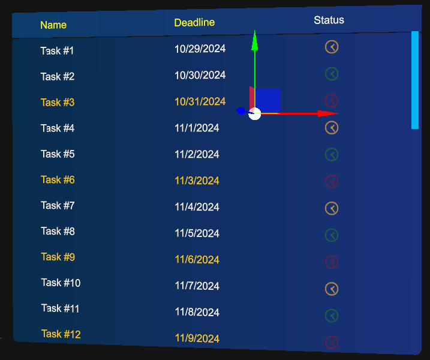

# List view

---


The `ListView` control displays data in rows and columns. Its cells are not limited to text: a cell can contain any 3D element, such as icons, images, or models. The list scrolls when the rows do not fit, keeps track of the selected row, and can show a header and a loading indicator.

The control is distributed as the `ListView.weprefab` prefab.

## Populate data

A list view gets its rows from a **data adapter**, a class derived from `DataAdapter` that links the UI with your data, in the style of Android adapters. The adapter tells the list how many rows there are, returns the value of each row, and chooses how each cell is rendered.

| `DataAdapter` member | Description |
| --- | --- |
| `Count` | Number of rows. |
| `GetRowValue(int rowIndex)` | Returns the object bound to a row. |
| `IndexOf(object value)` | Returns the row index of an object, or `-1`. |
| `GetRenderer(int rowIndex, int columnIndex)` | Returns the `CellRenderer` that draws a cell. |

MRTK includes `ArrayAdapter<T>`, which binds the list to an `IList<T>`. It renders one text cell per row with the `ToString()` value of each element, so it is enough for single-column lists:

```csharp
using System.Collections.Generic;
using Evergine.Framework;
using Evergine.MRTK.SDK.Features.UX.Components.Lists;

public class FruitList : Component
{
    [BindComponent(source: BindComponentSource.Children)]
    private ListView listView = null;

    protected override void OnActivated()
    {
        base.OnActivated();

        var fruits = new List<string> { "Apple", "Banana", "Cherry" };
        this.listView.DataSource = new ArrayAdapter<string>(fruits);

        // One column that takes the whole width of the list.
        this.listView.Columns = new[]
        {
            new ColumnDefinition { Title = "Fruit", PercentageSize = 1f },
        };
    }
}
```

You can create design-time adapters too, so Evergine Studio shows sample data in the list while you design the scene. The MRTK demo project includes several adapters you can use as a starting point.

## Custom cell renderers

To control how a cell looks, derive from `CellRenderer` and build the cell entities in `Render`. `TextCellRenderer`, the built-in renderer, draws the cell value as 3D text. Inside `Render`, the `Width`, `Height`, and `Layer` properties give you the cell size and the render layer the list uses to clip its content.



The following renderer, taken from the demo project, draws a colored square that shows the status of a task:

```csharp
using System;
using Evergine.Components.Graphics3D;
using Evergine.Framework;
using Evergine.Framework.Graphics;
using Evergine.Framework.Services;
using Evergine.Mathematics;
using Evergine.MRTK.SDK.Features.UX.Components.Lists;

public enum TaskStatus
{
    Pending,
    InProgress,
    Done,
}

public class TaskStatusCellRenderer : CellRenderer
{
    private readonly AssetsService assetsService;

    public TaskStatusCellRenderer(AssetsService assetsService)
    {
        this.assetsService = assetsService;
    }

    public TaskStatus Status { get; set; }

    public override void Render(Entity parent)
    {
        var statusMaterial = this.assetsService.Load<Material>(this.GetStatusMaterialId());

        parent.AddChild(new Entity()
            .AddComponent(new Transform3D
            {
                LocalPosition = new Vector3(0.01f, -0.008f, 0),
                LocalScale = new Vector3(0.008f, 0.008f, 0.001f),
            })
            .AddComponent(new MaterialComponent() { Material = statusMaterial })
            .AddComponent(new PlaneMesh
            {
                PlaneNormal = PlaneMesh.NormalAxis.ZPositive,
            })
            .AddComponent(new MeshRenderer()));
    }

    private Guid GetStatusMaterialId()
    {
        // These materials belong to the demo project; use your own asset IDs.
        switch (this.Status)
        {
            case TaskStatus.Pending:
                return EvergineContent.Materials.Samples.ListView.Task_Status_Red;
            case TaskStatus.InProgress:
                return EvergineContent.Materials.Samples.ListView.Task_Status_Yellow;
            case TaskStatus.Done:
                return EvergineContent.Materials.Samples.ListView.Task_Status_Green;
            default:
                throw new ArgumentOutOfRangeException();
        }
    }
}
```

> [!TIP]
> The list calls `GetRenderer` for every cell, so return a shared renderer instance and update its properties, as `ArrayAdapter<T>` does with `TextCellRenderer.Instance`, instead of creating a renderer per cell.

## Columns and custom adapters

`ColumnDefinition` sets the title, the relative width, and the header text color of each column. The `PercentageSize` values of all the columns must add up to 1.

To fill several columns, derive from `ArrayAdapter<T>` and override `GetRenderer` to return a different renderer per column. This adapter, also from the demo project, shows a task name, its deadline, and the status square from the previous example:

```csharp
using System;
using System.Collections.Generic;
using Evergine.Common.Graphics;
using Evergine.Framework;
using Evergine.Framework.Services;
using Evergine.MRTK.SDK.Features.UX.Components.Lists;

public class SampleTask
{
    public string Name { get; set; }

    public DateTime Deadline { get; set; }

    public TaskStatus Status { get; set; }
}

public class SampleTasksAdapter : ArrayAdapter<SampleTask>
{
    private readonly TaskStatusCellRenderer statusRenderer;

    public SampleTasksAdapter(IList<SampleTask> data, AssetsService assetsService)
        : base(data)
    {
        this.statusRenderer = new TaskStatusCellRenderer(assetsService);
    }

    public override CellRenderer GetRenderer(int rowIndex, int columnIndex)
    {
        SampleTask task = this.GetTypedRowValue(rowIndex);

        switch (columnIndex)
        {
            case 0:
            case 1:
                var textRenderer = TextCellRenderer.Instance;
                textRenderer.Text = columnIndex == 0 ? task.Name : task.Deadline.ToShortDateString();
                textRenderer.Color = task.Status == TaskStatus.Pending ? Color.Orange : Color.White;
                return textRenderer;
            case 2:
                this.statusRenderer.Status = task.Status;
                return this.statusRenderer;
            default:
                throw new IndexOutOfRangeException();
        }
    }
}

public class TaskList : Component
{
    [BindComponent(source: BindComponentSource.Children)]
    private ListView listView = null;

    [BindService]
    private AssetsService assetsService = null;

    protected override void OnActivated()
    {
        base.OnActivated();

        var tasks = new List<SampleTask>
        {
            new SampleTask { Name = "Design", Deadline = DateTime.Today.AddDays(1), Status = TaskStatus.Done },
            new SampleTask { Name = "Review", Deadline = DateTime.Today.AddDays(3), Status = TaskStatus.Pending },
        };

        this.listView.DataSource = new SampleTasksAdapter(tasks, this.assetsService);
        this.listView.Columns = new[]
        {
            new ColumnDefinition { Title = "Name", PercentageSize = 0.4f, HeaderTextColor = Color.Yellow },
            new ColumnDefinition { Title = "Deadline", PercentageSize = 0.4f, HeaderTextColor = Color.Yellow },
            new ColumnDefinition { Title = "Status", PercentageSize = 0.2f, HeaderTextColor = Color.White },
        };
        this.listView.HeaderEnabled = true;
    }
}
```

| `ColumnDefinition` property | Default | Description |
| --- | --- | --- |
| `Title` | `null` | Text shown in the header. |
| `PercentageSize` | `0` | Fraction of the list width used by the column. |
| `HeaderTextColor` | `Color.DarkBlue` | Color of the header text. |

## Properties

| Property | Default | Description |
| --- | --- | --- |
| `Size` | `(0.25, 0.18)` | Width and height of the list, in meters. |
| `ContentPadding` | `0.02` | Padding of the rows inside the list. It is applied vertically. |
| `ElasticTime` | `0.1` | Duration, in seconds, of the elastic animation when the content is dragged beyond its edges. |
| `ZContentDistance` | `0.004` | Distance along the local Z axis between the background and the rows. |
| `RowHeight` | `0.015` | Height of every row. All rows have the same height. |
| `BarWidth` | `0.004` | Width of the scroll bar. |
| `DataSource` | `null` | Data adapter that populates the list. |
| `SelectedIndex` | `-1` | Index of the selected row. `-1` means no selection. |
| `SelectedItem` | `null` | Object bound to the selected row. |
| `Columns` | `null` | Column definitions. |
| `HeaderEnabled` | `false` | Shows the header with the column titles. |
| `ShowLoadingIndicator` | `false` | Shows the loading indicator. Your code decides when, for example while it downloads data. |
| `LoadingIndicator` | Spinner | Entity used as the loading indicator. Assign your own entity to replace the default spinner. |

## Methods

| Method | Description |
| --- | --- |
| `Refresh()` | Rebuilds the rows and the layout. It recreates the whole hierarchy, so avoid calling it every frame. |
| `RefreshHeader()` | Rebuilds only the header. |
| `ScrollTo(int rowIndex, ScrollToPosition position)` | Scrolls until a row is visible, placed at the `Start`, `Center`, or `End` of the list. |
| `ScrollTo(object item, ScrollToPosition position)` | Same, for the row bound to an object. |

## Events

| Event | Description |
| --- | --- |
| `SelectedItemChanged` | Raised when the selection changes. |
| `Scrolled` | Raised when the content scrolls. |
