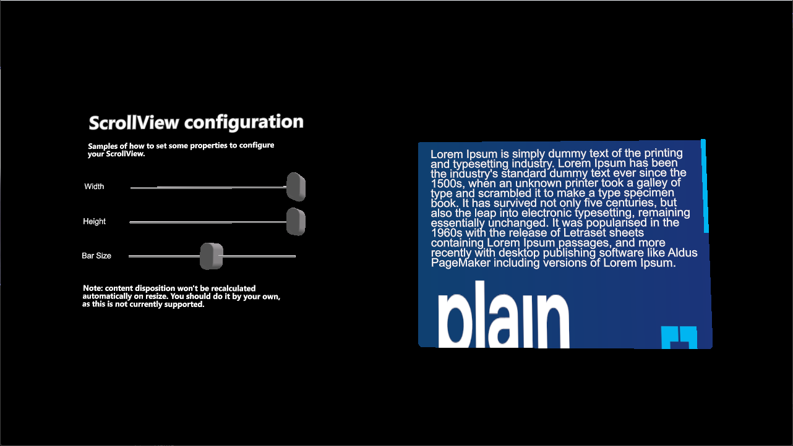
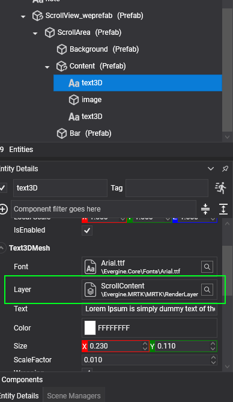
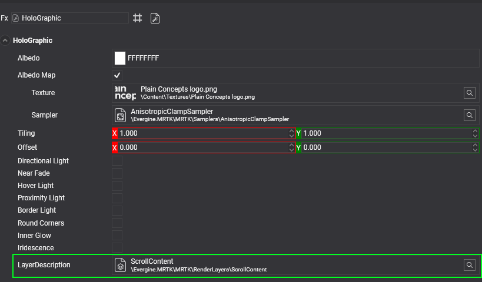

# Scroll view

---



The `ScrollView` control shows content that is larger than its visible area and lets the user scroll it by dragging with near or far interaction. Use it for long text, forms, or any group of UI elements that does not fit in a panel. It scrolls vertically, horizontally, or both, and shows a scroll bar for each direction when the content overflows.

The control is distributed as the `ScrollView.weprefab` prefab.

## Usage

Add the prefab to your scene and place your UI elements inside its content entity. The scroll view clips the content to its visible area, so every `Text3DMesh` and material used inside it must render in the **ScrollContent** render layer that MRTK provides.

|          |          |
|----------|----------|
|   |      |
| Scroll view layer for text  | Scroll view layer for materials     |

To add content from code, position the entity and call `AddContent` with the entity, its position, and its size. `AddContent` does not move the entity; it records the position and size to compute the scrollable area.

```csharp
using Evergine.Framework;
using Evergine.Framework.Graphics;
using Evergine.Mathematics;
using Evergine.MRTK.SDK.Features.UX.Components.Scrolling;

public class ScrollViewFiller : Component
{
    [BindComponent(source: BindComponentSource.Children)]
    private ScrollView scrollView = null;

    public Entity Item { get; set; }

    protected override void OnActivated()
    {
        base.OnActivated();

        // Place the item at the top-left corner of the visible area.
        // Positions are relative to the scroll view center, in meters.
        var size = new Vector2(0.2f, 0.05f);
        var topLeft = new Vector2(-this.scrollView.Size.X * 0.5f, this.scrollView.Size.Y * 0.5f);
        this.Item.FindComponent<Transform3D>().LocalPosition = new Vector3(topLeft.X, topLeft.Y, 0);
        this.scrollView.AddContent(this.Item, topLeft, size);
        this.scrollView.Refresh();
    }
}
```

## Properties

| Property | Default | Description |
| --- | --- | --- |
| `Size` | `(0.25, 0.18)` | Width and height of the visible area, in meters. Changing it does not move the content; update the content positions yourself. |
| `ContentPadding` | `0.01` | Padding between the edges of the visible area and the content. |
| `ElasticTime` | `0.1` | Duration, in seconds, of the elastic animation when the content is dragged beyond its edges. |
| `ZContentDistance` | `0.004` | Distance along the local Z axis between the background and the content. |
| `BarWidth` | `0.004` | Width of the scroll bars. |
| `HorizontalScrollEnabled` | `true` | Allows scrolling in the horizontal direction. |
| `VerticalScrollEnabled` | `true` | Allows scrolling in the vertical direction. |
| `HorizontalScrollBarVisibility` | `Auto` | Visibility of the horizontal bar: `Auto` shows it only when the content is wider than the visible area, `Visible` always shows it, and `Hidden` never does. |
| `VerticalScrollBarVisibility` | `Auto` | Visibility of the vertical bar, with the same options. |
| `Debug` | `false` | Draws debug information for the scroll area. |
| `ScrollPosition` | | Read-only. Current scroll offset of the content. |

> [!NOTE]
> `DisplayScrollBar` is obsolete. Use `HorizontalScrollBarVisibility` and `VerticalScrollBarVisibility` instead.

## Methods

| Method | Description |
| --- | --- |
| `AddContent(Entity entity, Vector2 contentPosition, Vector2 contentSize)` | Adds an entity to the content container and records its position and size to compute the scrollable area. |
| `ClearContents(Func<Entity, bool> clearCriteria = null)` | Removes the content entities. When you pass a criteria function, only the entities for which it returns `true` are removed. |
| `Refresh()` | Recomputes the position and size of the scroll bars. Call it after you add or remove content. |
| `ScrollTo(Vector2 position)` | Moves the content to the given scroll offset. |

## Events

| Event | Description |
| --- | --- |
| `Scrolled` | Raised when the content scrolls, either by user interaction or through `ScrollTo`. |
