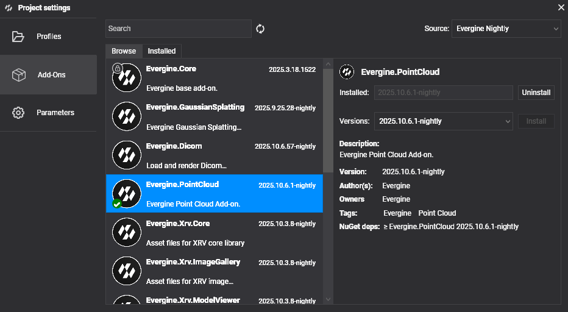

# Getting Started

---

Follow these steps to begin working with Point Clouds in your Evergine applications:

## Project Setup

### 1. Create a New Project

Use [Evergine Launcher](../../evergine_launcher/create_project.md) to start a new project. Along with Windows, select an additional template for your target device.

> [!NOTE]
> This addon doesn't support Web platforms. Please, select a different platform to test and use the addon.

### 2. Add the Evergine.PointCloud Add-on

Open Evergine Studio and add the Evergine.PointCloud add-on to your project. Refer to [this guide](../../addons/index.md) for instructions on adding add-ons.



> [!NOTE]
> Point Cloud add-on is available as NuGet packages. For nightly builds, update `nuget.config` to include the Evergine nightly feed:
> 
> ```xml
> <?xml version="1.0" encoding="utf-8"?>
> <configuration>
>  <packageSources>
>    <add key="nuget.org" value="https://api.nuget.org/v3/index.json" />
>    <add key="Evergine Nightly" value="https://pkgs.dev.azure.com/plainconcepts/Evergine.Nightly/_packaging/Evergine.NightlyBuilds/nuget/v3/index.json" />
>  </packageSources>
> </configuration>
> ```

### 3. Setup the Point Cloud Runtime

#### Register services during `Application` construction

```csharp
public partial class MyApplication : Application
{
    public MyApplication()
    {
        // Your usual core services...
        this.Container.Register<Settings>();
        this.Container.Register<Clock>();
        this.Container.Register<TimerFactory>();
        this.Container.Register<Random>();
        this.Container.Register<ErrorHandler>();
        this.Container.Register<ScreenContextManager>();
        this.Container.Register<GraphicsPresenter>();
        this.Container.Register<AssetsDirectory>();
        this.Container.Register<AssetsService>();
        this.Container.Register<ForegroundTaskSchedulerService>();
        this.Container.Register<WorkActionScheduler>();

        // Point Cloud addon hook:
        PointCloudRuntime.OnAppConstruction(this.Container);
    }
}
```

#### Register managers in your `Scene`

```csharp
public class MyScene : Scene
{
    public override void RegisterManagers()
    {
        base.RegisterManagers();
        PointCloudRuntime.RegisterManagers(this.Managers);
    }

    protected override void CreateScene()
    {
        PointCloudRuntime.OnSceneInitialization(this.Managers);
    }
}
```

### 4. Load point cloud data

Call once the scene is active (e.g., after you navigate to it). Remember supported extensions: `.e57`, `.las`, `.laz` and `.pcd`.

```csharp
await PointCloudRuntime.LoadCloudAsync(@"C:\Data\scans\building.e57");
```

This will:

1. Detect the importer based on extension
2. Stream metadata + point chunks
3. Instantiate the Point Cloud prefab
4. Allocate GPU buffers
5. Distribute uploaded points into sparse buffers for early image quality

No manual entity creation is required. An entity tagged `PointCloud` is added automatically.

## FAQ

**Q: Do I have to manually create the point cloud entity?**
No. The loader instantiates the prefab and injects required components.

**Q: Can I load multiple clouds?**
Yes. Each call to `LoadCloudAsync` adds another entity; buffers expand automatically.

**Q: How do I remove a cloud?**
Remove / dispose the entity (tagged `PointCloud`); GPU memory is compacted automatically.

**Q: How do I tweak point size or max points per frame?**
Resolve `PointDataManager` (e.g., via `Managers.FindManager<PointDataManager>()`) and adjust `PointSize` / `MaxPointsPerFrame` before or during runtime.
