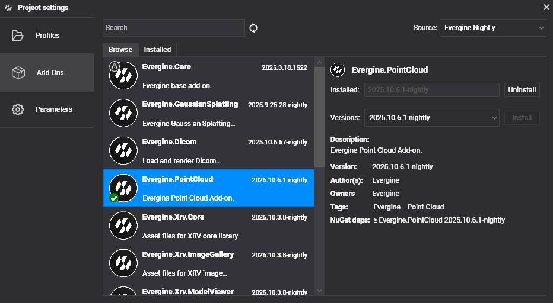

# Getting started with Point Cloud

---



This page adds the Point Cloud add-on to a project and loads a cloud into a scene. The add-on plugs into three moments of the application lifecycle: when the application is created, when the scene registers its managers, and when the scene is created. After that, one call loads a file.

<!-- CAPTURE: pointcloud_sample.png; PointCloudRender sample running in the Windows profile with a large E57 or LAS scan loaded -->

## Project setup

### 1. Create a project

Create a project with [Evergine Launcher](../../evergine_launcher/create_project.md) and keep the Windows profile.

> [!NOTE]
> The add-on does not support Web platforms.

### 2. Install the add-on

In Evergine Studio, open the [Add-ons Manager](../index.md#add-ons-manager) and install **Evergine.PointCloud**.

> [!NOTE]
> The add-on references NuGet packages. To use nightly builds, add the Evergine nightly feed to your `nuget.config`:
>
> ```xml
> <?xml version="1.0" encoding="utf-8"?>
> <configuration>
>   <packageSources>
>     <add key="nuget.org" value="https://api.nuget.org/v3/index.json" />
>     <add key="Evergine Nightly" value="https://pkgs.dev.azure.com/plainconcepts/Evergine.Nightly/_packaging/Evergine.NightlyBuilds/nuget/v3/index.json" />
>   </packageSources>
> </configuration>
> ```

### 3. Register the services in the application

Call `PointCloudRuntime.OnAppConstruction` at the end of your `Application` constructor. It registers the importers and the loader service in the container.

```csharp
using Evergine.Common.IO;
using Evergine.Framework;
using Evergine.Framework.Services;
using Evergine.Framework.Threading;
using Evergine.PointCloud;

public partial class MyApplication : Application
{
    public MyApplication()
    {
        this.Container.Register<Settings>();
        this.Container.Register<Clock>();
        this.Container.Register<TimerFactory>();
        this.Container.Register<Random>();
        this.Container.Register<ErrorHandler>();
        this.Container.Register<ScreenContextManager>();
        this.Container.Register<GraphicsPresenter>();
        this.Container.Register<AssetsDirectory>();
        this.Container.Register<AssetsService>();
        this.Container.Register<ForegroundTaskSchedulerService>();
        this.Container.Register<WorkActionScheduler>();

        // Registers the E57, EPC, LAS and PCD importers and the loader service.
        PointCloudRuntime.OnAppConstruction(this.Container);
    }
}
```

### 4. Set up the scene

In your scene, register the point data manager in `RegisterManagers`, and initialize the runtime in `CreateScene`. `OnSceneInitialization` replaces the default render path of the scene with `ProgressiveRenderPath`.

```csharp
using Evergine.Framework;
using Evergine.PointCloud;

public class MyScene : Scene
{
    public override void RegisterManagers()
    {
        base.RegisterManagers();

        // Adds PointDataManager, which owns the GPU buffers of every cloud.
        PointCloudRuntime.RegisterManagers(this.Managers);
    }

    protected override void CreateScene()
    {
        PointCloudRuntime.OnSceneInitialization(this.Managers);
    }

    protected override async void Start()
    {
        base.Start();
        await PointCloudRuntime.LoadCloudAsync(@"C:\Data\scans\building.e57");
    }
}
```

## Load a point cloud

Call `PointCloudRuntime.LoadCloudAsync` with the path of a `.e57`, `.las`, `.laz`, `.pcd`, or `.epc` file once the scene is initialized. It returns `null` if you call it before `OnSceneInitialization`. The loader then:

1. Picks the importer from the file extension.
2. Reads the file metadata and streams the points in chunks, in a background task.
3. Instantiates the point cloud prefab, an entity tagged `PointCloud` named after the file, with a `PointCloudDrawable` component.
4. Allocates GPU buffers for the cloud.
5. Uploads each chunk and distributes its points over the buffers, so the image shows the whole cloud early and fills in as loading continues.

You do not create the entity yourself. Each call to `LoadCloudAsync` adds a new entity, so you can load several clouds; the buffers grow automatically. To remove a cloud, remove its entity from the entity manager, and the add-on compacts the GPU memory.

> [!NOTE]
> The task returned by `LoadCloudAsync` completes when loading has started, not when every point is on the GPU. Use `PointCloudDrawable.IsPointCloudLoaded` to know when a cloud is complete.

`PointCloudDrawable` reports the loading progress:

| Member | Description |
| --- | --- |
| `NumPoints` | Number of points in the file. |
| `LoadedPoints` | Number of points uploaded so far. |
| `IsPointCloudLoaded` | `true` when every point has been uploaded. |
| `BoundingBox` | Bounds of the points loaded so far. Use it to frame the camera. |

## Tune the rendering

`PointDataManager` (namespace `Evergine.PointCloud.ProgressiveRendering`) controls how the points are drawn. Find it with `this.Managers.FindManager<PointDataManager>()` and change its fields at any time.

| Field | Default | Description |
| --- | --- | --- |
| `PointSize` | `1` | Size of each point, in pixels. |
| `MaxPointsPerFrame` | `10000000` | Maximum number of points projected per frame. Lower it on slower GPUs; the image then takes more frames to fill in. |

```csharp
using Evergine.PointCloud.ProgressiveRendering;

var pointData = this.Managers.FindManager<PointDataManager>();
pointData.PointSize = 2;
pointData.MaxPointsPerFrame = 2 * 1000 * 1000;
```
