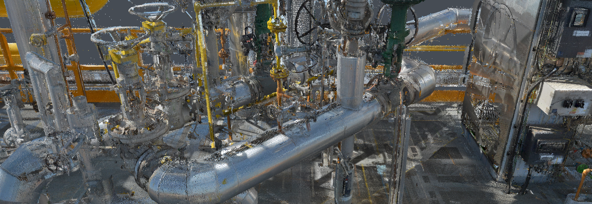

# Point Cloud

---

**Evergine Point Cloud add-on** brings a High-performance progressive GPU rendering and import pipeline for massive point cloud datasets to Evergine.

## Features

- A progressive GPU render path specialized for point clouds.

- Adaptative rendering to target from low end to high end hardware.

- Asynchronous, chunked loading that allows visualizing the cloud even when loading.

- Automatic memory management. 

## Supported Formats

Currently, this add-on supports the following formats:

| Format | Enum  | Notes                        |
| ------ | ----- | ---------------------------- |
| E57    | `E57` | ASTM standard; rich metadata |
| LAS    | `Las` | Widely used LiDAR format     |
| LAZ    | `Laz` | Compressed LAS               |
| PCD    | `Pcd` | Point Cloud Library format   |

### In this Section

* [Getting Started](getting_started.md)
