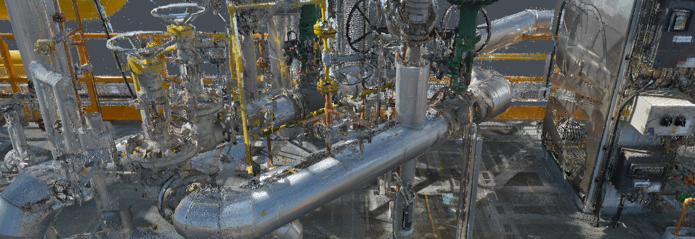

# Point Cloud

---

The **Evergine Point Cloud** add-on imports and renders massive point clouds, such as laser scans of buildings, plants, or terrain, in Evergine applications. Instead of drawing every point every frame, it renders progressively on the GPU: each frame projects a batch of points and reuses the image of the previous frames, so clouds with hundreds of millions of points stay interactive and the image sharpens while the camera is still.

## Features

- A progressive render path, `ProgressiveRenderPath`, that projects the points with compute shaders and composes the image with the rest of the scene.
- Adaptive rendering: `MaxPointsPerFrame` sets how much work each frame does, so you can target low-end and high-end hardware.
- Asynchronous, chunked loading: the cloud is visible while it is still loading.
- Automatic GPU memory management: buffers grow as clouds load and are compacted when you remove them.
- Point distribution that spreads the first loaded points over the whole cloud, so the early image already shows its shape.

## Supported formats

The importer is chosen from the file extension.

| Format | Extension | Notes |
| --- | --- | --- |
| E57 | `.e57` | ASTM standard for 3D imaging data, with rich metadata. |
| LAS | `.las` | Widely used LiDAR format. |
| LAZ | `.laz` | Compressed LAS. |
| PCD | `.pcd` | Point Cloud Library format. |
| EPC | `.epc` | Evergine Point Cloud format, with its data in `.epx` files. |

## Platforms

The add-on runs on Windows (x64). It needs a graphics backend with compute shader support, and the E57 importer uses a native Windows library. Web platforms are not supported.

## In this section

* [Getting started](getting_started.md)
