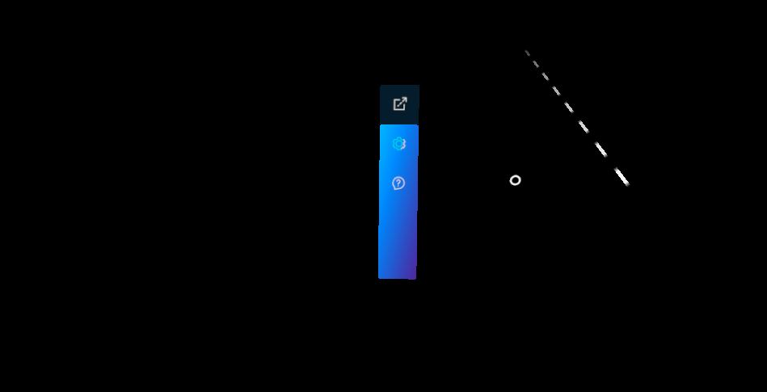
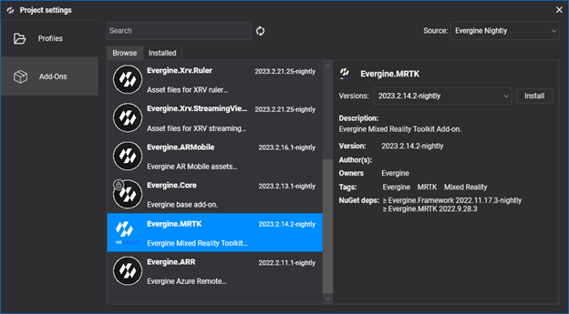
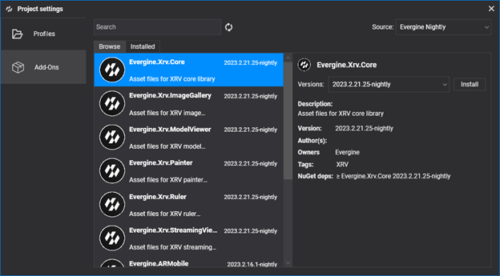
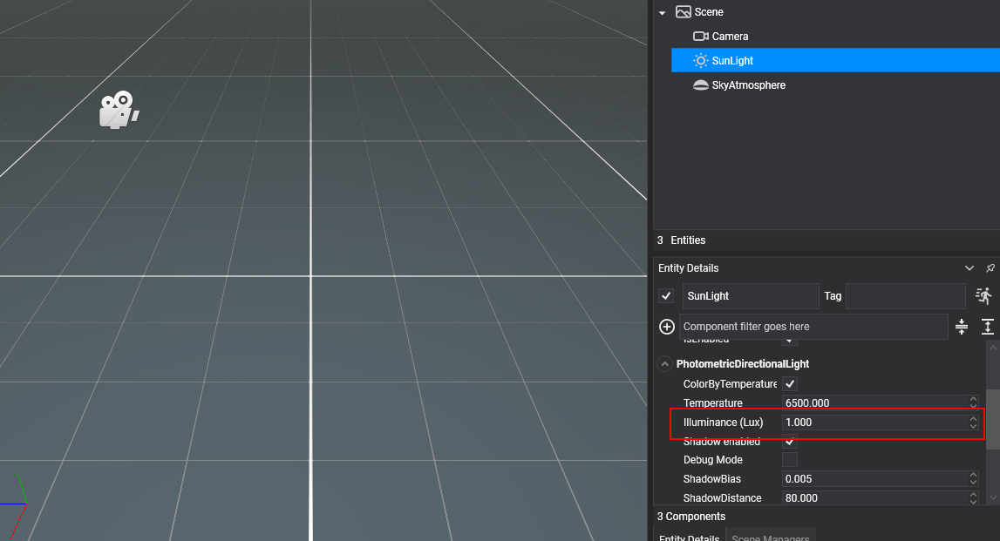

# Getting started with XRV

---



This page prepares an Evergine project to run XRV on a headset. You install the MRTK and XRV add-ons, register `XrvService` in your application, and initialize it from an MRTK scene. When you finish, the hand menu opens with the default **Settings** and **Help** buttons.

## Project setup

### 1. Create a project

Create a project with [Evergine Launcher](../../evergine_launcher/create_project.md). Along with Windows, add the profile for your target device: Meta Quest or Pico.

### 2. Install the MRTK add-on

Open the project in Evergine Studio and install the **Evergine.MRTK** add-on from the [Add-ons Manager](../index.md#add-ons-manager).



### 3. Install the XRV core add-on

With MRTK installed, install the **Evergine.Xrv.Core** add-on in the same way.



> [!NOTE]
> The XRV add-ons reference NuGet packages. To use nightly builds, add the Evergine nightly feed to your `nuget.config`:
>
> ```xml
> <?xml version="1.0" encoding="utf-8"?>
> <configuration>
>   <packageSources>
>     <add key="nuget.org" value="https://api.nuget.org/v3/index.json" />
>     <add key="Evergine Nightly" value="https://pkgs.dev.azure.com/plainconcepts/Evergine.Nightly/_packaging/Evergine.NightlyBuilds/nuget/v3/index.json" />
>   </packageSources>
> </configuration>
> ```

### 4. Adjust the sun light

In your default scene, set the **Illuminance** of the **SunLight** entity to 1, so XRV materials are not overexposed.



### 5. Add the Microsoft.Bcl.AsyncInterfaces package

Add this package reference to your shared project (the one that contains your scenes):

```xml
<PackageReference Include="Microsoft.Bcl.AsyncInterfaces" Version="7.0.0" />
```

## Code setup

### 1. Configure the background scheduler

XRV runs part of its work in background tasks. Configure the background scheduler at the end of your `Application` constructor:

```csharp
using Evergine.Common.IO;
using Evergine.Framework;
using Evergine.Framework.Services;
using Evergine.Framework.Threading;

public partial class MyApplication : Application
{
    public MyApplication()
    {
        this.Container.Register<Settings>();
        this.Container.Register<Clock>();
        this.Container.Register<TimerFactory>();
        this.Container.Register<Random>();
        this.Container.Register<ErrorHandler>();
        this.Container.Register<ScreenContextManager>();
        this.Container.Register<GraphicsPresenter>();
        this.Container.Register<AssetsDirectory>();
        this.Container.Register<AssetsService>();
        this.Container.Register<ForegroundTaskSchedulerService>();
        this.Container.Register<WorkActionScheduler>();

        // Required by XRV: lets it schedule work on background threads.
        BackgroundTaskScheduler.Background.Configure(this.Container);
    }
}
```

### 2. Register XrvService

Create the `XrvService` in `Initialize`, add the modules you want, and register the instance in the container so scenes and components can resolve it.

```csharp
using Evergine.Xrv.Core;

public partial class MyApplication : Application
{
    public override void Initialize()
    {
        base.Initialize();

        var xrv = new XrvService();
        // Add modules here, for example: xrv.AddModule(new RulerModule());
        this.Container.RegisterInstance(xrv);

        // ... navigate to your scene
    }
}
```

### 3. Inherit your scene from XRScene and initialize XRV

Your scene must inherit from MRTK's `XRScene`, as described in [Getting started with MRTK](../mrtk/getting_started.md). Initialize XRV in `OnPostCreateXRScene`, when the MRTK cursors and the camera already exist:

```csharp
using System;
using Evergine.Framework;
using Evergine.MRTK.Scenes;
using Evergine.Xrv.Core;

public class MyScene : XRScene
{
    protected override Guid CursorMatPressed => EvergineContent.MRTK.Materials.Cursor.CursorPinch;

    protected override Guid CursorMatReleased => EvergineContent.MRTK.Materials.Cursor.CursorBase;

    protected override Guid HoloHandsMat => EvergineContent.MRTK.Materials.Hands.QuestHands;

    protected override Guid SpatialMappingMat => Guid.Empty;

    protected override Guid HandRayTexture => EvergineContent.MRTK.Textures.line_dots_png;

    protected override Guid HandRaySampler => EvergineContent.MRTK.Samplers.LinearWrapSampler;

    protected override Guid LeftControllerModelPrefab => EvergineContent.MRTK.Prefabs.DefaultLeftController_weprefab;

    protected override Guid RightControllerModelPrefab => EvergineContent.MRTK.Prefabs.DefaultRightController_weprefab;

    protected override float MaxFarCursorLength => 0.5f;

    protected override void OnPostCreateXRScene()
    {
        base.OnPostCreateXRScene();

        // Creates the hand menu, windows, settings, help and themes, and initializes every module.
        var xrv = Application.Current.Container.Resolve<XrvService>();
        xrv.Initialize(this);
    }
}
```

> [!NOTE]
> `XrvService.Initialize` sets the background color of the scene camera to transparent, so passthrough can show the real world behind your content. Enable passthrough with `xrv.Services.Passthrough.EnablePassthrough = true` after initialization.

## Platform setup

### Android

If the Android build fails with an error like this one:

```
error XA2002: Cannot resolve reference: `Evergine.Editor.Extension`, referenced by `Evergine.MRTK.Editor`. Please add a NuGet package or assembly reference for `Evergine.Editor.Extension`, or remove the reference to `Evergine.MRTK.Editor`.
```

add the `Evergine.Editor.Extension` NuGet package to your Android project.

To use passthrough on Meta Quest or Pico, uncomment the passthrough code in `MainActivity.cs` and the related entries in the Android manifest of your project.

## Next steps

The hand menu now shows the default **Settings** and **Help** buttons. To add features, install one of the [XRV modules](modules/index.md), [create your own module](modules/customModule/index.md), or use the XRV API directly, for example to [open windows](ui/windows_system.md).

The [XRV samples](https://github.com/EvergineTeam/XRV/tree/develop/samples) project shows all the public modules working together.
