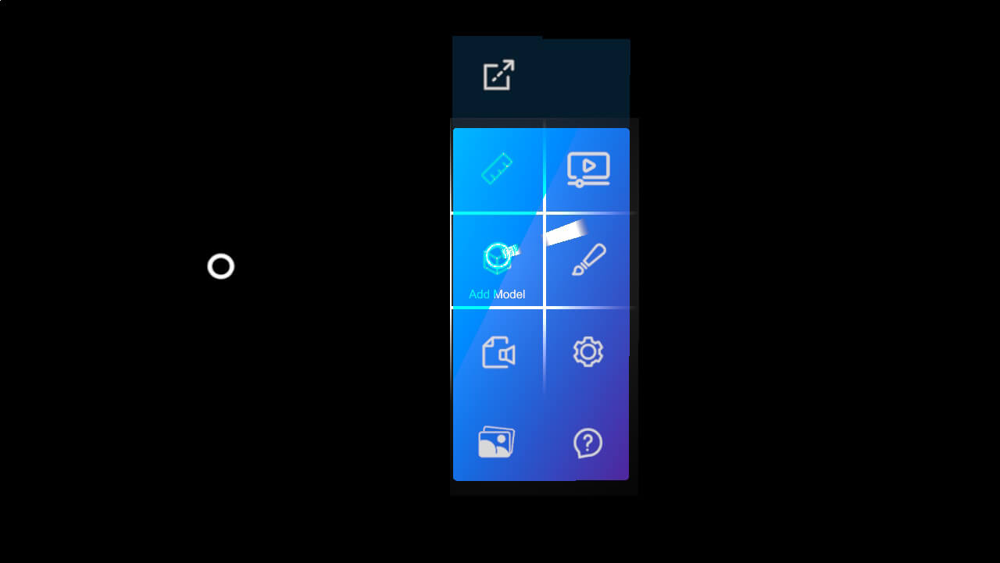
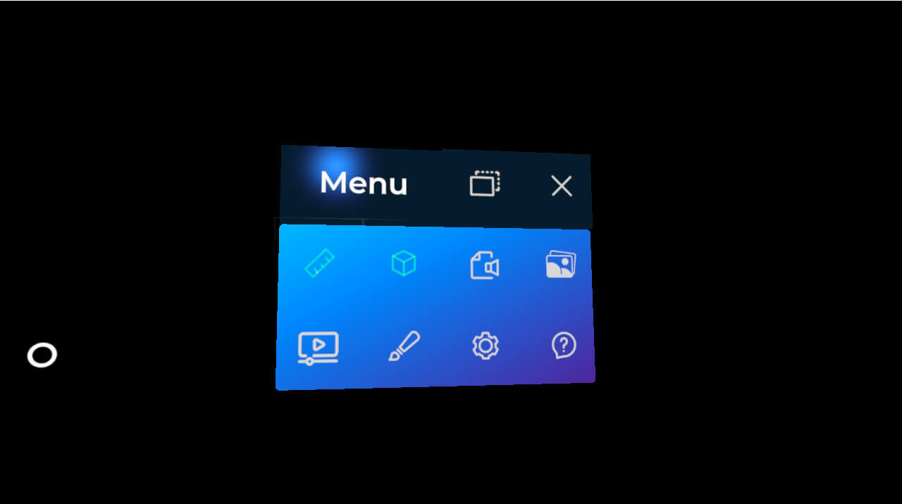
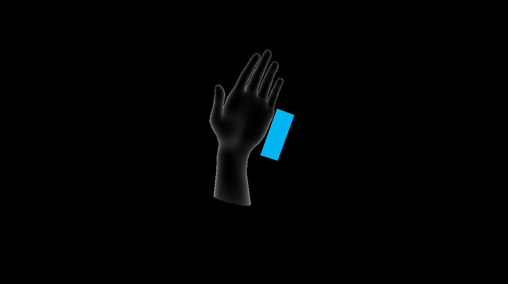

# Hand menu

---



The hand menu is the main entry point of an XRV application. It shows a panel of buttons next to the user's wrist when they turn their palm up, with either hand, so features are always one gesture away. Each module can add its own button, and your code can add and remove buttons at any time.

## Module buttons

A module adds a button to the hand menu through its `HandMenuButton` property. XRV reads the property after it calls the module's `Initialize` method, so set it there:

```csharp
using System.Collections.Generic;
using Evergine.Framework;
using Evergine.Xrv.Core.Modules;
using Evergine.Xrv.Core.UI.Buttons;
using Evergine.Xrv.Core.UI.Tabs;

public class MyModule : Module
{
    public override string Name => "My module";

    public override ButtonDescription HandMenuButton { get; protected set; }

    public override TabItem Help { get; protected set; }

    public override TabItem Settings { get; protected set; }

    public override IEnumerable<string> VoiceCommands => null;

    public override void Initialize(Scene scene)
    {
        this.HandMenuButton = new ButtonDescription
        {
            IsToggle = true,
            IconOn = EvergineContent.Materials.MyModuleIcon,
            IconOff = EvergineContent.Materials.MyModuleIcon,
            TextOn = () => "Hide",
            TextOff = () => "Show",
        };
    }

    public override void Run(bool turnOn)
    {
        // Called when the user presses the button. turnOn is the toggle state.
    }
}
```

`EvergineContent.Materials.MyModuleIcon` stands for the ID of a material asset in your project. If `HandMenuButton` is `null`, the module adds no button.

### Button properties

`ButtonDescription` (namespace `Evergine.Xrv.Core.UI.Buttons`) describes each button:

| Property | Default | Description |
| --- | --- | --- |
| `IsToggle` | `false` | Makes the button a toggle with on and off states. |
| `IconOn` | `Guid.Empty` | Material ID of the icon in the *on* state, or of the only icon for non-toggle buttons. |
| `IconOff` | `Guid.Empty` | Material ID of the icon in the *off* state. Toggle buttons only. |
| `TextOn` | `null` | Function that returns the text in the *on* state, or the only text for non-toggle buttons. Using a function lets the text follow [localization](localization.md) changes. |
| `TextOff` | `null` | Function that returns the text in the *off* state. Toggle buttons only. |
| `VoiceCommandOn` | `null` | Voice command that activates the *on* state. See the note below. |
| `VoiceCommandOff` | `null` | Voice command that activates the *off* state. See the note below. |
| `Order` | `0` | Position of the button in the menu. Lower values come first. |
| `Name` | `null` | Optional name that identifies the button. |
| `Id` | new `Guid` | Read-only. Unique identifier generated when the description is created. |

> [!NOTE]
> Voice commands only work when the application provides a speech recognizer. XRV does not include one for current devices. See [Voice commands](voice_commands.md).

## Attach and detach the menu

The user can detach the menu from the wrist with the **Detach** button at its top. The menu then becomes a floating window that the user can pin in place or set to follow them. Pressing **Close** on the detached menu attaches it to the wrist again.



`HandMenu.IsDetached` tells you the current state, and the `MenuStateChanged` event is raised when it changes.

## Add buttons from code

Besides module buttons, you can add and remove buttons through the `HandMenu` property of `XrvService`. When the user presses a button that does not belong to a module, XRV publishes a `HandMenuActionMessage` through the [messaging system](messaging.md), so subscribe to it to react:

```csharp
using System;
using Evergine.Framework;
using Evergine.Xrv.Core;
using Evergine.Xrv.Core.Menu;
using Evergine.Xrv.Core.UI.Buttons;

public class RecenterButton : Component
{
    [BindService]
    private XrvService xrvService = null;

    private ButtonDescription button;
    private Guid subscription;

    protected override void OnActivated()
    {
        base.OnActivated();

        this.button = new ButtonDescription
        {
            IconOn = EvergineContent.Materials.RecenterIcon,
            TextOn = () => "Recenter",
        };

        this.xrvService.HandMenu.ButtonDescriptions.Add(this.button);
        this.subscription = this.xrvService.Services.Messaging.Subscribe<HandMenuActionMessage>(this.OnHandMenuAction);
    }

    protected override void OnDeactivated()
    {
        base.OnDeactivated();
        this.xrvService.Services.Messaging.Unsubscribe(this.subscription);
        this.xrvService.HandMenu.ButtonDescriptions.Remove(this.button);
    }

    private void OnHandMenuAction(HandMenuActionMessage message)
    {
        // Every button added from code publishes this message, so check which one was pressed.
        if (message.Description == this.button)
        {
            // Recenter your content here.
        }
    }
}
```

## Layout

You cannot change the layout of the menu, but you can set how many buttons fit in each column. When a column is full, the menu adds a new one. The minimum is 4 buttons per column, which is also the default, because the detached menu needs that space for its own controls.

```csharp
var xrv = Application.Current.Container.Resolve<XrvService>();
xrv.HandMenu.ButtonsPerColumn = 5;
```

## Tutorial

When the application starts, a short animation shows the user how to open the menu by turning their hand.



To skip it, turn off `DisplayTutorial` right after you initialize XRV:

```csharp
var xrv = Application.Current.Container.Resolve<XrvService>();
xrv.Initialize(this);
xrv.HandMenu.DisplayTutorial = false;
```
