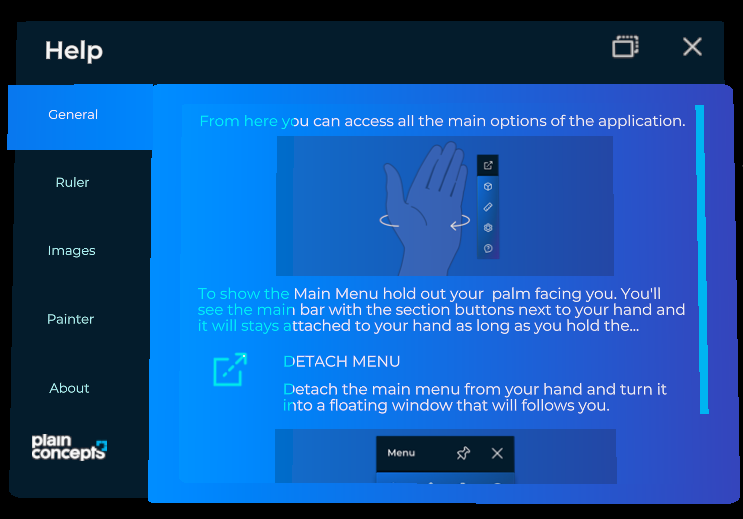

# Help system

---



The **Help** window contains text and images that teach users how to use your application. It opens from the  button of the hand menu and works like the [settings system](settings_system.md): each module can add its own help tab, and your code can add and remove tabs at any time. The window also includes a **General** tab and an **About** tab provided by XRV.

The window is a `TabbedWindow`, so each section is a [tab item](ui/tabs_control.md#tab-items).

## Add a help tab to a module

Set the `Help` property of your module in `Initialize`:

```csharp
// Inside a class derived from Module.
public override TabItem Help { get; protected set; }

public override void Initialize(Scene scene)
{
    this.Help = new TabItem
    {
        Name = () => "My module",
        Contents = this.CreateHelpContents, // Returns the entity with the help contents.
    };
}
```

See [Create your own modules](modules/customModule/index.md) for a complete module.

## Add a help tab from code

Use the `HelpSystem` property of `XrvService`:

```csharp
using Evergine.Framework;
using Evergine.Xrv.Core;
using Evergine.Xrv.Core.UI.Tabs;

public class NavigationHelp : Component
{
    [BindService]
    private XrvService xrvService = null;

    protected override void Start()
    {
        base.Start();

        this.xrvService.HelpSystem.AddTabItem(new TabItem
        {
            Order = 1,
            Name = () => "Getting around",
            Contents = this.CreateHelpContents,
        });
    }

    private Entity CreateHelpContents()
    {
        // Build or instantiate the entity with your help texts and images.
        return new Entity();
    }
}
```

| `HelpSystem` member | Default | Description |
| --- | --- | --- |
| `AddTabItem(TabItem item)` | | Adds a tab to the help window. |
| `RemoveTabItem(TabItem item)` | | Removes a tab from the help window. |
| `DisplayAboutSection` | `true` | Shows the **About** tab. |
| `AboutContents` | `null` | Function that returns the text of the **About** tab. |
| `Window` | | The `TabbedWindow` of the help. Use it to open or close the window from code. |
