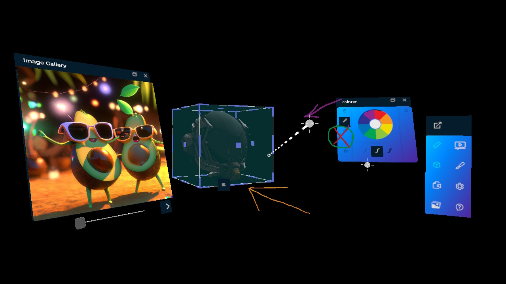
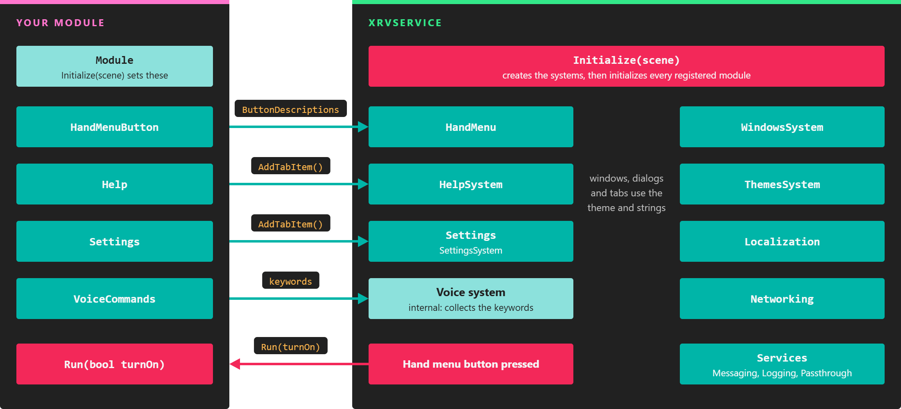

# Extended Reality Viewer (XRV)

---

**XRV** (Extended Reality Viewer) is the framework we use to build custom XR applications for our customers. It gathers in one library the features those applications keep needing: a hand menu, floating windows and dialogs, settings and help windows, themes, localization, file storage, and messaging. On top of it, ready-made modules add features such as a 3D model viewer, an image gallery, a ruler, and a painter.

XRV is built on the [MRTK add-on](../mrtk/index.md), so it reuses its pointers, buttons, sliders, and configurators. Like MRTK, it is open source under the MIT license, in the [XRV repository](https://github.com/EvergineTeam/XRV) on GitHub.

## Architecture

`XrvService` is the entry point. You register it in the application container, add the modules you want, and call `Initialize` from an `XRScene`. It then creates each system and wires every module into them: a module's hand menu button goes to the hand menu, its help and settings tabs go to the help and settings windows, and its voice commands are collected by the voice system.

*XrvService owns the systems; modules plug into them through the properties of the Module class.*

## Supported devices

Most features work on every platform, but some depend on the device. XRV runs on:

- Meta Quest 1, 2, 3, and Pro.
- Pico XR headsets.
- Windows, with the MRTK [desktop emulation](../mrtk/pointers_and_control.md#desktop-emulation), for development and testing.

> [!NOTE]
> Microsoft HoloLens 2 is no longer supported.

## In this section

- [Getting started](getting_started.md)
- [Hand menu](hand_menu.md)
- [UI](ui/index.md)
  - [Windows system](ui/windows_system.md)
  - [Tabs control](ui/tabs_control.md)
- [Settings system](settings_system.md)
- [Help system](help_system.md)
- [Voice commands](voice_commands.md)
- [Messaging](messaging.md)
- [Storage](storage.md)
- [Localization](localization.md)
- [Themes system](themes.md)
- [Logging](logging.md)
- [Modules](modules/index.md)
  - [Image Gallery](modules/imageGallery/index.md)
  - [Model Viewer](modules/modelViewer/index.md)
  - [Painter](modules/painter/index.md)
  - [Ruler](modules/ruler/index.md)
  - [Streaming Viewer](modules/streamingviewer/index.md)
  - [Custom modules](modules/customModule/index.md)
