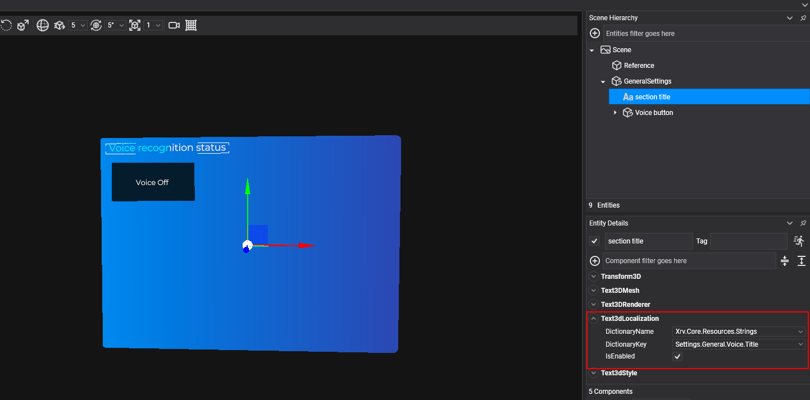
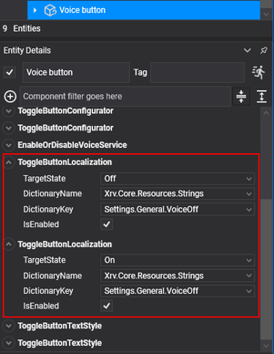

# Localization

---



XRV includes a localization service for applications that support several languages. It reads the strings from the embedded resource files (`.resx`) of your assemblies, and provides components that bind 3D texts and buttons to dictionary entries, so the UI updates when the language changes. Access it through `XrvService.Localization`.

The service looks for resources in the assemblies marked with the `EvergineAssembly` attribute set to `EvergineAssemblyUsage.UserProject` or `EvergineAssemblyUsage.Extension`. Evergine project templates already mark your projects this way.

> [!NOTE]
> The available languages are English, the fallback, and Spanish.

## Change the language

Set `CurrentCulture` to change the UI culture:

```csharp
using System.Globalization;

var localization = this.xrvService.Localization;
localization.CurrentCulture = CultureInfo.GetCultureInfo("es");
```

Setting `CurrentCulture` updates `CultureInfo.CurrentUICulture` and `CultureInfo.CurrentCulture`, and publishes a `CurrentCultureChangeMessage` through the [messaging system](messaging.md), whose `Culture` property holds the new culture.

## Localization components

These components localize texts in the editor or from code. Set `DictionaryName` and `DictionaryKey` to pick the entry, or `LocalizationFunc` to provide the text with a function.

| Component | Localizes |
| --- | --- |
| `Text3dLocalization` | The text of a `Text3DMesh` component on the same entity. |
| `ButtonLocalization` | The text of a button with a `StandardButtonConfigurator`. |
| `ToggleButtonLocalization` | The text of one state of a toggle button with a `ToggleStateManager`. Set `TargetState`, and add one component per state. |

For a toggle button, add one `ToggleButtonLocalization` for the *on* state and another for the *off* state:



## Get a localized string from code

`GetString` takes an expression that points at a property of the class generated for your `.resx` file. The service uses the class and property names to find the entry, so you keep compile-time checks on the keys.

```csharp
var localization = this.xrvService.Localization;
string text = localization.GetString(() => Resources.Strings.MyString);
```

`GetString(string dictionaryName, string key)` does the same lookup by name. When an entry does not exist, both return `<Not found>`.

Most XRV APIs take a `Func<string>` instead of a string, so the text is evaluated again when the culture changes. In the following examples, `localization` is `this.xrvService.Localization`, and `Resources.Strings` is the class generated for your resource file.

### Hand menu buttons

[`ButtonDescription`](hand_menu.md#button-properties) takes a function for each toggle state:

```csharp
var description = new ButtonDescription
{
    IsToggle = true,
    TextOn = () => localization.GetString(() => Resources.Strings.Menu_Hide),
    TextOff = () => localization.GetString(() => Resources.Strings.Menu_Show),
};
```

### Tab items

[`TabItem.Name`](ui/tabs_control.md#tab-items) is evaluated the first time the tab is shown and every time the culture changes:

```csharp
var item = new TabItem
{
    Name = () => localization.GetString(() => Resources.Strings.Help_Tab_Name),
    Contents = this.CreateHelpContents,
};
```

### Window titles

`WindowConfigurator.LocalizedTitle` provides the title of a [window](ui/windows_system.md):

```csharp
var window = this.xrvService.WindowsSystem.CreateWindow(config =>
{
    config.LocalizedTitle = () => localization.GetString(() => Resources.Strings.Window_Title);
});
```

### Dialogs

`ShowAlertDialog` and `ShowConfirmationDialog` have overloads that take functions:

```csharp
var dialog = this.xrvService.WindowsSystem.ShowAlertDialog(
    () => localization.GetString(() => Resources.Strings.Alert_Title),
    () => localization.GetString(() => Resources.Strings.Alert_Message),
    () => localization.GetString(() => Resources.Strings.Alert_Ok));
```
