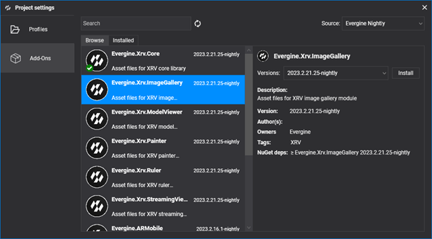

# Image Gallery module

---

The Image Gallery module shows a gallery of images stored in a local or remote repository. It adds a hand menu button that opens the gallery window, where the user moves between images with buttons or a slider.


If the repository contains a single image, the window shows it without navigation buttons.

> [!NOTE]
> All the images must have the same size.

| Property | Default | Description |
| --- | --- | --- |
| `ImagePixelsWidth` | `0` | Width of the images, in pixels. |
| `ImagePixelsHeight` | `0` | Height of the images, in pixels. |
| `FileAccess` | `null` | Repository that contains the images. See [Storage](../../storage.md). |

## Installation

This module is distributed as the **Evergine.Xrv.ImageGallery** [add-on](../../../index.md). Install it from **Project Settings > Add-Ons** in Evergine Studio.



Then register the module in your `XrvService`:

```csharp
using Evergine.Xrv.Core;
using Evergine.Xrv.Core.Storage;
using Evergine.Xrv.ImageGallery;

// Any FileAccess works; this one reads images from the local application data folder.
var imagesDataSource = new ApplicationDataFileAccess() { BaseDirectory = "images" };
var xrv = new XrvService()
    .AddModule(new ImageGalleryModule
    {
        ImagePixelsWidth = 640,
        ImagePixelsHeight = 640,
        FileAccess = imagesDataSource,
    });
```

## Usage

- To open the gallery window, tap the  hand menu button.
- Move between images with the next  or previous  buttons, or with the slider.