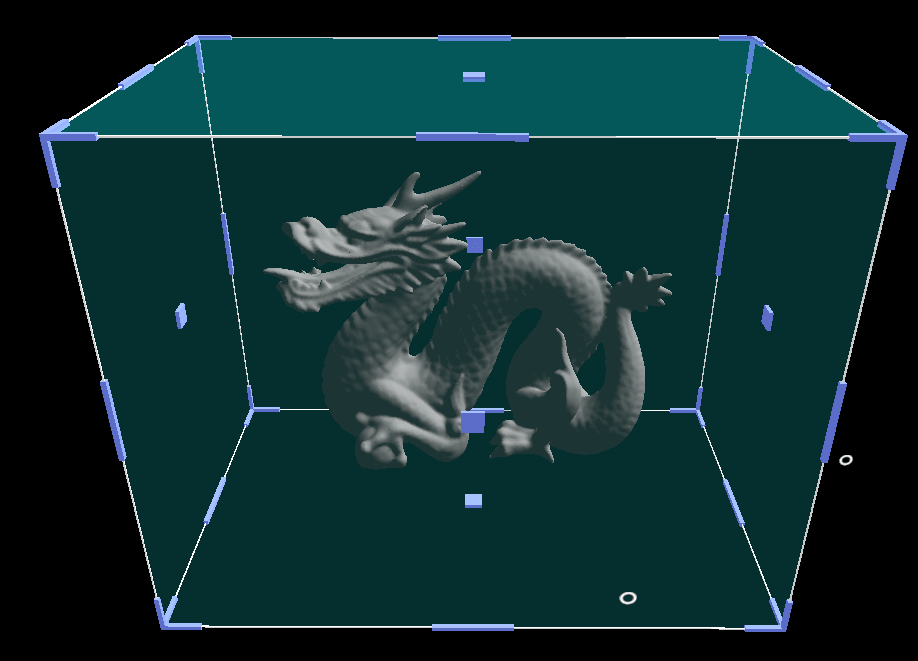
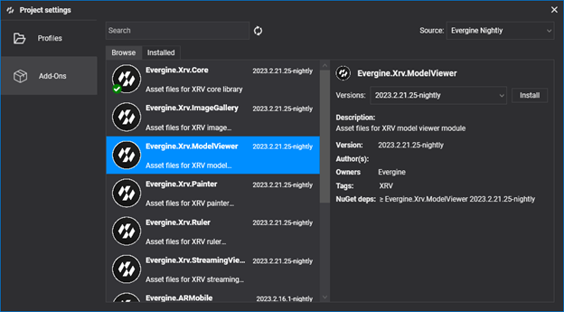
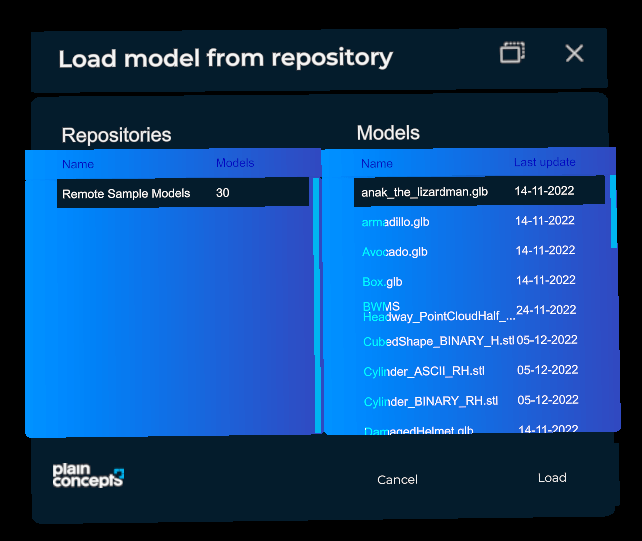
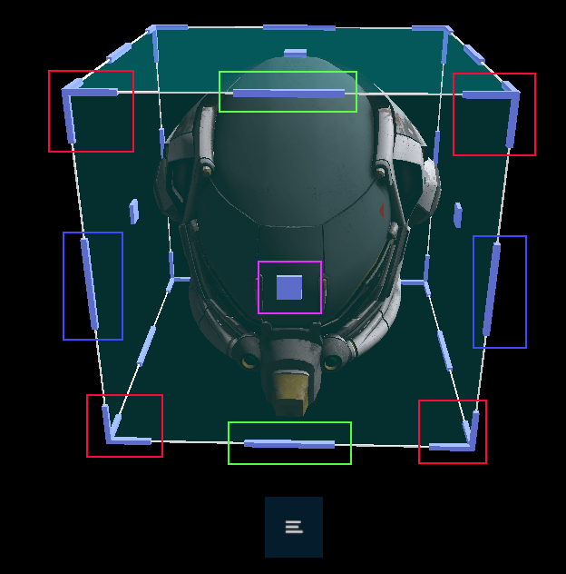

# Model Viewer module

---



Loading 3D models is one of the most common tasks in an XR experience. The Model Viewer module loads models from one or more repositories and places them in front of the user, surrounded by a bounding box that the user grabs to move, rotate, and scale them with near or far interaction. You can define any number of repositories, and each one can contain any number of models.

By default the module loads `.glb` and `.stl` files, through the Evergine GLB and STL runtimes.

| Property | Default | Description |
| --- | --- | --- |
| `Repositories` | `null` | Model repositories shown in the load window. |
| `NormalizedModelEnabled` | `true` | Scales every loaded model to the same size, ignoring its original scale. |
| `NormalizedModelSize` | `0.2` | Size, in meters, of the box that normalized models fit in. |
| `Loaders` | GLB and STL | Dictionary from file extension to the `ModelRuntime` that loads it. Add entries to support more formats. |
| `MaterialAssigner` | `null` | Function that creates the material for each `MaterialData` found in a model. Leave it `null` to use the runtime's default materials. |

Each `Repository` has these properties:

| Property | Description |
| --- | --- |
| `Name` | Name shown in the repository list of the load window. |
| `FileAccess` | Where the models are stored. See [Storage](../../storage.md). |

## Installation

This module is distributed as the **Evergine.Xrv.ModelViewer** [add-on](../../../index.md). Install it from **Project Settings > Add-Ons** in Evergine Studio.



Then register the module in your `XrvService`:

```csharp
using System;
using Evergine.Xrv.Core;
using Evergine.Xrv.Core.Storage;
using Evergine.Xrv.Core.Storage.Cache;
using Evergine.Xrv.ModelViewer;

var modelsFileAccess = AzureFileShareFileAccess.CreateFromUri(new Uri("https://<ACCOUNT>.file.core.windows.net/<share>?sv=..."));
modelsFileAccess.BaseDirectory = "models";

// Keeps downloaded models on disk, so they load faster the next time.
modelsFileAccess.Cache = new DiskCache("models");

var xrv = new XrvService()
    .AddModule(new ModelViewerModule
    {
        Repositories = new Repository[]
        {
            new Repository()
            {
                Name = "Remote sample models",
                FileAccess = modelsFileAccess,
            },
        },
        NormalizedModelEnabled = true,
        NormalizedModelSize = 0.2f,
    });
```

## Usage

- To open the model selection window, tap the  hand menu button.
- Select a repository and then a model from the **Models** list, and press **Load**.



### Manipulation

The bounding box shows manipulators to move, scale, and rotate the model.



Each color marks a kind of manipulation:

- **Red**: scale. Pinch a corner and drag to scale the model.
- **Green**: roll. Pinch the upper middle manipulator and drag to roll the model.
- **Blue**: pitch. Pinch a side middle manipulator and drag to pitch the model.
- **Pink**: stretch. Pinch the center manipulator and drag to stretch the model.

### Actions

Each model has a menu with more actions. Tap the  button to expand the list of available actions.

- : Locks the model, so it cannot be moved, rotated, or scaled until you unlock it.
- : Restores the original scale and orientation of the model. The position does not change.
- : Removes the model from the scene.

