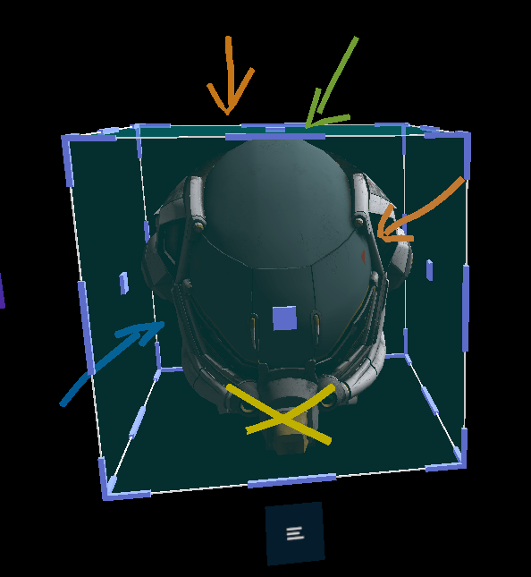
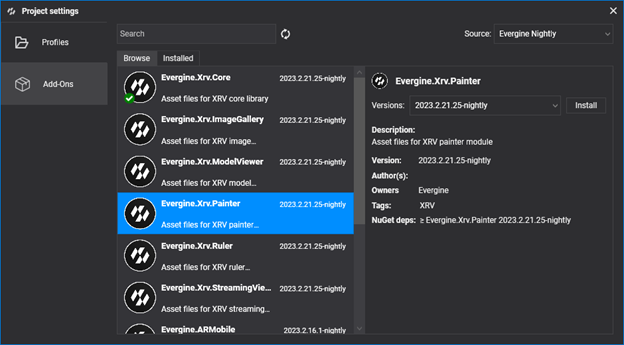
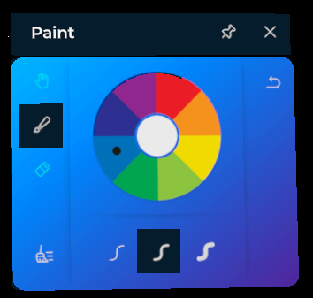

# Painter module

---

The Painter module draws 3D lines in space, with different colors and thicknesses. Use it to point out parts of a 3D model or of the real world to other people.



The user can draw with both hands at the same time, undo any drawing or erasing action, and remove all the lines at once.

## Installation

This module is distributed as the **Evergine.Xrv.Painter** [add-on](../../../index.md). Install it from **Project Settings > Add-Ons** in Evergine Studio.



Then register the module in your `XrvService`:

```csharp
using Evergine.Xrv.Core;
using Evergine.Xrv.Painter;

var xrv = new XrvService()
    .AddModule(new PainterModule());
```
## Usage

- To open the painter window, tap the  hand menu button.



> [!NOTE]
> Drawing or removing lines is only available while the painter window is open.

- Pick the current color in the color wheel. An indicator marks the active color.


- Pick the thickness for new lines:
    -  Thin.
    -  Medium.
    -  Thick.

- Choose the action of your hands, or undo and clear:
    -  : pinch and drag to draw a line.
    -  : pinch and drag over a line to erase it.
    -  : the hands do not draw or erase.
    -  : undoes the last action.
    -  : removes all the lines.