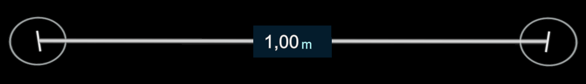
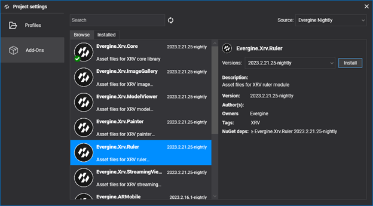

# Ruler module

---

The Ruler module measures distances in space. It shows a ruler with a handle at each end; when the user drags a handle, the ruler shows the distance between both ends.



## Installation

This module is distributed as the **Evergine.Xrv.Ruler** [add-on](../../../index.md). Install it from **Project Settings > Add-Ons** in Evergine Studio.



Then register the module in your `XrvService`:

```csharp
using Evergine.Xrv.Core;
using Evergine.Xrv.Ruler;

var xrv = new XrvService()
    .AddModule(new RulerModule());
```

## Usage

- The  hand menu button shows and hides the ruler.
- Drag the ends of the ruler to measure.
- Open the [settings window](../../settings_system.md) to switch the units between meters and feet.