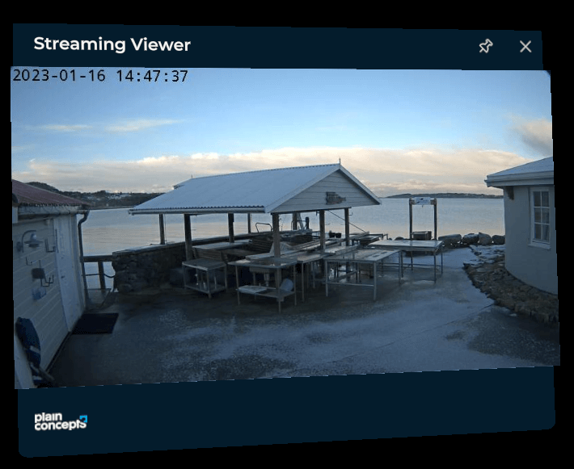
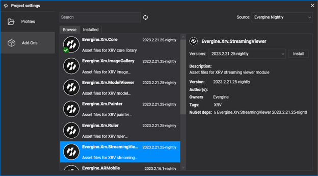

# Streaming Viewer module

---

The Streaming Viewer module shows a live video stream from an MJPEG source, such as an IP camera, in a window. MJPEG is the only supported protocol. The window takes the size of the images that the server sends, so it cannot be configured.



> [!NOTE]
> Each JPEG frame in the stream must include the `Content-Length` header.

| Property | Default | Description |
| --- | --- | --- |
| `SourceURL` | `null` | URL of the MJPEG stream. |

## Installation

This module is distributed as the **Evergine.Xrv.StreamingViewer** [add-on](../../../index.md). Install it from **Project Settings > Add-Ons** in Evergine Studio.



Then register the module in your `XrvService`, with the URL of the stream:

```csharp
using Evergine.Xrv.Core;
using Evergine.Xrv.StreamingViewer;

var xrv = new XrvService()
    .AddModule(new StreamingViewerModule
    {
        SourceURL = "http://<HOST>/video.mjpg",
    });
```

## Android devices

Android devices, such as Meta Quest and Pico, block clear-text (HTTP) traffic by default. If your stream is not served over HTTPS, allow the camera's domain or IP address in the network security configuration of your Android project. See the [Android documentation](https://developer.android.com/training/articles/security-config#CleartextTrafficPermitted) for details.

1. Add an XML file named `network_security_config.xml` to the `Resources/xml` folder of your Android project.

```xml
<?xml version="1.0" encoding="utf-8"?>
<network-security-config>
  <domain-config cleartextTrafficPermitted="true">
    <!-- Sample IP cameras for Streaming Viewer module -->
    <domain includeSubdomains="true">IP address or domain name</domain>
  </domain-config>
</network-security-config>
```

2. Reference it from the `application` element of the Android manifest with `android:networkSecurityConfig`.

```xml
<application android:allowBackup="true" android:icon="@mipmap/ic_launcher" android:label="@string/app_name" android:roundIcon="@mipmap/ic_launcher_round" android:supportsRtl="true" android:networkSecurityConfig="@xml/network_security_config">
  <!-- ... -->
</application>  
```

## Usage

- The  hand menu button opens the streaming window.