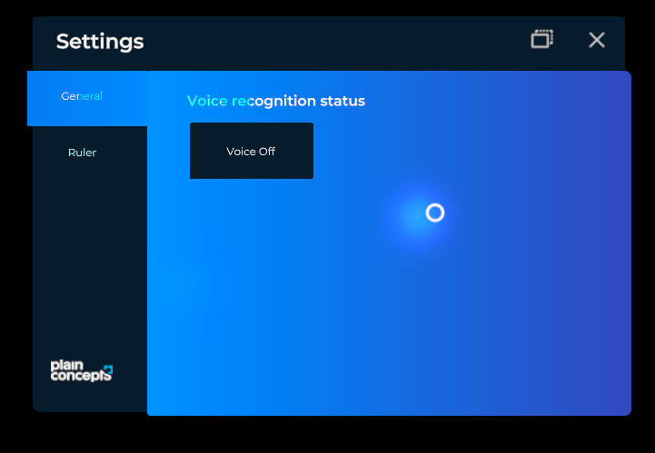

# Settings system

---



XRV includes a **Settings** window where your application and its modules show their options. The window opens from the  button of the hand menu. It always has a **General** tab with the options of the core library, such as turning voice commands on and off, and one extra tab for each module or piece of code that registers one.

The window is a `TabbedWindow`, so each section is a [tab item](ui/tabs_control.md#tab-items). There are two ways to add one.

## Add a settings tab to a module

Set the `Settings` property of your module in `Initialize`. XRV adds the tab when it initializes the module.

```csharp
using System.Collections.Generic;
using Evergine.Framework;
using Evergine.Xrv.Core.Modules;
using Evergine.Xrv.Core.UI.Buttons;
using Evergine.Xrv.Core.UI.Tabs;

public class MyModule : Module
{
    public override string Name => "My module";

    public override ButtonDescription HandMenuButton { get; protected set; }

    public override TabItem Help { get; protected set; }

    public override TabItem Settings { get; protected set; }

    public override IEnumerable<string> VoiceCommands => null;

    public override void Initialize(Scene scene)
    {
        this.Settings = new TabItem
        {
            Name = () => "My module",
            Contents = this.CreateSettingsContents,
        };
    }

    public override void Run(bool turnOn)
    {
    }

    private Entity CreateSettingsContents()
    {
        // Build or instantiate the entity with your settings controls.
        return new Entity();
    }
}
```

## Add a settings tab from code

Use the `Settings` property of `XrvService`, which returns the `SettingsSystem`:

```csharp
using Evergine.Framework;
using Evergine.Xrv.Core;
using Evergine.Xrv.Core.UI.Tabs;

public class NetworkSettings : Component
{
    [BindService]
    private XrvService xrvService = null;

    private TabItem item;

    protected override void Start()
    {
        base.Start();

        this.item = new TabItem
        {
            Order = 1,
            Name = () => "Network",
            Contents = () => new Entity(),
        };

        this.xrvService.Settings.AddTabItem(this.item);
    }

    protected override void OnDetached()
    {
        base.OnDetached();
        this.xrvService.Settings.RemoveTabItem(this.item);
    }
}
```

| `SettingsSystem` member | Description |
| --- | --- |
| `AddTabItem(TabItem item)` | Adds a tab to the settings window. |
| `RemoveTabItem(TabItem item)` | Removes a tab from the settings window. |
| `Window` | The `TabbedWindow` of the settings. Use it to open or close the window from code. |
