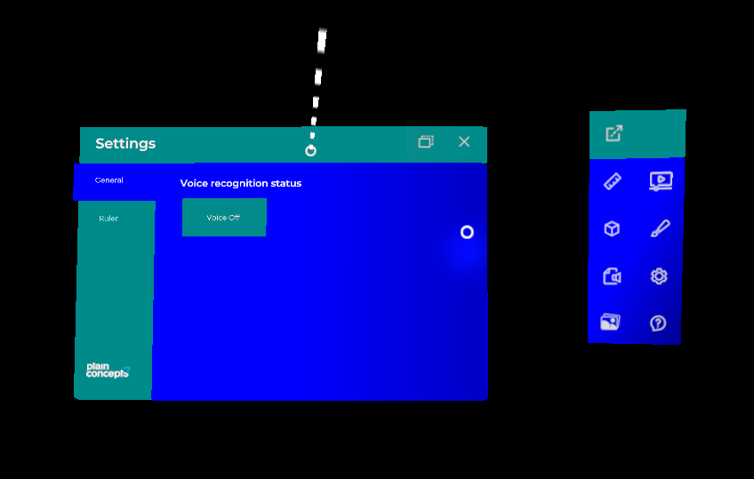
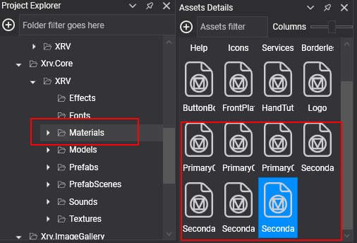
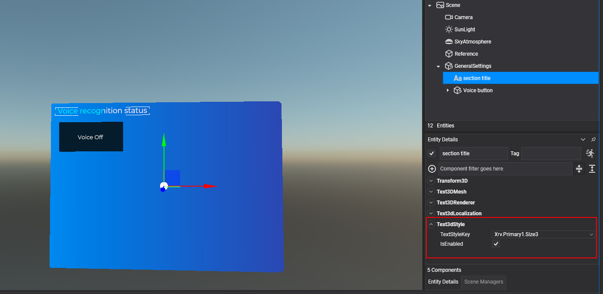

# Themes system

---



The themes system controls the look of an XRV application: a palette of colors, two fonts, and a set of shared text styles. XRV windows, buttons, and menus take their colors and fonts from the current theme, so changing one theme value restyles the whole application at runtime. Access it through `XrvService.ThemesSystem`. The types live in `Evergine.Xrv.Core.Themes` and `Evergine.Xrv.Core.Themes.Texts`.

## Theme colors

A theme defines its palette with generic color names:

| Color | Default | Used for |
| --- | --- | --- |
| `PrimaryColor1` | `#041C2C` | Window title bars, text of light buttons, and the background of selected list items. |
| `PrimaryColor2` | `#00B5F1` | Scroll bars. |
| `PrimaryColor3` | `#EBEBEB` | General texts and the active item of tab controls. |
| `SecondaryColor1` | `#70F2F8` | Inactive items of tab controls, back plate of some buttons, selection texts, and some manipulators. |
| `SecondaryColor2` | `#62CCD5` | Some manipulators. |
| `SecondaryColor3` | `#F10A42` | Back plate of the accept option in confirmation dialogs. |
| `SecondaryColor4` | `#0F72E8` | Start of the window front plate gradient, and the plate of dialog buttons. |
| `SecondaryColor5` | `#552098` | End of the window front plate gradient. |

XRV provides one material per theme color. The themes system changes these materials at runtime to match the theme, and because material instances are shared by every `MaterialComponent` that uses them, the change applies to the whole application. Use these materials in your own UI elements when you want them to follow the theme. Materials you create yourself are not modified.



## Change theme colors

`ThemesSystem.CurrentTheme` holds the active `Theme`. Change its colors, or assign a new `Theme` instance; a new instance starts with the XRV default values.

```csharp
using Evergine.Common.Graphics;

var theme = this.xrvService.ThemesSystem.CurrentTheme;
theme.PrimaryColor1 = Color.DarkCyan;
theme.SecondaryColor4 = Color.Blue;
theme.SecondaryColor5 = Color.DarkBlue;
```

This code produces the look shown at the top of this page. You can keep several `Theme` instances and switch between them by assigning `CurrentTheme`.

## Change theme fonts

Themes also define two fonts:

| Font | Default | Used for |
| --- | --- | --- |
| `PrimaryFont1` | Montserrat SemiBold | Window titles, buttons, section labels, and tab items. |
| `PrimaryFont2` | Montserrat Regular | Content texts, the hand menu, and window buttons. |

Add a font asset to your project and assign its ID:

```csharp
theme.PrimaryFont1 = EvergineContent.Fonts.MyCustomFont_ttf;
theme.PrimaryFont2 = EvergineContent.Fonts.MyCustomFont_ttf;
```

`EvergineContent.Fonts.MyCustomFont_ttf` stands for the ID of your font asset.

## Shared text styles

Text styles give your 3D texts a uniform look. A style defines a font, a scale, and a color, and you apply it to any number of texts by its key.

| `TextStyle` property | Type | Description |
| --- | --- | --- |
| `ThemeFont` | `ThemeFont?` | Theme font used by the style. |
| `Font` | `Guid?` | Font asset ID, used when `ThemeFont` is `null`. |
| `TextScale` | `float` | Scale of the text. |
| `ThemeColor` | `ThemeColor?` | Theme color used by the style. |
| `TextColor` | `Color?` | Explicit color, used when `ThemeColor` is `null`. |

Apply a style with these components, setting their `TextStyleKey`:

- `Text3dStyle`: applies a style to a `Text3DMesh`.
- `ButtonTextStyle`: applies a style to the text of a button with a `StandardButtonConfigurator`.
- `ToggleButtonTextStyle`: applies a style to one state of a `ToggleButton`. Set `TargetState` and add one component per state.

The components can also replace the style color: `OverrideThemeColor` with `ExplicitThemeColor` uses another theme color, and `OverrideColor` with `ExplicitColor` uses a fixed color.



XRV defines these styles. All of them use theme fonts and colors, and their keys are constants of `DefaultTextStyles`:

| Style key | Constant | Font | Scale | Color |
| --- | --- | --- | --- | --- |
| `Xrv.Primary1.Size1` | `XrvPrimary1Size1` | `PrimaryFont1` | 0.012 | `PrimaryColor3` |
| `Xrv.Primary1.Size2` | `XrvPrimary1Size2` | `PrimaryFont1` | 0.01 | `PrimaryColor3` |
| `Xrv.Primary1.Size3` | `XrvPrimary1Size3` | `PrimaryFont1` | 0.008 | `PrimaryColor3` |
| `Xrv.Primary2.Size1` | `XrvPrimary2Size1` | `PrimaryFont2` | 0.007 | `PrimaryColor3` |
| `Xrv.Primary2.Size2` | `XrvPrimary2Size2` | `PrimaryFont2` | 0.006 | `PrimaryColor3` |
| `Xrv.Primary2.Size3` | `XrvPrimary2Size3` | `PrimaryFont2` | 0.005 | `PrimaryColor3` |

> [!NOTE]
> Text styles are read when the application starts. Changing a style at runtime has no effect.

### Add or modify text styles

Implement `ITextStyleRegistration` to add styles or change the default ones. XRV finds every implementation in your assemblies at startup and calls its `Register` method with the dictionary of styles.

```csharp
using System.Collections.Generic;
using Evergine.Common.Graphics;
using Evergine.Xrv.Core.Themes;
using Evergine.Xrv.Core.Themes.Texts;

public class MyTextStylesRegistration : ITextStyleRegistration
{
    public void Register(Dictionary<string, TextStyle> registrations)
    {
        // Make the biggest default style a little bigger.
        if (registrations.TryGetValue(DefaultTextStyles.XrvPrimary1Size1, out var defaultStyle))
        {
            defaultStyle.TextScale = 0.015f;
        }

        // Add a style with a fixed color that does not follow the theme.
        registrations["RedStyle"] = new TextStyle
        {
            ThemeFont = ThemeFont.PrimaryFont1,
            TextScale = 0.013f,
            TextColor = Color.Red,
        };
    }
}
```

## React to theme changes

The themes system does not update your own materials, but it tells you when the theme changes. `ThemesSystem.ThemeUpdated` is raised with a `ThemeUpdatedEventArgs`:

| Property | Description |
| --- | --- |
| `Theme` | The theme that is being applied. |
| `UpdatedColor` | The color that changed, when a single color of the current theme changed. `null` when a new theme was assigned. |
| `IsNewThemeInstance` | `true` when a new theme instance was assigned to `CurrentTheme`. |

The following component tints a custom material when the theme changes:

```csharp
using Evergine.Framework;
using Evergine.Xrv.Core;
using Evergine.Xrv.Core.Themes;

public class ThemedHighlight : Component
{
    [BindService]
    private XrvService xrvService = null;

    private ThemesSystem Themes => this.xrvService.ThemesSystem;

    protected override bool OnAttached()
    {
        bool attached = base.OnAttached();
        if (attached)
        {
            this.Themes.ThemeUpdated += this.OnThemeUpdated;
        }

        return attached;
    }

    protected override void OnDetached()
    {
        base.OnDetached();
        this.Themes.ThemeUpdated -= this.OnThemeUpdated;
    }

    private void OnThemeUpdated(object sender, ThemeUpdatedEventArgs args)
    {
        if (args.IsNewThemeInstance || args.UpdatedColor == ThemeColor.PrimaryColor1)
        {
            var color = args.Theme.GetColor(ThemeColor.PrimaryColor1);
            // Apply the color to your own material here.
        }
    }
}
```
