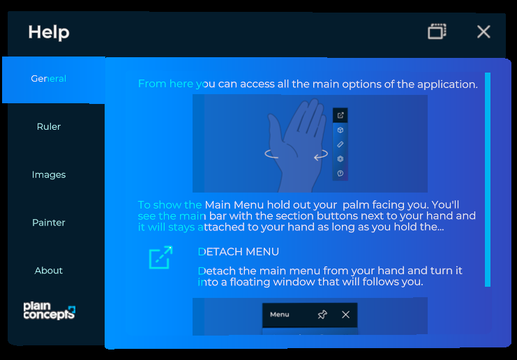

# Tabs control

---



The tabs control arranges content in tabbed panels: a row of tab buttons and a container that shows the content of the selected tab. XRV uses it in the settings and help windows, and you can use it in your own windows.

## Create a tab control

Build the control with `TabControl.Builder`, a `TabControlBuilder` that XRV creates when you call `XrvService.Initialize`. It returns an entity that you can add to the scene or use as window contents.

```csharp
using Evergine.Framework;
using Evergine.Mathematics;
using Evergine.Xrv.Core.UI.Tabs;

public class TabsSample : Component
{
    protected override void Start()
    {
        base.Start();

        Entity tabs = TabControl.Builder
            .Create()
            .WithSize(new Vector2(0.3f, 0.2f))
            .AddItem(new TabItem
            {
                Name = () => "General",
                Contents = this.CreateGeneralContents,
            })
            .AddItem(new TabItem
            {
                Name = () => "Advanced",
                Contents = this.CreateAdvancedContents,
            })
            .Build();

        this.Managers.EntityManager.Add(tabs);
    }

    private Entity CreateGeneralContents() => new Entity("General contents");

    private Entity CreateAdvancedContents() => new Entity("Advanced contents");
}
```

| `TabControlBuilder` method | Description |
| --- | --- |
| `Create()` | Starts a new tab control. |
| `WithSize(Vector2 size)` | Sets the size of the control. |
| `AddItem(TabItem item)` | Adds one tab. |
| `AddItems(IEnumerable<TabItem> items)` | Adds several tabs. |
| `WithActiveItemTextColor(Color color)` | Sets the text color of the selected tab. |
| `WithInactiveItemTextColor(Color color)` | Sets the text color of the other tabs. |
| `Build()` | Returns the entity of the tab control. |

If the tab control is the only content of a window, use the `TabbedWindow` class instead. The settings and help windows are tabbed windows, and their `Tabs` property gives you their list of tabs.

## TabControl properties

| Property | Default | Description |
| --- | --- | --- |
| `Size` | `(0.3, 0.2)` | Size of the control, in meters. |
| `Items` | empty | The tabs of the control. Add or remove `TabItem` objects to change them. |
| `SelectedItem` | | The selected tab. Setting it shows its content. |
| `MaxVisibleItems` | `null` | Maximum number of tab buttons shown at once. `null` shows all of them. |
| `DestroyContentOnTabChange` | `false` | Destroys the content of a tab when the user selects another one. Otherwise the content is kept and reused. |
| `OverrideThemeColors` | `false` | Uses `ActiveItemTextColor` and `InactiveItemTextColor` instead of the [theme](../themes.md) colors. |
| `ActiveItemTextColor` | | Text color of the selected tab when `OverrideThemeColors` is `true`. |
| `InactiveItemTextColor` | | Text color of the other tabs when `OverrideThemeColors` is `true`. |

The `SelectedItemChanged` event is raised when the selected tab changes. Its arguments include the new `Item`.

## Tab items

`TabItem` describes a tab and its content.

| Property | Type | Description |
| --- | --- | --- |
| `Name` | `Func<string>` | Returns the tab title. Using a function lets the title follow [localization](../localization.md) changes. |
| `Contents` | `Func<Entity>` | Returns the entity shown when the tab is selected. The control calls it when it needs the content. |
| `Order` | `int` | Position of the tab. Lower values come first. |
| `Data` | `object` | Any data you want to associate with the tab. |
| `Id` | `Guid` | Read-only. Unique identifier generated when the item is created. |
