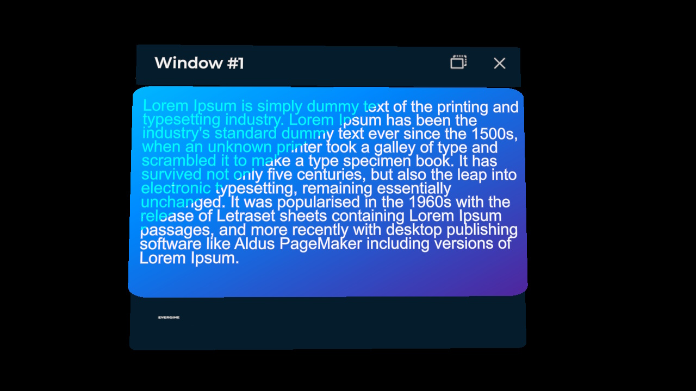
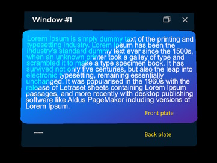
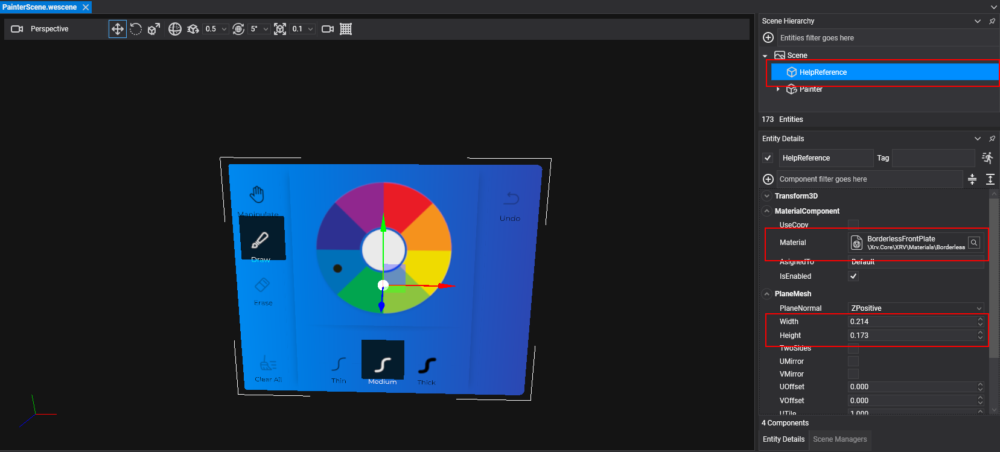
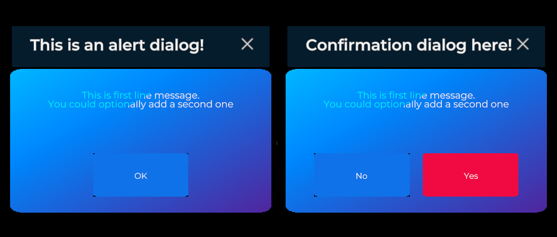

# Windows system

---



The windows system creates floating windows that the user can move, pin, or let follow them, and fills them with your own content. It also provides alert and confirmation dialogs, so you can inform the user or ask them to confirm an action and react to their choice. Access it through the `WindowsSystem` property of `XrvService`.

## Window interaction

Every window includes buttons in its title bar that change how it behaves:

-  **Follow mode**: the window follows the user and turns to face them. It stays between 0.4 m and 0.6 m away as the user moves.
-  **Pinned mode**: the window stays at its current position and orientation. The user can move and rotate it by pinching its title bar or its content.
-  **Close**: closes the window.

## Create and show a window

Call `CreateWindow` and set the options of the new window in the configuration callback. You can create as many windows as you need.

```csharp
using Evergine.Framework;
using Evergine.Mathematics;
using Evergine.Xrv.Core;

var xrv = Application.Current.Container.Resolve<XrvService>();
var window = xrv.WindowsSystem.CreateWindow(config =>
{
    config.Title = "Window #1";
    config.Size = new Vector2(0.3f, 0.2f);
});

// Shows the window, empty in this case, in front of the user.
window.Open();
```

`CreateWindow` adds the window entity to the scene. It also has an overload with an `out Entity` parameter, which gives you the window entity before the scene finishes loading, and an `addToScene` parameter to add it yourself later.

A window has three visual parts:

- **Title bar**: at the top, with the title and the action buttons.
- **Back plate**: uses the same material as the title bar and can show a logo.
- **Front plate**: drawn over the back plate, behind the window contents.



### Window properties

`CreateWindow` returns the `Window` component, which controls the behavior of the window.

| Property | Default | Description |
| --- | --- | --- |
| `AllowPin` | `true` | Shows the follow/pin toggle. Set it to `false` to keep the window in its current mode. |
| `EnableManipulation` | `true` | Lets the user move and rotate the window while it is pinned. |
| `PlaceInFrontOfUserWhenOpened` | `true` | Places the window in front of the user every time it opens. |
| `DistanceKey` | `null` | Key of the [distance](#window-distances) at which the window opens. `null` uses `Distances.MediumKey`. |
| `ShowCloseButton` | `true` | Shows the close button of the title bar. |
| `ExtraActionButtons` | empty | Extra buttons, described with `ButtonDescription`, for the title bar. |
| `AvailableActionSlots` | `3` | Number of extra buttons shown in the title bar. The rest go to a *more actions* menu, sorted by their `Order`. |
| `MoreActionsPlacement` | `BeforeFollowAndClose` | Where the *more actions* button goes: `BeforeFollowAndClose` or `BeforeActionButtons`. |
| `MoreActionsBehavior` | `HideAutomatically` | Whether the *more actions* panel closes after a selection (`HideAutomatically`) or stays open (`StayOpen`). |

| Method | Description |
| --- | --- |
| `Open()` | Opens the window, if it is not already open. |
| `Close()` | Closes the window. |

| Event | Description |
| --- | --- |
| `Opening`, `Opened` | Raised before and after the window opens. |
| `Closing`, `Closed` | Raised before and after the window closes. |
| `ActionButtonPressed` | Raised when the user presses one of the `ExtraActionButtons`. The arguments include the button `Description` and its toggle state `IsOn`. |

### Window configuration

The configuration callback receives the `WindowConfigurator` of the window, which controls its content and appearance.

| Property | Default | Description |
| --- | --- | --- |
| `Content` | `null` | Entity shown as the window contents, such as buttons, 3D text, or images. |
| `Title` | `null` | Fixed title text. |
| `LocalizedTitle` | `null` | Function that returns the title, for [localized](../localization.md) titles. |
| `Size` | `(0.35, 0.3)` | Width and height of the window, in meters. |
| `FrontPlateSize` | `(0, 0)` | Width and height of the front plate, in meters. |
| `FrontPlateOffsets` | `(0, 0)` | XY offset of the front plate relative to the back plate. |
| `DisplayFrontPlate` | `true` | Shows the front plate. |
| `DisplayBackPlate` | `true` | Shows the back plate. |
| `DisplayLogo` | `true` | Shows the logo on the back plate. |
| `LogoMaterial` | `null` | Material of the logo. `null` keeps the default XRV logo. |

### How-to: create a window with custom contents

Design the contents in a scene and save them as a prefab. To get the size right:

1. Create a scene for the window contents. You will save them as a prefab and load them into the window.
2. Add a plane that uses the _BorderlessFrontPlate_ material as a size guide.
3. Set the `PlaneMesh` width and height to the size you want for the window.
   
4. Lay out your contents over the guide.
5. Create a prefab from the contents entity, without the guide.
6. Create the window in code with the same size as the guide:

```csharp
using Evergine.Framework;
using Evergine.Framework.Prefabs;
using Evergine.Framework.Services;
using Evergine.Mathematics;
using Evergine.Xrv.Core;
using Evergine.Xrv.Core.UI.Windows;

public class CustomWindowOpener : Component
{
    [BindService]
    private XrvService xrvService = null;

    [BindService]
    private AssetsService assetsService = null;

    private Window window;

    protected override void Start()
    {
        base.Start();

        // Same size as the guide plane used to design the prefab.
        var contentsSize = new Vector2(0.214f, 0.173f);
        this.window = this.xrvService.WindowsSystem.CreateWindow(config =>
        {
            config.Size = contentsSize;
            config.FrontPlateSize = contentsSize;
            config.Content = this.assetsService.Load<Prefab>(EvergineContent.Prefabs.MyWindowContents_weprefab).Instantiate();
        });

        this.window.Open();
    }
}
```

`EvergineContent.Prefabs.MyWindowContents_weprefab` stands for the ID of your prefab.

## Built-in dialogs



XRV includes two dialogs:

- **Alert dialog** (`AlertDialog`): informs the user. It has a single accept button.
- **Confirmation dialog** (`ConfirmationDialog`): asks the user to confirm an action, such as removing a 3D model. It has cancel and accept buttons.

Only one dialog can be open at a time. If you open a dialog while another one is visible, XRV closes the first one, so the user always sees the latest prompt.

When a dialog closes, its `Result` property holds the key of the option the user pressed:

| Dialog | `Result` | When |
| --- | --- | --- |
| `AlertDialog` | `AlertDialog.AcceptKey` | The user pressed the accept button. |
| `ConfirmationDialog` | `ConfirmationDialog.AcceptKey` | The user pressed the accept button. |
| `ConfirmationDialog` | `ConfirmationDialog.CancelKey` | The user pressed the cancel button. |
| Both | `null` | The user pressed the close button, or your code opened another dialog. |

The following component shows both dialogs and checks the result when they close. It subscribes to `Closed` and unsubscribes in the handler, because a dialog closes only once.

```csharp
using System;
using Evergine.Framework;
using Evergine.Xrv.Core;
using Evergine.Xrv.Core.UI.Dialogs;
using Evergine.Xrv.Core.UI.Windows;

public class DialogsSample : Component
{
    [BindService]
    private XrvService xrvService = null;

    private WindowsSystem WindowsSystem => this.xrvService.WindowsSystem;

    public void ShowAlert()
    {
        var dialog = this.WindowsSystem.ShowAlertDialog("Alert title", "Sample content.", "OK");
        dialog.Closed += this.OnAlertClosed;
    }

    public void ShowConfirmation()
    {
        // The arguments are the title, the text, the cancel text and the accept text.
        var dialog = this.WindowsSystem.ShowConfirmationDialog("Remove model", "Do you want to remove this model?", "No", "Yes");
        dialog.Closed += this.OnConfirmationClosed;
    }

    private void OnAlertClosed(object sender, EventArgs e)
    {
        if (sender is AlertDialog dialog)
        {
            dialog.Closed -= this.OnAlertClosed;
        }
    }

    private void OnConfirmationClosed(object sender, EventArgs e)
    {
        if (sender is ConfirmationDialog dialog)
        {
            dialog.Closed -= this.OnConfirmationClosed;

            if (dialog.Result == ConfirmationDialog.AcceptKey)
            {
                // Run the action only when the user accepts.
            }
        }
    }
}
```

`ShowAlertDialog` and `ShowConfirmationDialog` also have overloads that take `Func<string>` arguments, for [localized](../localization.md) dialogs.

## Notifications

`ShowNotification(title, message)` shows a short notification to the user without blocking the interaction. An overload also takes the ID of an icon material.

## Windows system properties

| Property | Description |
| --- | --- |
| `AllWindows` | All the windows created by the system. |
| `Distances` | Predefined distances at which windows open. See below. |
| `OverrideIconMaterial` | Material for the logo of every window, so you do not have to set `LogoMaterial` on each one. |

### Window distances

XRV defines three distances that windows use when they open. You can change them or add your own.

| Key | Distance (meters) | Used by |
| --- | --- | --- |
| `Distances.NearKey` | 0.35 | Alert and confirmation dialogs. |
| `Distances.MediumKey` | 0.5 | Windows by default. |
| `Distances.FarKey` | 1 | Available for your own windows. |

Use `SetDistance` to change a distance or add a new key, and assign the key to a window:

```csharp
var windowsSystem = this.xrvService.WindowsSystem;

// Change an existing distance.
windowsSystem.Distances.SetDistance(Distances.NearKey, 0.45f);

// Add a new distance and use it in a window.
windowsSystem.Distances.SetDistance("custom", 0.7f);
window.DistanceKey = "custom";
```
