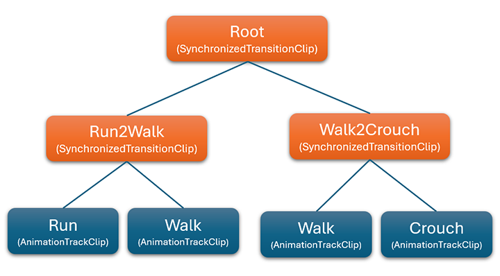

# Animation Blend Tree

<video autoplay loop muted width="100%" height="auto">
  <source src="images/AnimationTransition.mp4" type="video/mp4">
</video>

In complex animation systems, it is essential to blend multiple animations seamlessly based on various input conditions. Evergine allows the creation of an Animation Blend Tree system, which blends different animations based on parameters such as time (for transitions) or hierarchy. This results in smoother transitions between animations like walking, running, jumping, or transitioning between idle and action states.

## AnimationBlendClip
This class represents a node in the animation blending tree. It is an abstract class, so there are multiple node types, each with a specific behavior.

### Base properties
| Property | Description |
|------|-------------|
| **HierarchyMapping** | The hierarchy map object, that maps the model node with its intantiated entity in the scene.|
| **ListenKeyframeEvents** | If the blend clips launch keyframe events.|
| **GlobalStartTime** | The animation's global start time. |
| **Loop** | If the animation is looping.|
| **PlayTime** |The current time of the animation's execution.|
| **Frame** | The current frame of the animation. |
| **Phase** | the normalized time [0, 1], where 1 is the end of the animation clip.|
| **PlaybackRate** | _(1 by default)_ The speed factor of the playback.|


## Base methods
The most important method is:
```csharp
// Note the return type.
public abstract AnimationBlendClip UpdateClip();
```
The most important aspect of this method is that it returns an **AnimationBlendClip**. This allows you to change the type of the animation blend clip, enabling dynamic changes in behavior.

Now, let's explain the different types of **AnimationBlendClip**:

## AnimationTrackClip
The most important node. It simply plays the AnimationClip track from the asset model, passed as a constructor parameter.
When playing an animation from the model, the animation blend tree consists solely of this node.

## BinaryAnimationBlendClip
An abstract class that manages two different **AnimationBlendClips**. It contains two additional properties:

| Property | Description |
|----------|-------------|
| **ClipA** | _(Getter only, passed as a constructor parameter)_ The **AnimationBlendClip** of the "left" sub-node of the blending tree. |
| **ClipB** | _(Getter only, passed as a constructor parameter)_ The **AnimationBlendClip** of the "right" sub-node of the blending tree. |

It is up to the derived classes to specify how to handle these two **AnimationBlendClips**.

## TransitionClip
This **BinaryAnimationBlendClip** transitions from **ClipA** to **ClipB** during the duration of this animation clip. When the transition is finished, the `UpdateClip` method returns **ClipB**, finishing the transition.

## SynchronizedTransitionClip
This **BinaryAnimationBlendClip** also lerps between **ClipA** and **ClipB**, but it syncrhonizes the phase of the two animation blend clips, useful  for transitions between different character animations like running or walking. The **Lerp** of the transition is controlled by the user, instead of automatically being updated, like the previous clip.

## AdditiveBlendingClip
This **BinaryAnimationBlendClip** adds **ClipB** animation blend clip on top of **ClipA**, using a specific **Lerp** controlled by the user. This is useful when each animation changes different parts of the model. For example we can have an "walk" animation and a "carry a candle" animation.


## Sample
The next sample we will blend the animation of a character between 'crouch', 'walk' and 'run' animations.

To do that, we will create the following blend tree:



```csharp

// First we load the three AnimationTrackClips of the base animations.
var crouchTrack = new AnimationTrackClip(model.Animations["crouch"], looping: true);
var walkTrack = new AnimationTrackClip(model.Animations["walk"], looping: true);
var runTrack = new AnimationTrackClip(model.Animations["run"], looping: true);

// Because we want to blend 3 animations, we have to create a  2 level tree of SynchronizedTransitionClip and some leaves for the AnimationTrackClip.
var crouch2WalkClip = new SynchronizedTransitionClip(chrouchTrack, walkTrack);
var walk2RunClip = new SynchronizedTransitionClip(walkTrack, runTrack);
var rootClip = new SynchronizedTransitionClip(crouch2WalkClip, walk2RunClip);

// We finally can play this animation.
animation3DComponenet.PlayAnimation(rootClip);

``` 