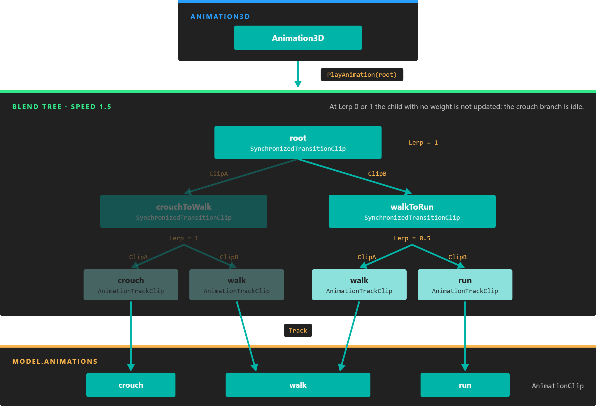

# Animation Blend Tree

<video autoplay loop muted playsinline width="100%" height="auto">
  <source src="images/AnimationTransition.mp4" type="video/mp4">
</video>

A blend tree combines several [animation clips](animation_clip.md) into one pose. The leaves of the tree play clips of the model, and every node above them blends the poses of its two children: a crossfade from walk to run, a blend between walk and run driven by the character's speed, or a small additive motion on top of a cycle.

`Animation3D` plays the root of the tree like any other clip, and [animation layers](#animation-layers) let you play several trees at once, for example one for the legs and one for the arms.

## How a blend tree works

Every node is an `AnimationBlendClip`. An `AnimationTrackClip` samples one `AnimationClip` of the model; a `BinaryAnimationBlendClip` owns two child clips, `ClipA` and `ClipB`, and combines their samples. Each update, `Animation3D` calls `UpdateClip()` on the root, the call travels down to the leaves, and the blended pose travels back up and is written to the entities of the model.



*The tree built in the [speed blend example](#example-blend-crouch-walk-and-run-by-speed). The `Lerp` of each node chooses how much of each child reaches its parent; only the leaves read clip data.*

| Clip | Children | What it does |
| --- | --- | --- |
| [`AnimationTrackClip`](#animationtrackclip) | none | Plays one `AnimationClip`, or a time range of it. |
| [`DummyTrackClip`](#dummytrackclip) | none | Plays nothing. A placeholder leaf. |
| [`TransitionClip`](#transitionclip) | two | Fades from `ClipA` to `ClipB` over a fixed time, then becomes `ClipB`. |
| [`SynchronizedTransitionClip`](#synchronizedtransitionclip) | two | Blends `ClipA` and `ClipB` by a weight you control, keeping both at the same phase. |
| [`AdditiveBlendingClip`](#additiveblendingclip) | two | Adds the motion of `ClipB` on top of `ClipA`. |

All these types are in the `Evergine.Components.Animation` namespace.

## AnimationBlendClip

The abstract base of every node. What each property means for a particular node depends on its type: a `TransitionClip`, for example, reports the duration of the clip it fades to.

| Property | Default | Description |
| --- | --- | --- |
| **State** | `Playing` | `Playing` or `Stopped`. Change it with `Play()` and `Pause()`. |
| **Loop** | | Whether the clip restarts when it ends. |
| **PlaybackRate** | 1 | Speed factor. A negative value plays backwards. |
| **PlayTime** | 0 | Current time in seconds. |
| **Phase** | 0 | `PlayTime` divided by `Duration`: 0 at the start of the clip, 1 at its end. Setting it seeks. |
| **Duration** | | Length of the clip in seconds. |
| **Framerate** | | Frames per second of the clip. 0 for clips loaded from a model asset. |
| **Frame** | 0 | `PlayTime` in frames. |
| **StartAnimationTime** / **EndAnimationTime** | | The time range that plays, in seconds. |
| **GlobalStartTime** | | The application time at which the clip would have started to reach its current `PlayTime`. |
| **ListenKeyframeEvents** | true | Whether this clip raises [keyframe events](#keyframe-events-in-a-blend-tree). |
| **HierarchyMapping** | null | The map from model nodes to entities. `Animation3D` sets it when it plays the clip. |
| **Sample** | | The pose computed in the last update. |
| **UpdateRequired** | | Whether the clip needs an update: it is playing, or its `PlayTime` was set. |

| Method | Description |
| --- | --- |
| **Play()** | Sets `State` to `Playing`. |
| **Pause()** | Sets `State` to `Stopped`. The clip keeps its time. |
| **UpdateClip()** | Advances the clip, computes its `Sample` and returns the clip to use from now on: itself, or, for a finished `TransitionClip`, its `ClipB`. |

> [!NOTE]
> A clip object can be played by one `Animation3D` only, and should appear only once in a tree: each clip keeps its own time and sample. To use the same `AnimationClip` in two places, create two `AnimationTrackClip` objects.

## AnimationTrackClip

The leaf that reads a clip of the model. `Animation3D.PlayAnimation(name)` builds one for you; build it yourself to put a clip into a tree.

```csharp
AnimationClip walk = this.animation3D.Model.Animations["walk"];

// looping is false by default here, unlike PlayAnimation, where loop defaults to true.
var walkClip = new AnimationTrackClip(walk, looping: true);

// Only the range between seconds 0.5 and 1.5, at half speed.
var partialClip = new AnimationTrackClip(walk, looping: true, playbackRate: 0.5f, startTime: 0.5f, endTime: 1.5f);
```

| Constructor parameter | Default | Description |
| --- | --- | --- |
| **track** | | The `AnimationClip` to play. |
| **looping** | false | Whether it restarts when it ends. |
| **playbackRate** | 1 | Speed factor. |
| **startTime** / **endTime** | null | The range to play, in seconds. Null means the start and the end of the clip. |

`Track` returns the `AnimationClip`, and `UpdateAnimationRange(startTime, endTime)` changes the range while it plays.

## DummyTrackClip

A leaf with no data: it has no duration and writes nothing. Use it where a tree needs a child but there is nothing to play yet.

## BinaryAnimationBlendClip

The abstract base of the nodes with two children. The children are passed to the constructor and cannot be changed afterwards.

| Property | Default | Description |
| --- | --- | --- |
| **ClipA** | | The first child. |
| **ClipB** | | The second child. |
| **ListenAnimationThreshold** | 0 | Minimum weight a child needs for its keyframe events to be raised. See [Keyframe events in a blend tree](#keyframe-events-in-a-blend-tree). |

## TransitionClip

Fades from `ClipA` to `ClipB` over a fixed time. Both children play during the fade; when it ends, `UpdateClip()` returns `ClipB`. This is the clip that `Animation3D.PlayAnimation` builds when you pass a `transitionTime`.

```csharp
new TransitionClip(clipA, clipB, duration: 0.3f, playbackRate: 1, smoothTransition: false)
```

| Constructor parameter | Default | Description |
| --- | --- | --- |
| **clipA** | | The clip to fade from, usually what is playing now (`Animation3D.Clip`). |
| **clipB** | | The clip to fade to. |
| **duration** | | Length of the fade, in seconds. |
| **playbackRate** | 1 | Speed of the fade itself. 2 finishes it in half the `duration`. |
| **smoothTransition** | false | Eases the weight in and out (a smoothstep) instead of changing it linearly. |

`Loop`, `PlayTime`, `Duration`, `PlaybackRate` and the time range of a `TransitionClip` are those of `ClipB`, so `Animation3D` reports the new clip as soon as the fade starts.

### Example: crossfade from walk to run

This behavior fades between a walk and a run whenever `Run` changes. It keeps its own two `AnimationTrackClip` objects and always fades from the clip it faded to last, so the tree is never more than one transition deep, however many times the character switches.

```csharp
using System;
using Evergine.Components.Animation;
using Evergine.Framework;

public class WalkRunCrossfade : Behavior
{
    [BindComponent]
    private Animation3D animation3D = null;

    private AnimationTrackClip walk;
    private AnimationTrackClip run;
    private AnimationTrackClip current;

    // Set by your input or AI code.
    public bool Run { get; set; }

    protected override void Start()
    {
        base.Start();

        var animations = this.animation3D.Model.Animations;
        this.walk = new AnimationTrackClip(animations["walk"], looping: true);
        this.run = new AnimationTrackClip(animations["run"], looping: true);

        this.current = this.walk;
        this.animation3D.PlayAnimation(this.walk);
    }

    protected override void Update(TimeSpan gameTime)
    {
        AnimationTrackClip next = this.Run ? this.run : this.walk;
        if (next == this.current)
        {
            return;
        }

        // Both cycles start on the same foot, so starting the new one at the same phase
        // keeps the steps roughly in time during the fade.
        next.Phase = this.current.Phase;

        // No transitionTime here: the TransitionClip replaces the first layer as it is,
        // instead of being wrapped around the previous one.
        this.animation3D.PlayAnimation(new TransitionClip(this.current, next, duration: 0.3f, smoothTransition: true));
        this.current = next;
    }
}
```

## SynchronizedTransitionClip

Blends `ClipA` and `ClipB` by a weight, `Lerp`, that you set every frame. Before each update it sets both children to the same `Phase`, so two cycles of different length stay in step: the left foot of the walk lands together with the left foot of the run, and the blend never crosses its legs. That makes it the node for locomotion driven by a continuous value such as speed.

```csharp
new SynchronizedTransitionClip(clipA, clipB, loop: true, playbackRate: 1)
```

| Property | Default | Description |
| --- | --- | --- |
| **Lerp** | 0 | Weight of `ClipB`, clamped to [0, 1]. At 0 only `ClipA` plays, at 1 only `ClipB`. At exactly 0 or 1, the child with no weight is not updated at all. |
| **Loop** | true | Applied to both children. |
| **PlaybackRate** | 1 | Applied to both children. |
| **Duration** | | The durations of the children blended by `Lerp`, so the cycle stretches smoothly from one length to the other. |

### Example: blend crouch, walk and run by speed

A `SynchronizedTransitionClip` blends two clips, so three clips need two levels: one node blends crouch and walk, another walk and run, and the root chooses between them. This is the tree in the diagram at the top of the page.

```csharp
using System;
using Evergine.Components.Animation;
using Evergine.Framework;
using Evergine.Mathematics;

public class LocomotionBlend : Behavior
{
    [BindComponent]
    private Animation3D animation3D = null;

    private SynchronizedTransitionClip root;
    private SynchronizedTransitionClip crouchToWalk;
    private SynchronizedTransitionClip walkToRun;

    // 0 is crouching, 1 walking and 2 running. Set it from the character's speed.
    public float Speed { get; set; } = 1;

    protected override void Start()
    {
        base.Start();

        var animations = this.animation3D.Model.Animations;

        // Walk appears in both branches, and each branch needs its own clip object.
        var crouch = new AnimationTrackClip(animations["crouch"], looping: true);
        var walkSlow = new AnimationTrackClip(animations["walk"], looping: true);
        var walkFast = new AnimationTrackClip(animations["walk"], looping: true);
        var run = new AnimationTrackClip(animations["run"], looping: true);

        this.crouchToWalk = new SynchronizedTransitionClip(crouch, walkSlow);
        this.walkToRun = new SynchronizedTransitionClip(walkFast, run);
        this.root = new SynchronizedTransitionClip(this.crouchToWalk, this.walkToRun);

        this.animation3D.PlayAnimation(this.root);
    }

    protected override void Update(TimeSpan gameTime)
    {
        float speed = MathHelper.Clamp(this.Speed, 0, 2);

        // The root only picks a branch. Both branches are pure walk at speed 1,
        // so switching there does not change the pose.
        this.root.Lerp = speed <= 1 ? 0 : 1;

        // Lerp is clamped, so the branch that is not in use simply saturates.
        this.crouchToWalk.Lerp = speed;
        this.walkToRun.Lerp = speed - 1;
    }
}
```

<!-- CAPTURE: images/locomotion_blend.mp4; short loop (6-10 s) of an animated character driven by the LocomotionBlend behavior, with Speed swept from 0 to 2 and back, showing crouch, walk and run blending without foot crossing; overlay or caption with the current Speed value -->

## AdditiveBlendingClip

Adds the motion of `ClipB` on top of `ClipA`: `ClipB` positions are added to those of `ClipA`, and `ClipB` rotations are combined with those of `ClipA`. The time, duration and loop of the node are those of `ClipA`.

`ClipB` must therefore hold **offsets from a rest pose**, not a full pose: a difference clip, such as a breathing or recoil motion authored as offsets, or a clip converted with `AnimationClip.SubstractSample`. Adding a full pose to another would apply every bone's rotation twice. To replace part of the body with another clip instead, use an [animation layer](#animation-layers).

```csharp
var animations = this.animation3D.Model.Animations;
var walk = new AnimationTrackClip(animations["walk"], looping: true);
var breathe = new AnimationTrackClip(animations["breathe_offsets"], looping: true);

// Set BlendFactor as a property: see the note below.
var clip = new AdditiveBlendingClip(walk, breathe, loop: true) { BlendFactor = 0.5f };

this.animation3D.PlayAnimation(clip);
```

| Property | Default | Description |
| --- | --- | --- |
| **BlendFactor** | 1 | How much of `ClipB` is added. 0 plays `ClipA` alone and does not update `ClipB`. |
| **Loop** | true | Applied to `ClipA`. |

> [!IMPORTANT]
> On the current engine version the `blendFactor` argument of the constructor is ignored and `BlendFactor` always starts at 1. Set the property after construction, as in the example.

## Keyframe events in a blend tree

Every clip in a tree can raise the [keyframe events](animation_clip.md#keyframe-events) of the clip it plays, and `Animation3D.OnKeyFrameEvent` receives all of them. During a blend that often means twice as many events as you want: a crossfade from walk to run raises the footsteps of both.

Two settings choose which clips are heard:

- **ListenKeyframeEvents** on any clip. Set it to `false` and that clip raises no events.
- **ListenAnimationThreshold** on a `BinaryAnimationBlendClip`. A child raises events only while its weight reaches the threshold. In a transition the weights are `1 - w` for `ClipA` and `w` for `ClipB`, where `w` is the progress of a `TransitionClip` or the `Lerp` of a `SynchronizedTransitionClip`; in an `AdditiveBlendingClip`, `ClipA` always raises its events and `ClipB` only while `BlendFactor` is above the threshold.

```csharp
// Only the clip that dominates the blend plays its footsteps.
var transition = new TransitionClip(this.current, next, duration: 0.3f)
{
    ListenAnimationThreshold = 0.5f,
};
```

## Animation layers

A blend tree produces one pose. Animation layers play several poses at once: `Animation3D` keeps a list of layers, each one an `AnimationBlendClip` (a single clip or a whole tree), and applies them in order every update.


*Layers do not blend: each one writes the properties it animates, and the last write wins. A layer with only upper-body channels leaves the legs to the layers before it.*

- The first layer is the one `PlayAnimation` starts and replaces, and the one `Animation3D.Clip`, `Loop`, `PlaybackRate` and `PlayTime` refer to.
- `AddAnimationLayer(clip)` adds a layer at the end of the list: it is applied after, and so over, the layers already there. Start the first layer with `PlayAnimation` before adding others: on an empty list, `AddAnimationLayer` creates the first layer, and the next `PlayAnimation` replaces it.
- `RemoveAnimationLayer(clip)` takes it out. From the next update, the nodes it animated follow the layers below it again, if those animate them.
- Each layer keeps its own time. Control it through the clip object you added: `Pause()`, `Play()`, `PlayTime`, `PlaybackRate`.

There is no animation state machine in Evergine. The usual transitions of one are a `TransitionClip` in a layer, and the conditions that trigger them are ordinary code in a `Behavior`, as in the [crossfade example](#example-crossfade-from-walk-to-run).

### Example: an upper-body layer

The walk keeps playing on the first layer. A second layer plays the wave clip, but only its channels for the spine and everything below it in the skeleton, so the arms and head wave and the legs keep walking.

```csharp
using System;
using System.Collections.Generic;
using Evergine.Components.Animation;
using Evergine.Framework;
using Evergine.Framework.Animation;
using Evergine.Framework.Graphics;

public class UpperBodyWave : Component
{
    [BindComponent]
    private Animation3D animation3D = null;

    private AnimationTrackClip waveLayer;

    // The first bone of the upper body. This name comes from a Mixamo skeleton.
    public string UpperBodyRoot { get; set; } = "mixamorig:Spine1";

    protected override void Start()
    {
        base.Start();

        Model model = this.animation3D.Model;

        // First layer: the whole body walks.
        this.animation3D.PlayAnimation("walk");

        // Collect the upper body: the root bone and all its descendants.
        int upperBodyRoot = Array.FindIndex(model.AllNodes, node => node.Name == this.UpperBodyRoot);
        if (upperBodyRoot < 0)
        {
            throw new InvalidOperationException($"The model has no node named {this.UpperBodyRoot}.");
        }

        var upperBody = new HashSet<int>();
        var pending = new Stack<int>();
        pending.Push(upperBodyRoot);
        while (pending.Count > 0)
        {
            int index = pending.Pop();
            upperBody.Add(index);

            foreach (int child in model.AllNodes[index].ChildIndices ?? Array.Empty<int>())
            {
                pending.Push(child);
            }
        }

        // A new clip with only the upper-body channels of the wave. The channels are new,
        // but they share the curves of the original: the keyframes are not copied.
        AnimationClip wave = model.Animations["wave"];
        var upperBodyWave = new AnimationClip()
        {
            Name = "wave_upper_body",
            Duration = wave.Duration,
            Framerate = wave.Framerate,
        };

        foreach (AnimationChannel channel in wave.Channels)
        {
            if (upperBody.Contains(channel.NodeIndex))
            {
                upperBodyWave.AddChannel(new AnimationChannel()
                {
                    NodeIndex = channel.NodeIndex,
                    ComponentType = channel.ComponentType,
                    PropertyName = channel.PropertyName,
                    Duration = channel.Duration,
                    Curve = channel.Curve,
                });
            }
        }

        // Second layer: applied after the walk, so it wins on the bones it animates.
        this.waveLayer = new AnimationTrackClip(upperBodyWave, looping: true);
        this.animation3D.AddAnimationLayer(this.waveLayer);
    }

    public void StopWaving()
    {
        // The walk writes the arms again on the next update.
        this.animation3D.RemoveAnimationLayer(this.waveLayer);
    }
}
```

> [!TIP]
> Use the [clip inspector example](animation_clip.md#example-inspect-a-clip) to list the node names of your model and pick the bone where the upper body starts.

> [!NOTE]
> Build the channels as shown instead of calling `AnimationChannel.Clone()`: on the current engine version a cloned curve loses its start and end times and always returns its last keyframe.
