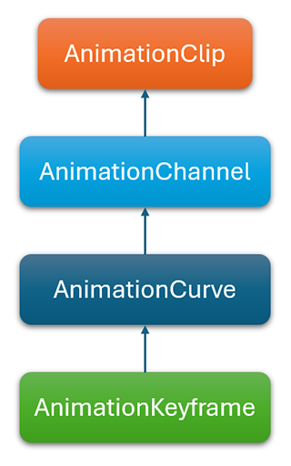

# Animation Clip

<video autoplay loop muted width="100%" height="auto">
  <source src="images/AnimationSample.mp4" type="video/mp4">
</video>

The **AnimationClip** class is the base class for animations. It holds the information of a specific track in a **[Model](../graphics/models/index.md)** asset. It is designed to manage a sequence of keyframes that define the transformation (such as position, rotation, scale) or other animated properties (morphing weights) of the model. These keyframes are interpolated over time to create smooth and dynamic movement.
This class is the foundation of the animation system, because it's the core of the **[Animation Blend Tree](animation_blend_tree.md)**

## Structure

The base structure of the **AnimationClip** is explained in this graph.

- **AnimationClip**: Main class that contains a list of **AnimationChannels**.
- **AnimationChannel**: Defines the **target** of the animation and contains an **AnimationCurve**.
- **AnimationCurve**: Define the sampling information of the specific property animation, containing the keyframes.

### AnimationClip Properties
It has the following information:

| Property | Description |
|------|-------------|
| **Name** | The name of the **AnimationClip**. |
| **Channels** | The list of **AnimationChannel** objects. |
| **RootMotionPositionChannel** | The channel that controls the main model's position, among all the channels.|
| **RootMotionRotationChannel** | The channel that controls the main model's rotation, among all the channels.|
| **RootMotionNodeIndex** |The index of the model's root node.|
| **Duration** | The duration of the animation **in seconds**.|
| **Framerate** | The frames per second that the animation has been sampled.|
| **InPlaceMode** | Indicates how the center of the model is handled. Useful when the model's animation displaces it around the scene but we want to control it. Has the following values: <li>**None.** *(default)* The animation is not centered.</li><li>**CenterOnlyPosition**. The positions is centered.</li><li>**CenterOnlyRotation**. The rotation is centered.</li><li>**Center**. Both position and rotation are centered.</li>|

## AnimationChannel
Each channel defines the target of the animation. This target usually refers to a node, using the index of this node, and to name of the animated property. The animated properties usually are "LocalPosition", "LocalRotation" or "LocalScale", affecting the local transform of the node. The channel also refers to an **AnimationCurve**, which summarizes the actual animation data.

### Properties

| Property | Description |
|------|-------------|
| **NodeIndex** | The index of the node among the **Model** nodel hierarchy.|
| **ComponentType** | The target component type of the animation channel.|
| **PropertyName** | The target property of this animation channel.|
| **Duration** | Duration (in seconds) of the animation.|
| **Curve** | **AnimationCurve** for this channel.|

## AnimationCurve
This class represents how the value of the channel  proerty changes over time, and it's made of keyframes containing the **time** and **value** of the curve at a specific moment in time. It's an abstract class, which specific type depends of the type of the channel's property:

- AnimationCurveFloat.
- AnimationCurveFloatArray.
- AnimationCurveQuaterion.
- AnimationCurveVector2.
- AnimationCurveVector3.
- AnimationCurveVector4.

Every frame, the curve calculates its value interpolating the keyframes. 

### Properties

| Property | Description |
|------|------------- |
| **KeyCount** | The number of keyframes. |
| **StartTime** | The start time of the curve. This is used because not every animation channel animates the property during the animation, only during a specific range|
| **EndTime** | The end time of the curve. |
| **Keyframes** | Array of the different keyframes of the curve.|
| **DefaultValue** | The base value, used for additive blending. Loot at **[this section](animation_blend_tree.md)** for more information. |

## AnimationKeyframe
The keyframe represents the animation state at a specific moment. It contains only two parameters:
- **Time:** The time of the keyframe, in seconds.
- **Value:** The value of that speficic channel's curve.