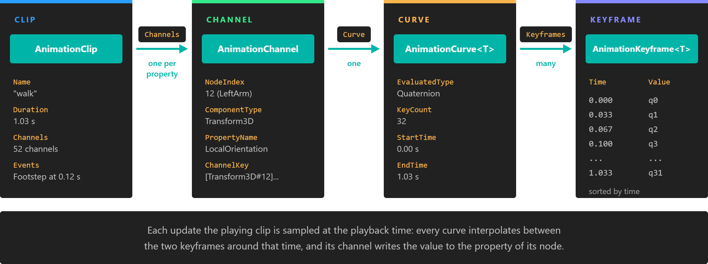

# Animation Clip

<video autoplay loop muted playsinline width="100%" height="auto">
  <source src="images/AnimationSample.mp4" type="video/mp4">
</video>

An `AnimationClip` is one animation track of a [Model](../graphics/models/index.md) asset: a walk, a jump, a door opening. It stores, for every animated node, how a property of that node changes over time as a list of keyframes, plus the keyframe events that fire while the clip plays.

You rarely create clips yourself. The model importer builds them from the animations in the source file, and the [Animation3D](animation3d_component.md) component plays them by name. Reading a clip is useful when you need its duration, want to inspect or react to its keyframe events, or build a new clip from part of an existing one.

## Where clips come from

Every animated model asset exposes its clips in `Model.Animations`, a dictionary keyed by clip name. The names are the ones shown in the [Model Editor](../graphics/models/model_editor.md), and they are the names you pass to `Animation3D.PlayAnimation`.

<!-- CAPTURE: images/model_editor_animation_clips.png; Model Editor in Evergine Studio with an animated character (Mixamo), showing the list of animation clips in the properties panel, one clip selected with its keyframe events, and the playback timeline at mid-clip -->

```csharp
using Evergine.Components.Animation;
using Evergine.Framework;
using Evergine.Framework.Animation;

public class ClipLookup : Component
{
    // Instantiating an animated model adds Animation3D to the root entity.
    [BindComponent]
    private Animation3D animation3D = null;

    protected override void Start()
    {
        base.Start();

        // The clips live in the Model asset, so every entity that uses this model shares them.
        AnimationClip walk = this.animation3D.Model.Animations["walk"];
        float seconds = walk.Duration;
    }
}
```

## Structure



*A clip is a set of channels. Each channel animates one property of one node through a curve, and the curve is interpolated between its keyframes.*

- **AnimationClip**: the track. It owns the channels and the keyframe events.
- **AnimationChannel**: the target. It names a node of the model and a property of a component on that node.
- **AnimationCurve**: the data. It holds the keyframes of that property and interpolates between them.
- **AnimationKeyframe**: one value of the property at one moment.

## AnimationClip

| Property | Default | Description |
| --- | --- | --- |
| **Name** | | The clip name. It is also the key of the clip in `Model.Animations`. |
| **Duration** | | Length of the clip in seconds. |
| **Framerate** | 0 | Frames per second the clip was sampled at. Used to convert between seconds and frames. |
| **Channels** | empty | The `AnimationChannel` list. |
| **ChannelsByKey** | empty | The same channels indexed by their `ChannelKey`, for example `[Transform3D#12].LocalOrientation`. `AddChannel` ignores a channel whose key is already present. |
| **Events** | empty | The keyframe events of the clip, as a `SortedList<float, AnimationKeyframeEvent>` keyed by time. See [Keyframe events](#keyframe-events). |
| **Type** | `Default` | An `AnimationClipType`: `Default` for an ordinary clip, `Difference` for a clip that stores offsets from a reference pose, which is what an [additive blend](animation_blend_tree.md#additiveblendingclip) needs. |
| **InPlaceMode** | `None` | An `AnimationInPlaceMode` that removes the root node's travel from the clip: `None`, `CenterOnlyPosition`, `CenterOnlyRotation` or `Center` (both). `ComputeRootMotion` uses it to build the root motion channels. |
| **RootMotionNodeIndex** | 0 | Index in `Model.AllNodes` of the node whose motion is extracted as root motion. |
| **RootMotionPositionChannel** | null | Channel with the position that `ComputeRootMotion` extracted from the root node. `Animation3D` applies it to the entity when `ApplyRootMotion` is set. |
| **RootMotionRotationChannel** | null | The same for rotation. |
| **IsInitialized** | false | Whether `Initialize()` has resolved the property updaters of the channels. Playing the clip initializes it. |

> [!IMPORTANT]
> On the current engine version the model loader fills `Name`, `Duration`, `Channels` and `Events`, but not `Framerate`, `Type`, `InPlaceMode` or the root motion channels. Clips read from a model asset therefore report a `Framerate` of 0, so anything expressed in frames returns 0 for them: work in seconds. `Type` is always `Default` and there is no root motion to apply. The [Ragdolls](../physics/ragdolls.md) page shows how to remove the root translation of a clip at run time.

| Method | Description |
| --- | --- |
| **AddChannel(AnimationChannel)** | Adds a channel and sets its `Track` to this clip. |
| **RemoveChannel(AnimationChannel)** | Removes a channel. Returns `false` if it was not in the clip. |
| **GetSubAnimation(name, startTime, endTime)** | Returns a new clip with the keyframes between two times, in seconds, shifted to start at 0. The range is clamped to the clip. |
| **GetSample(time, sample, ...)** | Evaluates every channel at a time and writes the values into an `AnimationSample`. The blend clips call it; you do not need to. |
| **ComputeRootMotion(Matrix4x4)** | Moves the root node's travel, as selected by `InPlaceMode`, into the root motion channels. |
| **SubstractSample(AnimationSample)** | Subtracts a reference pose from every channel, which turns the clip into a difference clip. |

> [!NOTE]
> `GetSubAnimation` copies keyframes into new curves, and on the current engine version those curves are created without their `StartTime` and `EndTime`, so sampling one returns its last keyframe at any time after 0. To play part of a clip, pass `startTime` and `endTime` to [`PlayAnimation`](animation3d_component.md#play-an-animation) or to an [`AnimationTrackClip`](animation_blend_tree.md#animationtrackclip) instead: they play the same range without copying anything.

## Keyframe events

A keyframe event is a marker at a point in a clip. When playback crosses that point, `Animation3D` raises `OnKeyFrameEvent` with the event, which is how you play a footstep sound when a foot touches the floor or spawn a projectile on the frame the arm releases it.

| Field | Description |
| --- | --- |
| **Time** | Position of the event in the clip, in seconds. |
| **Tag** | The name you test for in the handler, for example `Footstep`. The Model Editor names new events `Event0`, `Event1` and so on. |
| **Value** | An optional string payload, for example `Left` or `Right`. |

Events are normally authored in the [Model Editor](../graphics/models/model_editor.md): each clip lists its events with their time, tag and value, and they are stored with the model asset. You can also add them from code. The list is sorted by time and keyed by it, so the key must match `Time` and two events cannot share the same time:

```csharp
AnimationClip walk = this.animation3D.Model.Animations["walk"];

// The clip belongs to the Model asset: these events fire for every entity that plays it.
walk.Events.Add(0.12f, new AnimationKeyframeEvent() { Time = 0.12f, Tag = "Footstep", Value = "Left" });
walk.Events.Add(0.62f, new AnimationKeyframeEvent() { Time = 0.62f, Tag = "Footstep", Value = "Right" });
```

An event fires in the update where the playback crosses its time, in either direction.

> [!NOTE]
> On the current engine version, the update in which a looping clip wraps around from its end to its start raises the wrong set of events: events that were not crossed fire, some of them twice. Keep this in mind for looping clips with events, such as a walk cycle with footsteps.

The [Animation3D](animation3d_component.md#keyframe-events) page shows how to handle them, and the [Animation Blend Tree](animation_blend_tree.md#keyframe-events-in-a-blend-tree) page how to choose which clips of a blend raise them.

## AnimationChannel

A channel connects a curve to the thing it animates. The target is a node of the model, by its index in `Model.AllNodes`, and a property of a component on the entity created for that node.

| Property | Description |
| --- | --- |
| **NodeIndex** | Index of the target node in `Model.AllNodes`. |
| **ComponentType** | Type of the target component: `Transform3D` for node transforms, `SkinnedMeshRenderer` for morph target weights. |
| **PropertyName** | Name of the animated property: `LocalPosition`, `LocalOrientation` or `LocalScale` on `Transform3D`, or `MorphTargetWeights` on `SkinnedMeshRenderer`. |
| **ChannelKey** | Read-only key built from the three values above, used by `ChannelsByKey` and to match channels when two clips are blended. |
| **Curve** | The `AnimationCurve` with the keyframes. |
| **Duration** | Time of the last keyframe of the channel, in seconds. |
| **Track** | The `AnimationClip` that owns the channel. |

A channel does not need to cover the whole clip: a curve that ends early holds its last value until the end.

## AnimationCurve

`AnimationCurve` is the abstract base of the curves. The concrete type depends on the type of the animated property:

| Curve | Value type | Used for |
| --- | --- | --- |
| `AnimationCurveVector3` | `Vector3` | `LocalPosition`, `LocalScale` |
| `AnimationCurveQuaternion` | `Quaternion` | `LocalOrientation` |
| `AnimationCurveFloatArray` | `float[]` | `MorphTargetWeights` |
| `AnimationCurveFloat` | `float` | Any `float` property |
| `AnimationCurveVector2` | `Vector2` | Any `Vector2` property |
| `AnimationCurveVector4` | `Vector4` | Any `Vector4` property |

All of them derive from `AnimationCurve<T>`, which holds the keyframes:

| Property | Description |
| --- | --- |
| **KeyCount** | Number of keyframes. |
| **Keyframes** | The `AnimationKeyframe<T>` array, sorted by time. |
| **StartTime** | Time of the first keyframe. Before it, the curve returns the first value. |
| **EndTime** | Time of the last keyframe. After it, the curve returns the last value. |
| **Duration** | Length of the clip, in seconds. |
| **DefaultValue** | Value used for the property when a reference pose has none, for example when `SubstractSample` turns the clip into a difference clip. Identity for rotation curves. |
| **EvaluatedType** | The value type `T`. |

`GetValue(time, ref value)` returns the curve at any time, interpolating linearly between the two keyframes around it.

## AnimationKeyframe

`AnimationKeyframe<T>` is a struct with two fields:

- **Time**: when the keyframe happens, in seconds from the start of the clip.
- **Value**: the value of the property at that time.

## Example: inspect a clip

This component lists what every clip of a model animates and reads one channel at a given time. It is a quick way to find the node indices and channel keys you need for [animation layers](animation_blend_tree.md#animation-layers).

```csharp
using System.Diagnostics;
using Evergine.Components.Animation;
using Evergine.Framework;
using Evergine.Framework.Animation;
using Evergine.Framework.Graphics;
using Evergine.Mathematics;

public class ClipInspector : Component
{
    [BindComponent]
    private Animation3D animation3D = null;

    protected override void Start()
    {
        base.Start();

        Model model = this.animation3D.Model;

        foreach (AnimationClip clip in model.Animations.Values)
        {
            Debug.WriteLine($"{clip.Name}: {clip.Duration:0.00} s, {clip.Channels.Count} channels, {clip.Events.Count} events");

            foreach (AnimationChannel channel in clip.Channels)
            {
                // NodeIndex points into AllNodes, which gives the bone name to look for.
                string node = model.AllNodes[channel.NodeIndex].Name;
                Debug.WriteLine($"  {channel.ChannelKey} ({node}): {channel.Curve.EvaluatedType.Name}");
            }
        }

        // Sample the rotation of node 0 half a second into the walk.
        AnimationClip walk = model.Animations["walk"];
        if (walk.ChannelsByKey.TryGetValue("[Transform3D#0].LocalOrientation", out AnimationChannel rotation))
        {
            Quaternion value = Quaternion.Identity;
            ((AnimationCurve<Quaternion>)rotation.Curve).GetValue(0.5f, ref value);
        }
    }
}
```
