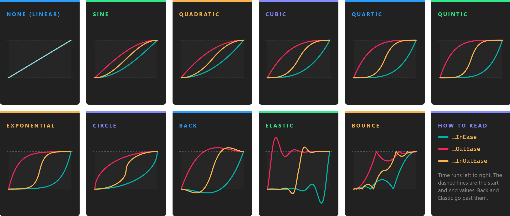

# Animation Work Actions



An animation work action changes a value from a start value to an end value over a time, a technique also called tweening. Every frame it computes the value for the time elapsed, shaped by an [easing function](#easing-functions), and hands it to a method of yours that applies it: to the position of an entity, the intensity of a light, the field of view of a camera, or anything else you can set from code. When the time is up it applies the end value and completes, so the next work action of the [chain](composing_work_actions.md) can start.

There are generic animation work actions for `float`, `Vector2`, `Vector3` and `Quaternion` values, and three ready-made ones that move, rotate and scale an entity.

## Animate a value

| Class | Value |
| --- | --- |
| **FloatAnimationWorkAction** | `float` |
| **Vector2AnimationWorkAction** | `Vector2` |
| **Vector3AnimationWorkAction** | `Vector3` |
| **QuaternionAnimationWorkAction** | `Quaternion`. See the [note on rotations](#rotations-with-quaternions). |

All four take the same arguments:

```csharp
new FloatAnimationWorkAction(Entity entity, float from, float to, TimeSpan time, EaseFunction ease, Action<float> updateAction)
```

| Argument | Description |
| --- | --- |
| **entity** | The entity that hosts the animation. It does not have to be the entity you animate, but it must be in the scene: the work action belongs to the [scene of this entity](composing_work_actions.md#work-actions-and-scenes), and runs with its updates. It cannot be `null`. |
| **from** | The value at the start. |
| **to** | The value at the end. |
| **time** | How long the animation lasts. |
| **ease** | The [easing function](#easing-functions). `EaseFunction.None` is a linear interpolation. |
| **updateAction** | Called every frame with the new value. Set your property here. |

```csharp
// Fade a light in over a second.
var fadeIn = new FloatAnimationWorkAction(
    this.Owner,
    0f,
    5f,
    TimeSpan.FromSeconds(1),
    EaseFunction.QuadraticOutEase,
    intensity => this.light.Intensity = intensity);

fadeIn.Run();
```

The start and end values are fixed when you create the action. If the start value must be whatever the property holds when the step begins, read it in a [generator](composing_work_actions.md#create-work-actions-when-they-run), or use the ready-made actions below, which read it themselves.

### Drive anything with a value from 0 to 1

A `FloatAnimationWorkAction` from `0` to `1` gives you an eased progress that you can turn into any other value: interpolate colors, slerp rotations, or walk along a curve.

```csharp
Color from = Color.White;
Color to = Color.Red;

new FloatAnimationWorkAction(this.Owner, 0f, 1f, TimeSpan.FromSeconds(0.5), EaseFunction.SineInOutEase,
    t => this.material.BaseColor = Color.Lerp(from, to, t))
    .Run();
```

## Move, rotate and scale an entity

Three animation work actions animate the [Transform3D](../../basics/transform.md) of an entity directly. They read the start value from the transform when they start running, so in a chain each one continues from where the previous step left the entity.

| Class | Animates |
| --- | --- |
| **MoveTo3DWorkAction** | `Position`, or `LocalPosition` when `local` is `true`. |
| **RotateTo3DWorkAction** | `Rotation`, or `LocalRotation` when `local` is `true`: Euler angles in radians, with the pitch in `X`, the yaw in `Y` and the roll in `Z`. |
| **ScaleTo3DWorkAction** | `Scale`, or `LocalScale` when `local` is `true`. |

```csharp
new MoveTo3DWorkAction(Entity entity, Vector3 to, TimeSpan time, EaseFunction ease = EaseFunction.None, bool local = false)
new RotateTo3DWorkAction(Entity entity, Vector3 to, TimeSpan time, EaseFunction ease = EaseFunction.None, bool local = false, bool shorterPath = false)
new ScaleTo3DWorkAction(Entity entity, Vector3 to, TimeSpan time, EaseFunction ease = EaseFunction.None, bool local = false)
```

The entity must have a `Transform3D`. The end value is in world space by default; pass `local: true` to animate relative to the parent, which is what you usually want for a part of a model, such as a door in a building.

`RotateTo3DWorkAction` interpolates each Euler angle on its own. With `shorterPath: true`, it adds or removes a full turn to each target angle that is more than half a turn away from the current one, so the entity turns the short way round. Interpolating Euler angles works well for turns about one axis; for a rotation between two arbitrary orientations, slerp a `Quaternion` instead, as in the [example below](#example-fly-the-camera-to-a-point-of-interest).

```csharp
// Turn a quarter turn to the left about the vertical axis, taking the short way.
var turn = new RotateTo3DWorkAction(
    this.Owner,
    this.transform.LocalRotation + new Vector3(0, MathHelper.PiOver2, 0),
    TimeSpan.FromSeconds(0.4),
    EaseFunction.CubicInOutEase,
    local: true,
    shorterPath: true);
```

## Easing functions

The `EaseFunction` enum selects how the value moves from start to end over time. `None` is linear: the value advances at a constant speed. The other values combine a family, which sets the shape of the curve, with a mode:

- **In**: starts slowly and speeds up towards the end.
- **Out**: starts fast and slows down towards the end.
- **InOut**: starts slowly, speeds up in the middle and slows down at the end.

| Family | Values | Shape |
| --- | --- | --- |
| **Sine** | `SineInEase`, `SineOutEase`, `SineInOutEase` | The gentlest acceleration. |
| **Quadratic** | `QuadraticInEase`, `QuadraticOutEase`, `QuadraticInOutEase` | The value changes with the square of the time. |
| **Cubic** | `CubicInEase`, `CubicOutEase`, `CubicInOutEase` | The cube: a stronger acceleration. |
| **Quartic** | `QuarticInEase`, `QuarticOutEase`, `QuarticInOutEase` | The fourth power. |
| **Quintic** | `QuinticInEase`, `QuinticOutEase`, `QuinticInOutEase` | The fifth power, the strongest of the polynomial curves. |
| **Exponential** | `ExponentialInEase`, `ExponentialOutEase`, `ExponentialInOutEase` | Almost still at one end and almost instant at the other. |
| **Circle** | `CircleInEase`, `CircleOutEase`, `CircleInOutEase` | A quarter circle: a very sharp change at one end. |
| **Back** | `BackInEase`, `BackOutEase`, `BackInOutEase` | Pulls back before it starts, or overshoots before it settles. |
| **Elastic** | `ElasticInEase`, `ElasticOutEase`, `ElasticInOutEase` | Oscillates around the start or the end value, like a spring. |
| **Bounce** | `BounceInEase`, `BounceOutEase`, `BounceInOutEase` | Bounces against the start or the end value, like a dropped ball. |

`Back` and `Elastic` go beyond the start and end values for a moment. That is the point of them, but check that your property accepts those values: a scale that eases from 0 with `BackInEase` goes negative first, and an `ElasticOutEase` to an alpha of 1 goes above 1. `Bounce` stays between the start and end values.

## Cancel and skip

`Cancel()` stops the animation where it is: the property keeps the last value applied. `TrySkip()` applies the end value at once and completes the work action, so the chain continues as if the animation had played to the end. In a chain, only the first step jumps to its end value when skipped; see the [note on skipping a chain](composing_work_actions.md#sequences).

## How they run

The first time an animation work action runs, it adds a `WorkActionUpdaterBehavior` to its entity, if the entity does not have one already. That behavior updates every animation work action hosted by the entity, once per frame and in the update of the entity's behaviors. Each frame the animation adds the frame time to its elapsed time and calls the update action with the new value. On the first frame past its duration, it calls the update action with the exact end value and completes.

Because the behavior lives on the entity, removing the entity from the scene stops its animations: they no longer advance and never complete. Cancel the work actions an entity hosts before you remove it, or host them on an entity that stays.

## Rotations with quaternions

> [!IMPORTANT]
> On the current engine version `QuaternionAnimationWorkAction` interpolates the four components of the quaternion one by one, like four separate numbers. The values in between are not normalized, which scales and shears the entity if you assign them to an orientation, and the rotation does not follow the shortest arc. For orientations, animate a `float` from 0 to 1 and slerp:
>
> ```csharp
> Quaternion from = this.transform.Orientation;
> Quaternion to = targetOrientation;
>
> new FloatAnimationWorkAction(this.Owner, 0f, 1f, TimeSpan.FromSeconds(1), EaseFunction.SineInOutEase,
>     t => this.transform.Orientation = Quaternion.Slerp(from, to, t))
>     .Run();
> ```

## Example: fly the camera to a point of interest

This component, on the camera entity, flies the camera to a position and turns it to look at a target. The position and the orientation animate in parallel, and the flight can be interrupted by a new one at any time:

```csharp
using System;
using Evergine.Components.WorkActions;
using Evergine.Framework;
using Evergine.Framework.Graphics;
using Evergine.Framework.Services;
using Evergine.Mathematics;

public class CameraFlight : Component
{
    [BindComponent]
    private Transform3D transform = null;

    private IWorkAction flight;

    public event EventHandler Arrived;

    public void FlyTo(Vector3 position, Vector3 lookAt, TimeSpan duration)
    {
        // A new flight replaces the one in progress, starting from wherever the camera is now.
        if (this.flight?.State == WorkActionState.Running)
        {
            this.flight.Cancel();
        }

        Quaternion fromOrientation = this.transform.Orientation;

        // The orientation that looks at the target from the destination, as Transform3D.LookAt computes it.
        Vector3 direction = position - lookAt;
        Vector3 up = Vector3.Up;
        Quaternion.CreateFromLookAt(ref direction, ref up, out Quaternion toOrientation);

        this.flight = this.Owner.Scene.CreateParallelWorkActions(
                new MoveTo3DWorkAction(this.Owner, position, duration, EaseFunction.CubicInOutEase),
                new FloatAnimationWorkAction(this.Owner, 0f, 1f, duration, EaseFunction.CubicInOutEase,
                    t => this.transform.Orientation = Quaternion.Slerp(fromOrientation, toOrientation, t)))
            .WaitAll();

        this.flight.Completed += (action) => this.Arrived?.Invoke(this, EventArgs.Empty);
        this.flight.Run();
    }
}
```

Canceling the set cancels the two animations inside it, so a new `FlyTo` call takes over from the current position and orientation without a jump.
