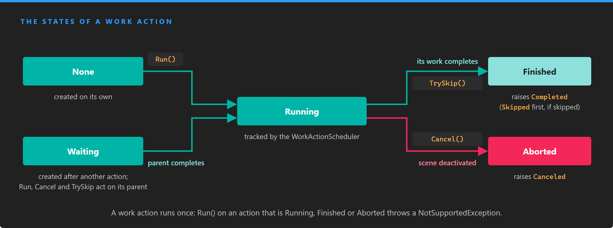

# Composing Work Actions

Every work action implements `IWorkAction`: you start it with `Run()`, stop it with `Cancel()` or `TrySkip()`, and it raises `Completed` when it is done. On their own, work actions are small: wait a time, call a method, move an entity. The extension methods of `WorkActionFactory` compose them into sequences, parallel blocks, waits and loops, and every composition is itself an `IWorkAction` that you can compose again.

## Lifecycle



*A work action runs once. A first action starts in `None`; an action created after another one starts in `Waiting` and runs when its parent completes.*

| State | Description |
| --- | --- |
| **None** | Created on its own and not started yet. |
| **Waiting** | Created after another work action, with `ContinueWith`, `Delay` or `AndWaitCondition`. It runs when that parent completes. |
| **Running** | Started. The `WorkActionScheduler` tracks it until it finishes. |
| **Finished** | Completed, or skipped with `TrySkip()`. |
| **Aborted** | Canceled with `Cancel()`, or because its [scene was deactivated](#work-actions-and-scenes). |

A work action cannot run twice. `Run()` on an action that is `Running`, `Finished` or `Aborted` throws a `NotSupportedException`, so to play the same motion again, build new work actions: put the composition in a method and call it each time, or let a [generator](#create-work-actions-when-they-run) build it.

## Run, cancel and skip

| Member | Description |
| --- | --- |
| **Run()** | Starts the work action. On an action that is `Waiting`, it starts its parent instead, and so on up to the first action of the chain: running the last action of a chain runs the whole chain. |
| **Cancel()** | Stops a running work action and sets it to `Aborted`. On an action that is `Waiting`, it cancels its parent instead, which stops the chain at the step that is running. |
| **TrySkip()** | Finishes a running work action at once, as if it had completed, and returns whether it could. On an action that is `Waiting`, it skips the step of the chain that is running, and the chain continues with the next step. |
| **State** | The current `WorkActionState`. |
| **Scene** | The scene the work action belongs to. Actions created after another one take the scene of their parent. |
| **ChildActions** | The work actions this one wraps or runs, if any. |
| **IsSkippable** | A public field of the `WorkAction` base class. `true` by default; when `false`, `TrySkip()` returns `false` and the action keeps running. `AsSkippableWorkAction()` sets it to `true`. |

| Event | Description |
| --- | --- |
| **Completed** | Raised when the work action finishes, including when it is skipped. Subscribe to the last action of a chain to know when the whole chain is done. |
| **Canceled** | Raised when the work action is aborted. |
| **Skipped** | Raised when the work action is skipped, just before `Completed`. |

> [!NOTE]
> When you cancel a chain through its last action, the step that was running is aborted and raises `Canceled`, but the steps after it, including the last action, stay in `Waiting` and raise nothing. Keep your own record that you canceled it, for example by setting the field that holds the chain to `null`.

> [!NOTE]
> Release builds of the engine ignore `Cancel()` and `TrySkip()` on an action that never started, has already finished or was already canceled. Debug builds of the engine throw a `NotSupportedException` instead. Check `State` before you call them if the action may have ended on its own.

## Create work actions

`WorkActionFactory` adds two groups of extension methods. The first group, on `Scene`, creates the first action of a composition:

| Method | Description |
| --- | --- |
| **CreateEmptyWorkAction()** | An action that completes as soon as it runs. A neutral first step when you build a chain in a loop. |
| **CreateDelayWorkAction(TimeSpan)** | Waits for a time. `CreateWaitWorkAction` does the same. |
| **CreateWorkActionFromAction(Action)** | Calls a method and completes. |
| **CreateWaitConditionWorkAction(Func&lt;bool&gt;, eventCount)** | Waits until a condition holds. See [Wait for a condition](#wait-for-a-condition). |
| **CreateWorkAction(Func&lt;IWorkAction&gt;)** | Calls the function when it runs and runs the action it returns. See [Create work actions when they run](#create-work-actions-when-they-run). |
| **CreateWorkAction(IWorkAction)** | Wraps an existing action. |
| **CreateParallelWorkActions(...)** | Runs several actions at the same time. See [Run work actions in parallel](#run-work-actions-in-parallel). |
| **CreateLoopWorkActionUntil(Func&lt;IWorkAction&gt;, Func&lt;bool&gt;)** | Repeats a composition until a condition holds. See [Loops](#loops). |

The [animation work actions](animation_work_actions.md), and any [custom work action](custom_work_actions.md), are also valid first actions: you create them with `new`.

The second group, on `IWorkAction`, adds a step after an existing action and returns the new step, so the calls chain:

| Method | Description |
| --- | --- |
| **ContinueWith(IWorkAction)** | Runs an action after this one. The action must not have run yet. |
| **ContinueWith(Func&lt;IWorkAction&gt;)** | When this action completes, calls the function and runs the action it returns. |
| **ContinueWithAction(Action)** | Calls a method after this action. |
| **Delay(TimeSpan)** | Waits for a time after this action. |
| **AndWaitCondition(Func&lt;bool&gt;, eventCount)** | Waits for a condition after this action. |
| **ContinueWith(params IWorkAction[])** | Runs several actions at the same time after this one. Returns an `IWorkActionSet`. `CreateParallelWorkActions(IEnumerable<IWorkAction>)` on an `IWorkAction` does the same. |
| **AsSkippableWorkAction()** | Sets `IsSkippable` to `true` and returns the same action. |

They are extension methods, so call them on a scene (`this.Owner.Scene.CreateDelayWorkAction(...)`) or on a work action, after adding `using Evergine.Components.WorkActions;`.

## Sequences

Each `ContinueWith`, `ContinueWithAction`, `Delay` or `AndWaitCondition` call returns a new step that waits for the one before it. Keep the last step, and run it:

```csharp
Scene scene = this.Owner.Scene;

IWorkAction sequence = scene.CreateWorkActionFromAction(() => this.ShowMessage("Ready?"))
    .Delay(TimeSpan.FromSeconds(1))
    .ContinueWithAction(() => this.ShowMessage("Go!"))
    .ContinueWith(new MoveTo3DWorkAction(this.Owner, this.target, TimeSpan.FromSeconds(2), EaseFunction.QuadraticInOutEase))
    .ContinueWithAction(() => this.ShowMessage("Done"));

sequence.Completed += (action) => this.OnSequenceFinished();
sequence.Run();
```

`ContinueWith(IWorkAction)` wraps the action you pass into a new step, so the `IWorkAction` it returns is that step, not your action. The events of your action still fire, which is useful when you need to know when one particular step ends.

> [!IMPORTANT]
> `TrySkip()` on a chain skips the step that is running. If that step is the first action of the chain, it is skipped itself: an [animation work action](animation_work_actions.md) jumps to its end value. Every later step is a wrapper, and skipping a wrapper cancels the action inside it, so an animation in a later step stops where it is instead of jumping to its end value, and the wrapper raises `Canceled` before `Skipped` and `Completed`. The chain then continues with the next step either way.

## Run work actions in parallel

`ContinueWith` with several actions, or `CreateParallelWorkActions` on a scene, returns an `IWorkActionSet`. A set is not a work action yet: you choose when it counts as done, and that choice is the `IWorkAction` you continue from.

| Method | Description |
| --- | --- |
| **WaitAll()** | Completes when every action of the set has completed. |
| **WaitAny()** | Completes when the first action of the set completes. The others keep running. |
| **WaitCount(int)** | Completes when that many actions of the set have completed. After another work action, the count must be between 0 and the number of actions, or it throws an `ArgumentOutOfRangeException`. |
| **WaitPredicate(...)** | Not implemented; it throws a `NotImplementedException`. |

When the set runs, it runs all of its actions at once. Canceling the set cancels the ones still running.

```csharp
IWorkAction intro = new MoveTo3DWorkAction(panel, slotPosition, TimeSpan.FromSeconds(0.5), EaseFunction.QuadraticOutEase)
    .Delay(TimeSpan.FromSeconds(0.2))
    .ContinueWith(
        new RotateTo3DWorkAction(panel, new Vector3(0, MathHelper.Pi, 0), TimeSpan.FromSeconds(1), EaseFunction.SineInOutEase),
        new ScaleTo3DWorkAction(panel, new Vector3(1.5f), TimeSpan.FromSeconds(0.6), EaseFunction.BackOutEase))
    .WaitAll()
    .ContinueWithAction(() => this.EnableButtons());

intro.Run();
```

This is the composition in the diagram on the [Work Actions](index.md) page: the rotation and the scale start together, and `EnableButtons` runs after the longer of the two.

> [!IMPORTANT]
> On the current engine version a set only counts completed actions. If one of its actions is canceled, `WaitAll()` never completes, and neither does the rest of the chain. Cancel the set, not the actions inside it.

> [!IMPORTANT]
> On the current engine version the overloads that take generators, `ContinueWith(params Func<IWorkAction>[])` and `CreateParallelWorkActions` with `Func<IWorkAction>` arguments, throw a `NullReferenceException` when the set runs. To build the actions of a set when it runs, wrap each generator in `CreateWorkAction` and pass the resulting actions instead:
>
> ```csharp
> scene.CreateParallelWorkActions(
>         scene.CreateWorkAction(() => new MoveTo3DWorkAction(left, this.NextLeftSlot(), duration)),
>         scene.CreateWorkAction(() => new MoveTo3DWorkAction(right, this.NextRightSlot(), duration)))
>     .WaitAll()
>     .Run();
> ```

## Create work actions when they run

The overloads that take a `Func<IWorkAction>` call it when the step starts, not when you build the chain. Use them when the action depends on something that is only known by then, such as where an entity has moved to, or when you build a composition once and the step must be created again each time it runs:

```csharp
IWorkAction delivery = new MoveTo3DWorkAction(drone, pickupPoint, TimeSpan.FromSeconds(3), EaseFunction.SineInOutEase)
    .ContinueWithAction(() => this.AttachParcel())
    // The destination is read when the drone has the parcel, not when the chain is built.
    .ContinueWith(() => new MoveTo3DWorkAction(drone, this.GetDropPoint(), TimeSpan.FromSeconds(3), EaseFunction.SineInOutEase));

delivery.Run();
```

The function must return a new action, never `null`, or the step throws a `NullReferenceException`.

## Wait for a condition

`CreateWaitConditionWorkAction` and `AndWaitCondition` wait until a predicate returns `true`. The `WorkActionScheduler` evaluates the predicate once per frame while the action runs, and the action completes on the frame where the predicate has returned `true` `eventCount` times, which by default is the first time. The frames do not have to be consecutive.

```csharp
// Show the next hint once the user has picked up the key.
IWorkAction tutorial = scene.CreateWorkActionFromAction(() => this.ShowHint("Pick up the key"))
    .AndWaitCondition(() => this.inventory.Contains("key"))
    .ContinueWithAction(() => this.ShowHint("Now open the door"));

tutorial.Run();
```

The predicate runs every frame, so keep it cheap.

## Loops

`CreateLoopWorkActionUntil` repeats a composition until a condition holds. It takes a generator, because each iteration needs new work actions, and the condition, which it checks before each iteration:

```csharp
IWorkAction patrol = scene.CreateLoopWorkActionUntil(
    () => new MoveTo3DWorkAction(guard, pointA, TimeSpan.FromSeconds(4), EaseFunction.SineInOutEase)
        .ContinueWith(new MoveTo3DWorkAction(guard, pointB, TimeSpan.FromSeconds(4), EaseFunction.SineInOutEase)),
    () => this.alarmRaised);

patrol.Run();
```

When the condition becomes `true`, the loop finishes the iteration in progress and completes. To stop it at once, call `Cancel()` on the loop. A condition that always returns `false` gives a loop that runs until you cancel it.

> [!IMPORTANT]
> Each iteration runs inside the one before it, and stays running until the whole loop ends. A loop that runs for a long time therefore keeps a few work actions per iteration alive in the `WorkActionScheduler`, and when it finally completes, the completion travels back through every iteration at once. Use `CreateLoopWorkActionUntil` for loops with a bounded number of iterations. For a motion that repeats indefinitely, build one cycle and build it again from its `Completed` event, as the [example below](#example-an-automatic-door) does.

## Work actions and scenes

Every work action belongs to a scene, given by the `Scene` you call a factory method on, by the entity of an animation work action or by its parent. When the `ScreenContextManager` deactivates a scene, the `WorkActionScheduler` cancels the work actions of that scene that are running, so a chain does not outlive the scene that started it.

> [!IMPORTANT]
> The `WorkActionScheduler` only follows the scenes that start after it has been created, and the container creates it the first time something asks for it, usually the first work action you run. If your first scene starts before that, its work actions are not canceled when you leave it. Ask for the scheduler in the `Initialize` method of your application, as shown in [Setup](index.md#setup).

An animation work action takes the scene of its entity when you construct it. Create work actions once the entity is in a scene, for example in `OnActivated` or `Start` of a component, not in its constructor; an action created without a scene keeps running when the scene is deactivated.

## Example: an automatic door

This component opens a sliding door when the camera comes near and closes it after the camera leaves. It combines conditions and a delay into one cycle, and starts a new cycle each time one completes, until the component is deactivated:

```csharp
using System;
using Evergine.Components.WorkActions;
using Evergine.Framework;
using Evergine.Framework.Graphics;
using Evergine.Framework.Services;
using Evergine.Mathematics;

public class AutomaticDoor : Component
{
    [BindComponent]
    private Transform3D transform = null;

    private Vector3 closedPosition;
    private Vector3 openPosition;
    private IWorkAction cycle;

    public float OpenDistance { get; set; } = 3f;

    public float SlideHeight { get; set; } = 2.5f;

    protected override void OnActivated()
    {
        base.OnActivated();

        this.closedPosition = this.transform.LocalPosition;
        this.openPosition = this.closedPosition + new Vector3(0, this.SlideHeight, 0);
        this.StartCycle();
    }

    protected override void OnDeactivated()
    {
        base.OnDeactivated();

        IWorkAction current = this.cycle;
        this.cycle = null;

        // Canceling the last step stops the step that is running; the rest of the cycle never starts.
        if (current?.State == WorkActionState.Waiting || current?.State == WorkActionState.Running)
        {
            current.Cancel();
        }

        // Leave the door closed, so OnActivated reads the right position next time.
        this.transform.LocalPosition = this.closedPosition;
    }

    private void StartCycle()
    {
        this.cycle = this.Owner.Scene.CreateWaitConditionWorkAction(() => this.DistanceToCamera() < this.OpenDistance)
            .ContinueWith(new MoveTo3DWorkAction(this.Owner, this.openPosition, TimeSpan.FromSeconds(0.6), EaseFunction.CubicOutEase, local: true))
            // A larger distance to close than to open, so the door does not flicker at the edge.
            .AndWaitCondition(() => this.DistanceToCamera() > this.OpenDistance + 1)
            .Delay(TimeSpan.FromSeconds(1))
            .ContinueWith(new MoveTo3DWorkAction(this.Owner, this.closedPosition, TimeSpan.FromSeconds(0.8), EaseFunction.QuadraticInOutEase, local: true));

        // Build a new cycle when this one ends. A canceled cycle never completes, so this stops by itself.
        this.cycle.Completed += (action) => this.StartCycle();
        this.cycle.Run();
    }

    private float DistanceToCamera()
    {
        Camera3D camera = this.Managers.RenderManager.ActiveCamera3D;
        return camera == null ? float.MaxValue : Vector3.Distance(camera.Transform.Position, this.transform.Position);
    }
}
```
