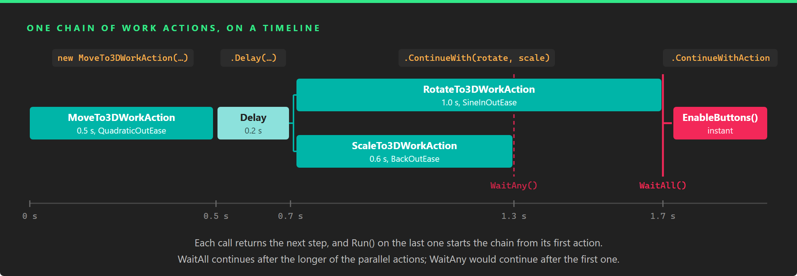

# Work Actions



Work actions animate from code. A work action is a small unit of work, such as moving an entity, waiting half a second, waiting for a condition or calling a method, that you start with `Run()` and that tells you when it has finished. You chain them into sequences, run them in parallel and wait for all or any of them, so a scripted motion that would otherwise be a state machine inside an `Update` method becomes one expression that reads in the order things happen.

They complement the [Animation3D](../animation3d_component.md) component rather than replace it. `Animation3D` plays the clips authored in a modelling tool; work actions interpolate any value you can set from code, which makes them the tool for procedural motion: a panel that slides in, a door that opens when the player arrives, a camera that flies to a point of interest, a light that pulses, a tutorial that waits for the user before showing the next hint.

## The parts

- **[Composing Work Actions](composing_work_actions.md)**: the flow. The lifecycle of a work action, and how `WorkActionFactory` builds sequences, parallel blocks, delays, conditions and loops out of them.
- **[Animation Work Actions](animation_work_actions.md)**: the motion. Work actions that interpolate a `float`, `Vector2`, `Vector3` or `Quaternion` over a time with an easing function, and the ready-made `MoveTo3DWorkAction`, `RotateTo3DWorkAction` and `ScaleTo3DWorkAction`.
- **[Custom Work Actions](custom_work_actions.md)**: your own steps. The base classes to derive from when the built-in work actions are not enough.

## Setup

Work actions live in the `Evergine.Components.WorkActions` namespace of the `Evergine.Components` package. `IWorkAction` and `WorkActionState` are in `Evergine.Framework.Services`.

They need two services: `WorkActionScheduler`, which tracks every running work action and updates the ones that wait for a condition, and `TimerFactory`, which runs the delays. The project template registers both in the constructor of your [application](../../basics/application/using_application.md):

```csharp
this.Container.Register<TimerFactory>();
this.Container.Register<WorkActionScheduler>();
```

> [!IMPORTANT]
> `WorkAction` looks up the `WorkActionScheduler` once, the first time the class is used, and keeps the result. If the service is not registered by then, every work action fails, and registering it afterwards does not help. Keep the registration in the constructor of the application.

The container creates a service the first time something asks for it, and the `WorkActionScheduler` only follows the scenes that start after it exists. To have the work actions of your first scene [canceled with that scene](composing_work_actions.md#work-actions-and-scenes), ask for the scheduler in `Initialize`, before you load the first scene:

```csharp
public override void Initialize()
{
    base.Initialize();

    // Create the scheduler now, so it sees the first scene start.
    this.Container.Resolve<WorkActionScheduler>();

    // Load the first scene and navigate to it as usual...
}
```

## Quick start

This component lifts its entity, holds it in the air for a moment and drops it with a bounce:

```csharp
using System;
using Evergine.Components.WorkActions;
using Evergine.Framework;
using Evergine.Framework.Graphics;
using Evergine.Framework.Services;
using Evergine.Mathematics;

public class Hop : Component
{
    [BindComponent]
    private Transform3D transform = null;

    private IWorkAction hop;

    protected override void OnActivated()
    {
        base.OnActivated();

        Vector3 ground = this.transform.Position;

        this.hop = new MoveTo3DWorkAction(this.Owner, ground + Vector3.Up, TimeSpan.FromSeconds(0.4), EaseFunction.CubicOutEase)
            .Delay(TimeSpan.FromSeconds(0.2))
            .ContinueWith(new MoveTo3DWorkAction(this.Owner, ground, TimeSpan.FromSeconds(0.6), EaseFunction.BounceOutEase));

        // Running the last action of a chain starts the chain from its first action.
        this.hop.Run();
    }
}
```

Every call returns a new `IWorkAction` that runs after the previous one, and `Run()` on the last one starts the whole chain. [Composing Work Actions](composing_work_actions.md) explains how.

## In this section
* [Composing Work Actions](composing_work_actions.md)
* [Animation Work Actions](animation_work_actions.md)
* [Custom Work Actions](custom_work_actions.md)
