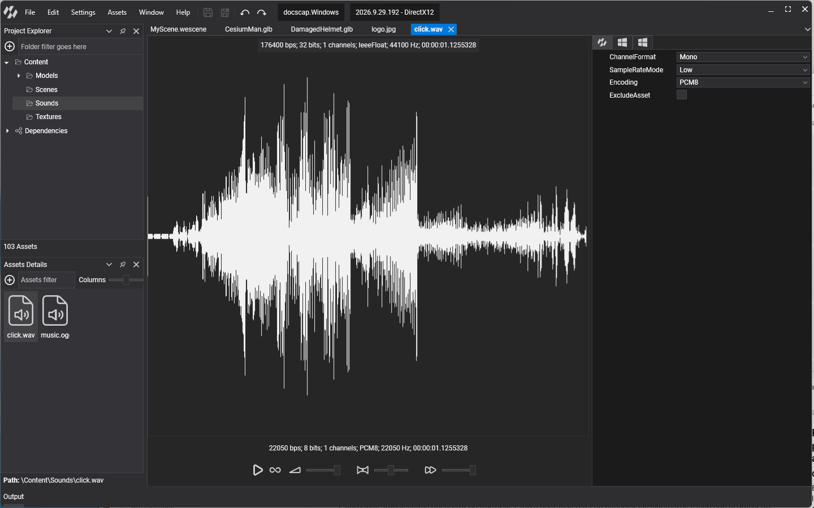

# Audio Editor

---

The **Audio Editor** is where you listen to a sound asset and choose the format it is exported with. Double-click a sound asset in [Assets Details](../evergine_studio/interface.md) to open it. The editor has two parts: the **viewport**, with the waveform and a playback toolbox, and the **properties** panel, with the asset profiles.

## Viewport

The viewport draws the waveform of the audio. The line at the top describes the **original file**: bit rate, bits per sample, channels, encoding, sample rate and duration. The line above the toolbox describes the **exported asset** as the current profile produces it, so you can see the effect of a profile change straight away.

The toolbox plays the exported asset:

| Icon | Control | Description |
| --- | --- | --- |
|  | **Play / Stop** | Starts playback. Click again to stop. |
|  | **Loop** | Plays the sound in a loop. |
|  | **Volume** | Playback volume, from 0 to 100%. |
|  | **Pan** | Moves the sound between the left (-100) and right (100) speakers. Double-click the slider to center it. |
|  | **Speed** | Playback pitch and speed, from 10% to 100% of the original. |

> [!NOTE]
> The toolbox settings are for listening only. They are not saved in the asset. To set the volume or pitch a sound plays at in your scene, use the properties of [`SoundEmitter3D`](using_audio_from_editor.md) or of an `AudioSource`.

## Properties

The properties panel has one tab per profile. The first tab is the default profile, which every platform uses unless it has a profile of its own. Each remaining tab overrides the default for one platform, so you can, for example, export smaller 8-bit sounds for a mobile profile only.

These are the `SoundProfile` properties:

| Property | Default | Description |
| --- | --- | --- |
| **ChannelFormat** | `Mono` | `Mono` or `Stereo`. The audio is mixed down or up to this channel count on export. Sounds played by `SoundEmitter3D` must be `Mono`. |
| **SampleRateMode** | `Low` | `Low` exports at 22050 Hz and `High` at 44100 Hz. A higher rate keeps more of the high frequencies but doubles the size of the data. |
| **Encoding** | `PCM8` | `PCM8` stores 8 bits per sample and `PCM16` 16 bits. `PCM16` has much less background noise, at twice the size. |
| **ExcludeAsset** | false | Leaves this asset out of the exported content for the profile, for sounds a platform never plays. |

`SoundProfile` also exposes a read-only **Frequency** value: the sample rate in hertz that the exporter uses, 22050 for `Low` and 44100 for `High`. At run time the same value appears as `WaveFormat.SampleRate` of the loaded `AudioBuffer`.

> [!TIP]
> The defaults favour small files. For music, or for any sound where quality matters, set **SampleRateMode** to `High` and **Encoding** to `PCM16`.
