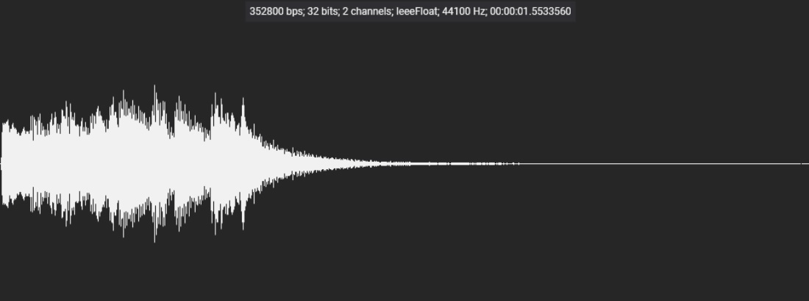
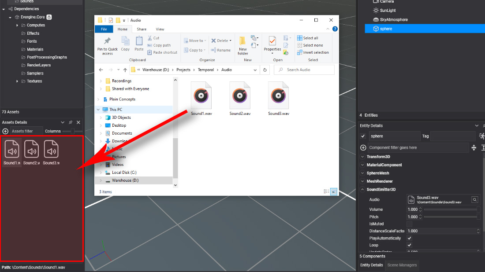
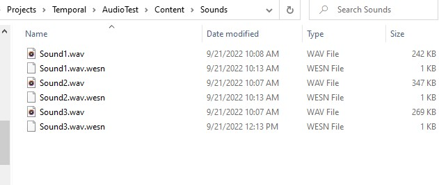

# Import Audio

---

A **sound asset** is an audio file that Evergine has imported, ready to be played by a [`SoundEmitter3D`](using_audio_from_editor.md) or loaded from code as an `AudioBuffer`. Import your sound effects and music this way so that Evergine Studio can convert them to the format each platform profile needs.

## Import an audio file in Evergine Studio

Drag an audio file into the [Assets Details](../evergine_studio/interface.md) panel, as explained in [Create Assets](../evergine_studio/assets/create.md). Evergine Studio adds the file to your `Content` directory and creates the sound asset.

## Supported formats

| Extension | Format | Notes |
| --- | --- | --- |
| `.wav` | Waveform audio | Uncompressed PCM or 32-bit IEEE float. Float data is converted to 16-bit PCM on import. Compressed WAV encodings, such as ADPCM, are rejected. |
| `.mp3` | MPEG-1/2 Audio Layer III | Decoded to 16-bit PCM on import. |
| `.ogg` | Ogg Vorbis | Decoded and converted to 16-bit PCM on import. |

> [!IMPORTANT]
> The sample rate of the source file must be one of the rates Evergine supports: 8000, 11025, 12000, 16000, 22050, 24000, 32000, 44100 or 48000 Hz. A file recorded at another rate, 96 kHz for example, fails to import. Resample it in an audio tool first.

## Files in the Content directory

Importing an audio file creates a metadata file with the `.wesn` extension next to it. The metadata stores the asset id and the export profiles described in [Audio Editor](audio_editor.md).

When the project content is built, each sound asset is exported to a `.wepsn` file in the format its profile asks for: the audio is mixed down to mono or up to stereo, resampled and quantized to 8 or 16 bits as needed. The original file stays untouched, so you can change the profile at any time and export again.

> [!TIP]
> A sound played by a `SoundEmitter3D` must be **mono**. Set **ChannelFormat** to `Mono` in the asset profile rather than preparing a separate mono file.
