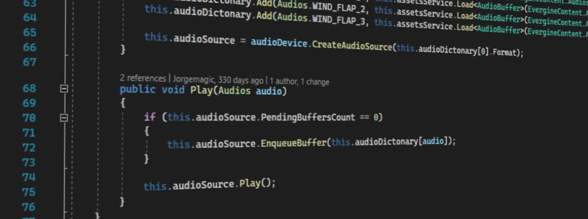
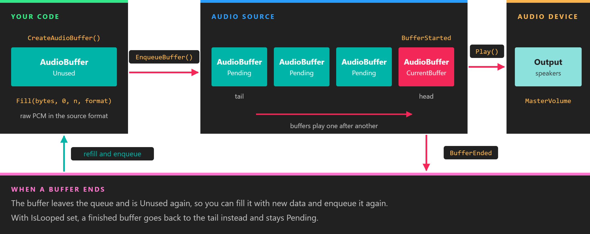

# Using Audio from Code

---



Everything the audio components do is built on a small API in `Evergine.Common.Audio` that you can use directly. Use it for sounds that do not belong to a place in the scene, such as interface clicks and music, for fine control over a queue of sounds, or to play audio you generate at run time.

This page starts with the component route and then goes down a level:

* The **AudioDevice** is the output. The platform launcher creates it, and it creates everything else.
* A **WaveFormat** describes PCM data: channels, sample rate and bits per sample.
* An **AudioBuffer** holds a block of PCM data in one format. Sound assets load as buffers.
* An **AudioSource** plays a queue of buffers that share its format.

## Play a sound with SoundEmitter3D

The components described in [Using Audio from Evergine Studio](using_audio_from_editor.md) can be created from code like any other. Load the sound asset, give it to a `SoundEmitter3D`, and put a `SoundListener3D` on the camera. If your scene already has a camera, add the listener to that entity instead of creating a new one:

```csharp
using Evergine.Common.Audio;
using Evergine.Components.Sound;
using Evergine.Framework;
using Evergine.Framework.Graphics;
using Evergine.Mathematics;

public class MyScene : Scene
{
    protected override void CreateScene()
    {
        // The listener rides on the camera, so what you hear matches what you see.
        Entity camera = new Entity("camera")
            .AddComponent(new Transform3D() { Position = new Vector3(0, 1.5f, 6) })
            .AddComponent(new Camera3D())
            .AddComponent(new SoundListener3D());

        // The sound asset must be exported as Mono to play in 3D.
        AudioBuffer engineSound = this.Managers.AssetSceneManager.Load<AudioBuffer>(EvergineContent.Sounds.Engine_wav);

        Entity generator = new Entity("generator")
            .AddComponent(new Transform3D() { Position = new Vector3(4, 0, 0) })
            .AddComponent(new SoundEmitter3D()
            {
                Audio = engineSound,

                // Loop is read when the emitter creates its audio source, so set it before the entity is added.
                Loop = true,
                PlayAutomatically = true,

                // Full volume within 3 units of the generator, half at 6, a quarter at 12.
                DistanceScaleFactor = 3,
            });

        this.Managers.EntityManager.Add(camera);
        this.Managers.EntityManager.Add(generator);
    }
}
```

`EvergineContent` is the class Evergine Studio generates with the id of every asset in your `Content` folder. `EvergineContent.Sounds.Engine_wav` stands for a file `Content/Sounds/Engine.wav`.

## Audio device

An `AudioDevice` is the audio output of the application. Evergine has two implementations:

| Implementation | Package | Backend | Used by |
| --- | --- | --- | --- |
| `Evergine.XAudio2.XAudioDevice` | `Evergine.XAudio2` | XAudio2 with X3DAudio for 3D sound | Windows templates |
| `Evergine.OpenAL.ALAudioDevice` | `Evergine.OpenAL` | OpenAL Soft. The package includes the native libraries for Android and a WebAssembly build. | Android templates |

The launcher of each profile creates the device and registers it in the application container. This is how the Windows launcher (`Program.cs`) does it:

```csharp
// Creates XAudio device
var xaudio = new global::Evergine.XAudio2.XAudioDevice();
application.Container.RegisterInstance(xaudio);
```

The Android launchers (`MainActivity.cs`) do the same with `new global::Evergine.OpenAL.ALAudioDevice()`. See [Platform support](index.md#platform-support) for the device each template registers.

Get the device from a component with `[BindService]`, or from anywhere with `Application.Current.Container.Resolve<AudioDevice>()`.

| Member | Default | Description |
| --- | --- | --- |
| **MasterVolume** | 1 | Volume applied to everything the device plays, clamped to [0, 1]. |
| **DefaultListener** | | The `AudioListener` used for 3D sound. It has `WorldTransform`, `Velocity` and `DopplerFactor` (default 1). `SoundListener3D` updates it every frame. |
| **CreateAudioSource(WaveFormat)** | | Creates an `AudioSource` that plays buffers in that format. |
| **CreateAudioBuffer()** | | Creates an empty `AudioBuffer`. |

> [!NOTE]
> `CreateAudioSource` and `CreateAudioBuffer` return `null` when the backend has no output device to play on, for example a machine without a sound card. Check the result if your application can run on such a machine.

## Wave format

`WaveFormat` describes uncompressed PCM data. Create one with:

```csharp
// Mono, 44100 Hz, 16 bits per sample: the defaults for the last two arguments.
var format = new WaveFormat(isMono: true, sampleRate: 44100, encoding: WaveFormatEncodings.PCM16);
```

| Member | Description |
| --- | --- |
| **Channels** | 1 for mono, 2 for stereo. Stereo samples are interleaved, left first. |
| **SampleRate** | Samples per second. Only 8000, 11025, 12000, 16000, 22050, 24000, 32000, 44100 and 48000 are valid; any other value throws. `WaveFormat.IsValidSampleRate` checks a value. |
| **Encoding** | `PCM8` (unsigned 8-bit samples) or `PCM16` (signed 16-bit little-endian samples). |
| **BitsPerSample** | 8 or 16, from `Encoding`. |
| **BlockAlign** | Bytes per sample frame: `Channels × BitsPerSample / 8`. Buffer sizes must be a multiple of it. |
| **AverageBytesPerSecond** | `SampleRate × BlockAlign`. |

The `Convert...` methods move between durations, sample counts and byte sizes, for example `ConvertDurationToByteSize(TimeSpan)` to size a buffer for 100 ms of audio. The byte sizes they return are already block aligned.

Two formats are equal when their channels, sample rate and encoding match. That is the test an `AudioSource` applies to every buffer you enqueue.

## Audio buffer

An `AudioBuffer` is one block of PCM data with its `WaveFormat`. Sound assets load as buffers, through the [assets service](../evergine_studio/assets/use.md) or the scene's `AssetSceneManager`:

```csharp
AudioBuffer click = this.assetsService.Load<AudioBuffer>(EvergineContent.Sounds.Click_wav);
```

A buffer loaded from an asset is shared by everything that loads the same asset. Several sources can play it at once. Do not fill it with other data or dispose it: the assets service owns it.

To create a buffer of your own, ask the device for an empty one and fill it:

| Member | Description |
| --- | --- |
| **Fill(TBuffer[], int offset, int count, WaveFormat)** | Copies data from an array. Pass a `byte[]` so that `count` is a byte count; it must be a multiple of `format.BlockAlign`. |
| **Fill(Stream, int byteCount, WaveFormat)** | Reads `byteCount` bytes of raw PCM from a stream. |
| **FillAsync(Stream, int bufferSize, WaveFormat)** | The same, asynchronously. The stream must provide exactly `bufferSize` bytes of raw PCM, with no file header. |
| **Format**, **Length**, **Duration**, **SampleCount** | The format and size of the data last filled in. |
| **State** | `Unused`, `Pending` while a source has it queued, or `Disposed`. A buffer can only be filled while `Unused`. |

`FillAsync` suits data that arrives from a file or the network, since the copy does not block the update loop:

```csharp
using System.IO;
using System.Threading.Tasks;
using Evergine.Common.Audio;

public static class RawPcmLoader
{
    // The file holds raw 16-bit mono PCM at 22050 Hz, and its length is a multiple of format.BlockAlign.
    public static async Task<AudioBuffer> LoadAsync(AudioDevice audioDevice, string path)
    {
        var format = new WaveFormat(isMono: true, sampleRate: 22050);
        AudioBuffer buffer = audioDevice.CreateAudioBuffer();
        using (var stream = File.OpenRead(path))
        {
            await buffer.FillAsync(stream, (int)stream.Length, format);
        }

        // The caller owns this buffer and disposes it when no source needs it any more.
        return buffer;
    }
}
```

## Audio source

An `AudioSource` plays a queue of buffers, one after another, and raises an event as each one starts and ends. All buffers in the queue must have the format the source was created with.



*A buffer is `Pending` from `EnqueueBuffer` until the source has played it. `BufferEnded` hands it back `Unused`, ready to be filled again, which is how audio is streamed through a fixed set of buffers.*

| Member | Default | Description |
| --- | --- | --- |
| **Volume** | 1 | Volume of this source, clamped to [0, 1]. |
| **Pan** | 0 | Balance between the left (-1) and right (1) speakers. It is meant for sounds that are not spatialized. |
| **Pitch** | 1 | Playback rate. 0.5 plays an octave lower at half speed. On XAudio2 values above 1 are clamped to 1. |
| **IsLooped** | false | When on, each finished buffer goes back to the tail of the queue, so the whole queue repeats. |
| **State** | `Stopped` | `Playing`, `Paused` or `Stopped` (`Evergine.Common.Media.PlayState`). |
| **Format** | | The `WaveFormat` given to `CreateAudioSource`. |
| **PendingBuffersCount** | 0 | Buffers still in the queue, including the one playing. `PendingBuffers` and `CurrentBuffer` return the buffers themselves. |
| **PlayPosition**, **QueuePlayPosition**, **QueueDuration** | | Position in the current buffer, position in the whole queue (settable, to seek), and the total duration queued. |

| Method or event | Description |
| --- | --- |
| **EnqueueBuffer(AudioBuffer)** | Adds a buffer to the tail of the queue. Throws if the buffer is empty, disposed, already in this queue, or in another format. |
| **Play()** | Starts playing, or resumes after `Pause()`. |
| **Pause()** | Pauses where it is. |
| **Stop()** | Stops and rewinds to the start of the queue. The buffers stay queued. |
| **FlushBuffers()** | Removes every buffer from the queue. |
| **Apply3D(AudioEmitter)** | Positions the source relative to `DefaultListener`. `SoundEmitter3D` calls it every frame. |
| **BufferStarted** | Raised when a buffer starts playing. |
| **BufferEnded** | Raised when a buffer has been played, or flushed. Unless the source is looped, the buffer has left the queue and is `Unused`. |

> [!IMPORTANT]
> `BufferStarted` and `BufferEnded` are raised on the audio backend's thread: an XAudio2 callback on Windows, and the OpenAL device's polling task on Android. Keep the handlers short, and do not touch entities or components from them.

> [!NOTE]
> A source keeps reporting `Playing` after its last buffer has ended, ready to continue as soon as you enqueue more. To make `State` return to `Stopped` when a sound is over, call `Stop()` from `BufferEnded`, as `SoundEmitter3D` does.

### Example: play a sound asset

This component plays a sound asset that is not tied to a position, such as an interface click. It creates one source for the asset's format and enqueues the asset each time it plays:

```csharp
using Evergine.Common.Audio;
using Evergine.Framework;
using Evergine.Framework.Services;

public class ClickSound : Component
{
    [BindService]
    private AudioDevice audioDevice = null;

    [BindService]
    private AssetsService assetsService = null;

    public float Volume = 0.8f;

    private AudioBuffer clip;
    private AudioSource source;

    public void Play()
    {
        // Stop() keeps the buffer queued, so only enqueue it when the queue is empty.
        if (this.source.PendingBuffersCount == 0)
        {
            this.source.EnqueueBuffer(this.clip);
        }

        this.source.Play();
    }

    protected override bool OnAttached()
    {
        this.clip = this.assetsService.Load<AudioBuffer>(EvergineContent.Sounds.Click_wav);

        // A source only accepts buffers in the format it was created with.
        this.source = this.audioDevice.CreateAudioSource(this.clip.Format);
        this.source.Volume = this.Volume;
        this.source.BufferEnded += this.OnBufferEnded;
        return base.OnAttached();
    }

    protected override void OnDetached()
    {
        this.source.BufferEnded -= this.OnBufferEnded;

        // The source is ours to dispose. The clip belongs to the assets service.
        this.source.Dispose();
        base.OnDetached();
    }

    private void OnBufferEnded(object sender, AudioBufferEventArgs e)
    {
        // Brings State back to Stopped once the click is over.
        this.source.Stop();
    }
}
```

Unlike `SoundEmitter3D`, this plays stereo assets as well as mono ones, and the listener position has no effect on it.

### Example: generate a tone

This component synthesizes a sine wave and streams it through three small buffers. Each time the source finishes a buffer, `BufferEnded` hands it back, and the component fills it with the next piece of the wave and enqueues it again. The queue never runs dry, and a change to `Frequency` is heard within a buffer or two.

```csharp
using System;
using Evergine.Common.Audio;
using Evergine.Framework;

public class ToneGenerator : Component
{
    private const int BufferCount = 3;

    [BindService]
    private AudioDevice audioDevice = null;

    // Read on the audio thread each time a buffer is refilled.
    public volatile float Frequency = 440.0f;

    public float Amplitude = 0.25f;

    private WaveFormat format;
    private AudioSource source;
    private AudioBuffer[] buffers;
    private byte[] samples;
    private double phase;

    protected override bool OnAttached()
    {
        this.format = new WaveFormat(isMono: true, sampleRate: 44100, encoding: WaveFormatEncodings.PCM16);
        this.source = this.audioDevice.CreateAudioSource(this.format);
        this.source.BufferEnded += this.OnBufferEnded;

        // 50 ms per buffer: short enough to react quickly to Frequency, long enough not to starve the queue.
        this.samples = new byte[this.format.ConvertDurationToByteSize(TimeSpan.FromMilliseconds(50))];
        this.buffers = new AudioBuffer[BufferCount];
        for (int i = 0; i < BufferCount; i++)
        {
            this.buffers[i] = this.audioDevice.CreateAudioBuffer();
        }

        return base.OnAttached();
    }

    protected override void Start()
    {
        base.Start();

        // Evergine Studio runs Start too. Keep the scene quiet while it is being edited.
        if (Application.Current.IsEditor)
        {
            return;
        }

        foreach (AudioBuffer buffer in this.buffers)
        {
            this.FillAndEnqueue(buffer);
        }

        this.source.Play();
    }

    protected override void OnDetached()
    {
        // Unsubscribe first, so that stopping the source does not refill anything.
        this.source.BufferEnded -= this.OnBufferEnded;
        this.source.Dispose();
        foreach (AudioBuffer buffer in this.buffers)
        {
            buffer.Dispose();
        }

        base.OnDetached();
    }

    private void OnBufferEnded(object sender, AudioBufferEventArgs e)
    {
        // A buffer that is still Pending was only rewound by Stop(); it is still queued.
        if (e.Buffer.State == AudioBufferStates.Unused)
        {
            this.FillAndEnqueue(e.Buffer);
        }
    }

    private void FillAndEnqueue(AudioBuffer buffer)
    {
        double step = 2 * Math.PI * this.Frequency / this.format.SampleRate;
        for (int i = 0; i < this.samples.Length; i += this.format.BlockAlign)
        {
            short sample = (short)(Math.Sin(this.phase) * this.Amplitude * short.MaxValue);

            // PCM16 samples are little-endian.
            this.samples[i] = (byte)sample;
            this.samples[i + 1] = (byte)(sample >> 8);

            // Carrying the phase from one buffer to the next avoids a click at every join.
            this.phase = (this.phase + step) % (2 * Math.PI);
        }

        buffer.Fill(this.samples, 0, this.samples.Length, this.format);
        this.source.EnqueueBuffer(buffer);
    }
}
```

Add it to any entity with `entity.AddComponent(new ToneGenerator())`, and change `Frequency` from a behavior to play a melody.

> [!TIP]
> Buffer size is a trade-off. Small buffers make the sound react quickly to changes, but give the backend less time to swap them; a queue that runs dry is heard as a gap. Three buffers of 20-100 ms work well for most generated audio.

For the full list of members, see the [AudioBuffer](xref:Evergine.Common.Audio.AudioBuffer) and [AudioSource](xref:Evergine.Common.Audio.AudioSource) API reference.
