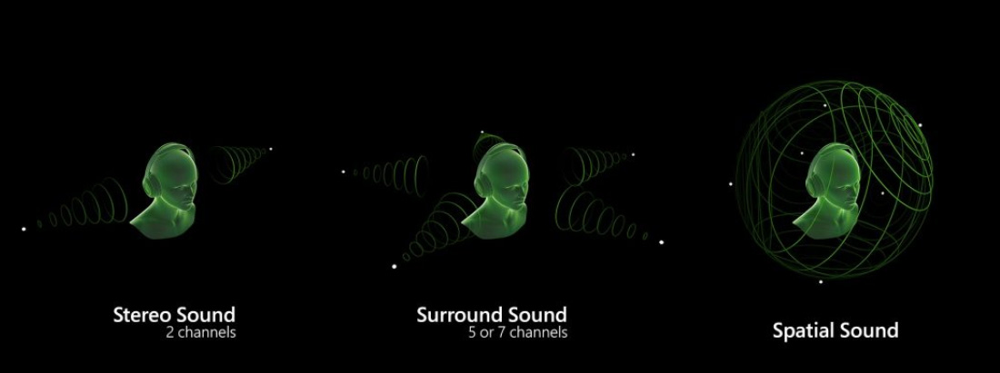
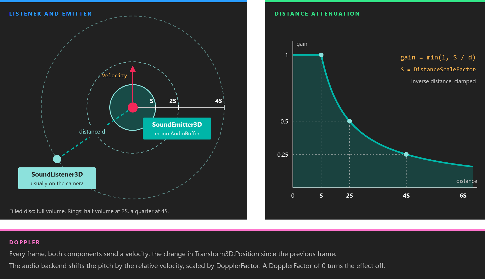
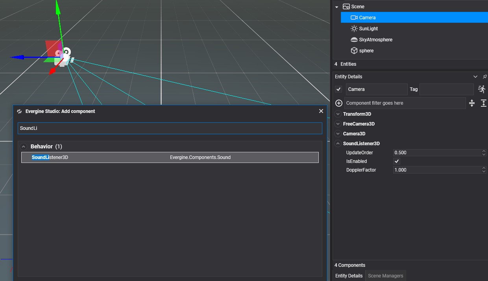
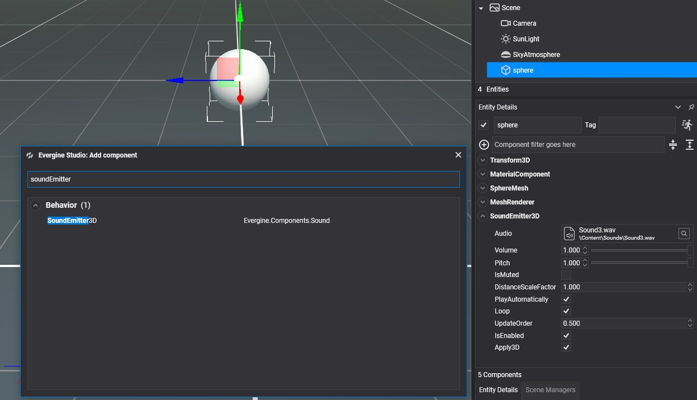

# Using Audio from Evergine Studio

---



Spatial audio places each sound at a point in the scene. A sound gets quieter as you walk away from it, comes from the left or the right depending on where you face, and changes pitch when its source rushes past. This matters most in virtual and augmented reality, where the ears are expected to agree with the eyes.

Two components do the work:

| Component | Description |
| --- | --- |
| **SoundListener3D** | The ears. It moves the audio device's listener with its entity. Add it to the camera. |
| **SoundEmitter3D** | A sound source. It plays one sound asset from the position of its entity. |

Both need a `Transform3D` on the same entity and an audio device registered by the platform launcher. See [Platform support](index.md#platform-support).



*Inside `DistanceScaleFactor` a sound plays at full volume. Beyond it, the gain is `DistanceScaleFactor` divided by the distance, so the volume halves every time the distance doubles. Movement between frames adds the Doppler shift.*

## Sound Listener

Select the camera entity, click  in the **Entity Details** panel, and search for `SoundListener3D`.



| Property | Default | Description |
| --- | --- | --- |
| **DopplerFactor** | 1 | Scales the Doppler effect. `0` turns it off, and values above 1 exaggerate it. Negative values are made positive. |

Every frame, the listener copies the world transform of its entity to the device's `DefaultListener`, along with a velocity and the `DopplerFactor`.

> [!NOTE]
> An audio device has a single listener, `AudioDevice.DefaultListener`. If a scene has more than one `SoundListener3D`, they all write to it and the last one updated wins. Keep one per scene.

## Sound Emitter

Select an entity, click  in the **Entity Details** panel, and search for `SoundEmitter3D`.

<!-- CAPTURE: add_component_sound.png; the Add Component dialog with "Sound" typed in the search box, listing SoundEmitter3D and SoundListener3D under Evergine.Components.Sound -->



<!-- CAPTURE: soundemitter3d_inspector.png; 403x477 crop of Entity Details for an entity with SoundEmitter3D (other components collapsed): Audio set to a mono sound asset, Volume, Pitch, IsMuted, DistanceScaleFactor, PlayAutomatically, Loop, Apply3D -->

| Property | Default | Description |
| --- | --- | --- |
| **Audio** | none | The sound asset to play. It must be **mono**: `Play()` logs a warning and plays nothing for a stereo sound. Set **ChannelFormat** to `Mono` in the [Audio Editor](audio_editor.md). |
| **Volume** | 1 | Volume of this emitter. The slider in Evergine Studio goes from 0.01 to 1. |
| **Pitch** | 1 | Playback rate. Lower values play the sound lower and slower. The slider goes from 0.01 to 1. |
| **IsMuted** | false | Silences the emitter without stopping it, so it can be unmuted where it left off. |
| **DistanceScaleFactor** | 1 | The distance, in scene units, up to which the sound plays at full volume. Beyond it, the volume falls in inverse proportion to the distance. Raise it for loud sources, such as an engine, that should carry far. |
| **PlayAutomatically** | false | Starts playing when the scene starts. It has no effect while you edit the scene in Evergine Studio. |
| **Loop** | false | Plays the sound in a loop. |
| **Apply3D** | true | Sends the position and velocity of the entity to the audio backend every frame while the sound plays. When off, the emitter sends neither. On XAudio2 the sound then plays without spatialization. |

> [!IMPORTANT]
> **Loop** is applied when the emitter creates its audio source, which happens when it is attached or when **Audio** changes to a sound with a different format. Set it before the entity is added to the scene. Changing it on a running emitter has no effect.

> [!NOTE]
> On Windows, the XAudio2 device creates its voices with a maximum frequency ratio of 1. Pitch values above 1, and the rise in pitch of a sound moving towards the listener, are clamped there, so the Doppler effect is only heard on sounds moving away. The OpenAL device used on Android has no such limit.

The velocity used for the Doppler effect is the change in the entity's `Transform3D.Position` since the previous frame. It is measured per frame, not per second, and `Position` is local to the parent entity, so an emitter carried along by its parent reports no velocity of its own.

### Controlling an emitter

`SoundEmitter3D` also has members that the inspector does not show:

| Member | Description |
| --- | --- |
| **Play()** | Starts the sound, or resumes it after `Pause()`. Does nothing while it is already playing. |
| **Pause()** | Pauses the sound where it is. |
| **Stop()** | Stops the sound. The next `Play()` starts it from the beginning. |
| **PlayState** | `Playing`, `Paused` or `Stopped` (the `PlayState` enum in `Evergine.Common.Media`). |
| **OnAudioEnd** | Raised when a sound that is not looping reaches its end, and also when `Stop()` interrupts it. The second argument is the emitter's `Audio`. |

Deactivating the entity pauses its emitter, and activating it again resumes the sound if it was playing.

The following behavior rings a bell a fixed number of times, restarting the emitter each time the sound ends:

```csharp
using System;
using Evergine.Common.Audio;
using Evergine.Common.Media;
using Evergine.Components.Sound;
using Evergine.Framework;

public class Doorbell : Behavior
{
    [BindComponent]
    private SoundEmitter3D emitter = null;

    public int Rings = 3;

    private int ringsLeft;

    // Written from the audio thread, read from Update.
    private volatile bool ended;

    public void Ring()
    {
        this.ringsLeft = this.Rings - 1;
        this.emitter.Play();
    }

    protected override bool OnAttached()
    {
        this.emitter.OnAudioEnd += this.OnAudioEnd;
        return base.OnAttached();
    }

    protected override void OnDetached()
    {
        this.emitter.OnAudioEnd -= this.OnAudioEnd;
        base.OnDetached();
    }

    protected override void Update(TimeSpan gameTime)
    {
        if (!this.ended)
        {
            return;
        }

        this.ended = false;
        if (this.ringsLeft > 0 && this.emitter.PlayState == PlayState.Stopped)
        {
            this.ringsLeft--;
            this.emitter.Play();
        }
    }

    private void OnAudioEnd(object sender, AudioBuffer audio)
    {
        // OnAudioEnd is raised by the audio backend, not by the update loop.
        // Only set a flag here and leave the scene to Update.
        this.ended = true;
    }
}
```

Add it to the entity that has the `SoundEmitter3D`, leave **Loop** off, and call `Ring()` from your game logic.

To create emitters and listeners from code instead of in Evergine Studio, see [Using Audio from Code](using_audio_from_code.md#play-a-sound-with-soundemitter3d).
