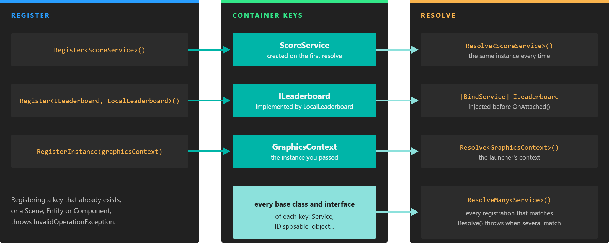

# Application Container

---



*A registration by type is created lazily on the first resolve; an instance is stored as it is. Both are also reachable through their base classes and interfaces.*

The **Application Container** is the dependency injection container of an Evergine application. It stores the objects that must be reachable from everywhere: the [services](../services.md) of your project and the ones Evergine needs to run, such as the [GraphicsContext](../../graphics/low_level_api/graphicscontext.md), the `AssetsService` and the [ScreenContextManager](screen_context_manager.md). The application itself has almost no logic; it asks the container for these objects and drives them every frame.

You reach the container through the `Container` property of the `Application` class, usually as `this.Container` inside your application class or `Application.Current.Container` anywhere else.

> [!NOTE]
> Every registration is keyed by type, and there can only be one registration per type. Registering the same type twice throws an `InvalidOperationException`.

## Register

### Register a Type

`Register<T>()` tells the container which type to create, but creates nothing yet. The instance is built the first time someone resolves it, and the same instance is returned from then on:

```csharp
public partial class MyApplication : Application
{
    public MyApplication()
    {
        // ... the services registered by the project template ...

        this.Container.Register<ScoreService>();
    }
}
```

To create the instance, the container picks the public constructor with the most parameters that it can fill with registered objects. A service that needs another one can simply ask for it in its constructor:

```csharp
public class LeaderboardUploader
{
    private readonly ScoreService scores;

    // ScoreService is registered, so the container can call this constructor.
    public LeaderboardUploader(ScoreService scores)
    {
        this.scores = scores;
    }
}
```

### Register an Implementation of an Abstraction

`Register<T, TImplementation>()` registers `TImplementation` so that it is resolved when someone asks for `T`. Code that depends on the interface does not need to know which implementation the profile chose:

```csharp
public interface ILeaderboard
{
    void Submit(int score);
}

public class LocalLeaderboard : ILeaderboard
{
    public void Submit(int score)
    {
        // Store the score on the device...
    }
}
```

```csharp
this.Container.Register<ILeaderboard, LocalLeaderboard>();

// Anywhere in the application:
var leaderboard = Application.Current.Container.Resolve<ILeaderboard>();
```

### Register an Instance

`RegisterInstance(instance)` stores an object that you have already created. Use it when the object needs configuration before anyone uses it, or when only the launcher project knows which implementation to create. This is how every profile registers its graphics context:

```csharp
GraphicsContext graphicsContext = new DX12GraphicsContext();
graphicsContext.CreateDevice();

// The registration key is the static type of the argument: GraphicsContext.
application.Container.RegisterInstance(graphicsContext);
```

> [!TIP]
> The key is the generic type argument, which C# infers from the declared type of the variable. In the example above, `Resolve<GraphicsContext>()` finds the context but `Resolve<DX12GraphicsContext>()` does not. Write `RegisterInstance<GraphicsContext>(new DX12GraphicsContext())` to make the key explicit.

### Singletons and Factories

Every `Register` overload accepts two optional parameters:

| Parameter | Default | Description |
| --- | --- | --- |
| `factoryDelegate` | `null` | A function that the container calls **every time** the type is resolved, instead of calling a constructor. When it is set, `reuse` is ignored. |
| `reuse` | `true` | `true` creates one instance on the first resolve and returns it from then on. `false` creates a new instance on every resolve. |

```csharp
// A new, independent uploader every time it is resolved.
this.Container.Register<LeaderboardUploader>(reuse: false);

// Built by your code every time it is resolved.
this.Container.Register<ILeaderboard>(() => new LocalLeaderboard());
```

> [!IMPORTANT]
> Keep `Service` classes as singletons, registered by type with the default `reuse` or registered as an instance. The service lifecycle tracks one instance per service type, and objects returned by a factory delegate never join it. Factories and `reuse: false` are meant for plain objects.

### Base Classes and Interfaces

A registration is also stored under every base class and interface of its key type. `Resolve<Service>()` or `Resolve<IDisposable>()` would therefore match many registrations at once, which makes them ambiguous: `Resolve` throws an `InvalidOperationException` in that case. Use `ResolveMany` to get all of them instead.

## Resolve

| Method | Description |
| --- | --- |
| `T Resolve<T>()` | Returns the object registered for `T`, creating it if needed. Returns `null` if nothing is registered for `T`. |
| `object Resolve(Type type)` | The same, without generics. |
| `IEnumerable<T> ResolveMany<T>()` | Returns every object registered for `T` or for a type that derives from it. Returns `null` if there is none. |
| `IEnumerable<object> ResolveMany(Type type)` | The same, without generics. Returns an empty collection if there is none. |
| `bool IsRegistered<T>()` | Returns `true` if something is registered for `T`. |

Inside components, scene managers and services, prefer the [`[BindService]`](../bindings/bind_services.md) attribute to calling `Resolve` yourself:

```csharp
using System;
using Evergine.Framework;

namespace MyProject
{
    public class PickupBehavior : Behavior
    {
        // Resolved from the container before OnAttached() runs.
        [BindService]
        private ScoreService scoreService;

        // Interfaces work too, as long as exactly one registration matches.
        [BindService(isRequired: false)]
        private ILeaderboard leaderboard;

        protected override void Update(TimeSpan gameTime)
        {
            this.scoreService.Add(1);
        }
    }
}
```

`Resolve` is the right tool outside Evergine elements, or where the dependency is only known at runtime:

```csharp
var assetsService = Application.Current.Container.Resolve<AssetsService>();
```

## Unregister

| Method | Description |
| --- | --- |
| `Unregister<T>()` | Removes the registration for `T`. |
| `Unregister(Type type)` | The same, without generics. |

Unregistering a `Service` also destroys it: it runs `OnDeactivated()`, `OnDetached()` and `OnDestroy()`, and the instance cannot be used again.

```csharp
// The player left the online mode: stop and release the service.
this.Container.Unregister<SessionTimerService>();
```

## What Cannot Be Registered

Scenes, entities and components belong to a scene, not to the application. Registering a `Scene`, `Entity` or `Component` (or any subclass) throws an `InvalidOperationException`. Reach entities and components through the [EntityManager](../component_arch/entities/entity_manager.md) and the [bindings](../bindings/index.md) instead.
