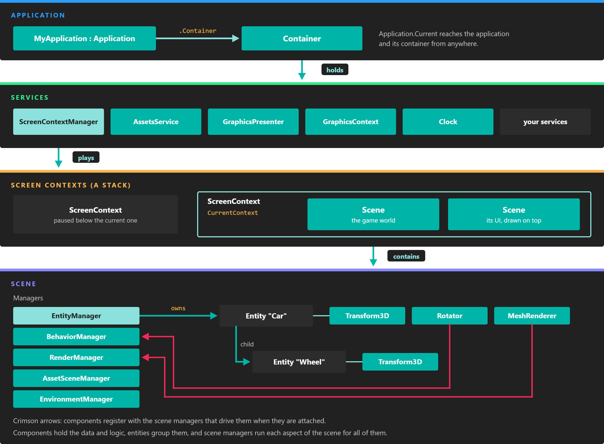

# Application

---

*Everything hangs from the application: services live in its container, and one of them, the ScreenContextManager, owns the scenes that are playing.*

The **Application** class is the entry point of every Evergine project. It owns the [Container](container.md) where all services are registered, and it exposes the frame loop through `UpdateFrame()` and `DrawFrame()`, which the launcher of each profile calls once per frame. Your project contains one class that derives from it, `MyApplication` in the project template.

There is only one application per process. Once created, it is available everywhere through `Application.Current`.

## Members

### Properties

| Property | Default | Description |
| --- | --- | --- |
| **Current** (static) | The last application created | The running application. It is the usual way to reach the container from code that is not an Evergine element. |
| **Container** | A new container | The [Application Container](container.md) with every registered service. |
| **ExecutionMode** | `Standalone` | Where the application runs: `Standalone`, `Editor` (inside Evergine Studio) or `EditorSimulation` (playing inside Evergine Studio). |
| **IsEditor** | `false` | `true` when `ExecutionMode` is `Editor` or `EditorSimulation`. |
| **IsLowProfile** | `true` on Android, iOS, Web, Arm and Arm64 | Tells the engine to favour cheaper rendering paths. It can only be changed before `Initialize()` runs, or through the `Application(bool isLowProfile)` constructor. |

### Methods

| Method | Description |
| --- | --- |
| **Initialize()** | Registers the services configured in Evergine Studio, caches the core services and starts every service already created. Override it to navigate to your first scene, and call `base.Initialize()` first. |
| **UpdateFrame(TimeSpan gameTime)** | Runs the update half of a frame: clock, updatable services and the scenes that are playing. |
| **DrawFrame(TimeSpan gameTime)** | Runs the draw half of a frame: renders the scenes and presents the result on every display. |
| **OnActivated()** | Called by the launcher when the application returns to the foreground. It resumes updates and reactivates the services. |
| **OnDeactivated()** | Called by the launcher when the application goes to the background. It deactivates the services and stops updates until `OnActivated()`. |
| **Dispose()** | Destroys every service, then releases the container. The launcher calls it when the main loop ends. |

The [Using Application](using_application.md) page shows how these methods fit together in a frame.

## In this section

* [Application Container](container.md)
* [Using Application](using_application.md)
* [ScreenContext Manager](screen_context_manager.md)
