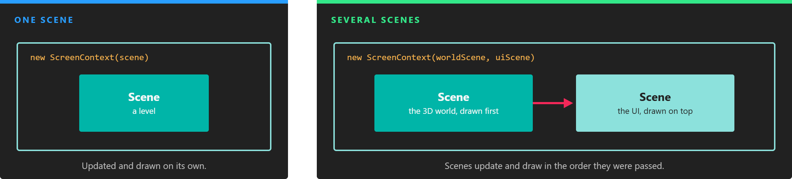
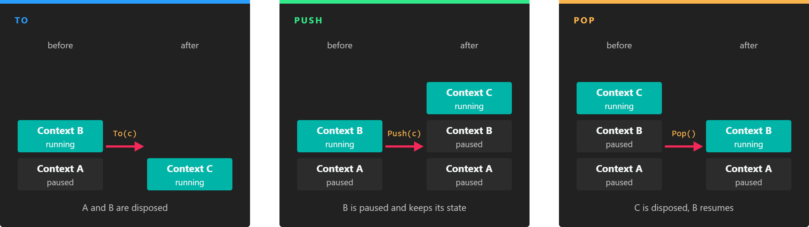

# ScreenContext Manager

---



*A screen context is the set of scenes that play together. It can hold a single scene or several, such as the game world and its UI.*

The **ScreenContextManager** is the [service](../services.md) that decides which [scenes](../scenes/index.md) are playing. It does not work with scenes directly but with **screen contexts**: groups of scenes that are loaded, updated and drawn together. The manager keeps a stack of them, so you can replace everything that is playing, or put something on top (a pause menu, a dialog) and come back to where you were.

Navigation happens only from code. Evergine Studio edits scenes, but the order in which they play is decided by your application.

## ScreenContext

A `ScreenContext` is created from one or more scenes:

```csharp
// A context with a single scene. It gets a generated name.
var gameContext = new ScreenContext(gameScene);

// A named context that plays two scenes: the 3D world first, its UI on top.
var hudContext = new ScreenContext("Game", gameScene, uiScene);
```

| Member | Description |
| --- | --- |
| **Name** | The name used by `ScreenContextManager.FindContextByName()`. If you do not give one, the context is named `ScreenContext0`, `ScreenContext1`, and so on. |
| **Behavior** | A `ScreenContextBehaviors` value that says what the context does while another one is on top of it. `None` by default. See [ScreenContext Behaviors](#screencontext-behaviors). |
| **Count** | The number of scenes in the context. |
| **this[int]** | The scene at the given index. Scenes are updated and drawn in this order. |
| **FindScene\<T\>()** | Returns the first scene of type `T`. |
| **FindScenes\<T\>()** | Returns every scene of type `T`. |

## Load a Scene and Play It

To play a scene asset, load it with the `AssetsService` and navigate to a context that contains it. The template does it in `MyApplication.Initialize()`:

```csharp
public override void Initialize()
{
    base.Initialize();

    var screenContextManager = this.Container.Resolve<ScreenContextManager>();
    var assetsService = this.Container.Resolve<AssetsService>();

    // Loading a .wescene asset creates an instance of the class you ask for (MyScene here)
    // and fills it with the entities saved in the asset.
    var scene = assetsService.Load<MyScene>(EvergineContent.Scenes.MyScene_wescene);

    var screenContext = new ScreenContext(scene);
    screenContextManager.To(screenContext);
}
```

A context with several scenes is built the same way. This one plays the game world and draws a separate UI scene over it:

```csharp
var mainScene = assetsService.Load<MainScene>(EvergineContent.Scenes.MainScene_wescene);
var uiScene = assetsService.Load<UIScene>(EvergineContent.Scenes.UIScene_wescene);

screenContextManager.To(new ScreenContext(mainScene, uiScene));
```

`MainScene` and `UIScene` are classes of your project that derive from `Scene` (see [Create Scenes](../scenes/create_scenes.md)). A scene without custom code can be loaded as a plain `Scene`.

> [!NOTE]
> The `AssetsService` caches what it loads: loading the same scene twice returns the same instance. If the first instance was disposed by a navigation, call `Load<T>(id, forceNewInstance: true)` to get a new one.

## Navigate Between ScreenContexts



*Only the context at the top of the stack runs. The ones below are paused, unless their Behavior says otherwise.*

| Method | Description |
| --- | --- |
| **To(ScreenContext nextContext, bool doDispose = true)** | Removes every context in the stack and plays `nextContext`. With `doDispose` set to `true`, the scenes that are not part of `nextContext` are disposed. |
| **Push(ScreenContext nextContext)** | Pauses the current context and plays `nextContext` on top of it. The paused context keeps its state. |
| **Pop(bool doDispose = true)** | Removes the context at the top of the stack and resumes the one below. With `doDispose` set to `true`, its scenes are disposed. Popping the last context throws an `InvalidOperationException`. |
| **FindContextByName(string name)** | Returns the context in the stack with that name, or `null`. |
| **CurrentContext** | The context at the top of the stack, or `null` when the stack is empty. |

The manager also raises two events: `OnActivatingScene` when a scene starts playing, and `OnDesactivatingScene` when a scene stops playing because its context left the stack.

> [!NOTE]
> `To()`, `Push()` and `Pop()` do not navigate immediately. They queue a command that the manager executes at the start of its next update, one command per frame. The scene that called them finishes its current frame normally.

> [!TIP]
> Pass `doDispose: false` when you plan to come back to the scenes you leave, for example a main menu that you show again later. You are then responsible for disposing them when they are no longer needed.

## ScreenContext Behaviors

When a context is paused, its scenes stop updating and are no longer drawn. The `Behavior` field changes that for the context it is set on:

| Value | Description |
| --- | --- |
| `None` | The default. A paused context neither updates nor draws. |
| `UpdateInBackground` | The scenes of the context keep updating while another context is on top of it. |
| `DrawInBackground` | The scenes of the context keep drawing, below the context on top, while it is paused. |

`ScreenContextBehaviors` is a flags enum, so both values can be combined:

```csharp
var gameContext = new ScreenContext("Game", gameScene)
{
    Behavior = ScreenContextBehaviors.UpdateInBackground | ScreenContextBehaviors.DrawInBackground,
};
```

## Example: A Pause Menu

A pause menu is the typical use of `Push` and `Pop`: the game stops, stays visible behind the menu, and resumes exactly where it was.

First, give the game context `DrawInBackground` when you navigate to it, so it keeps drawing while it is paused:

```csharp
public override void Initialize()
{
    base.Initialize();

    var screenContextManager = this.Container.Resolve<ScreenContextManager>();
    var assetsService = this.Container.Resolve<AssetsService>();

    var gameScene = assetsService.Load<MyScene>(EvergineContent.Scenes.MyScene_wescene);
    var gameContext = new ScreenContext("Game", gameScene)
    {
        // Not UpdateInBackground: the game must freeze while the menu is open.
        Behavior = ScreenContextBehaviors.DrawInBackground,
    };

    screenContextManager.To(gameContext);
}
```

Then add this behavior to any entity of the game scene. It opens the menu when the player presses Escape:

```csharp
using System;
using Evergine.Common.Input;
using Evergine.Common.Input.Keyboard;
using Evergine.Framework;
using Evergine.Framework.Services;

namespace MyProject
{
    public class OpenPauseMenu : Behavior
    {
        [BindService]
        private GraphicsPresenter graphicsPresenter;

        [BindService]
        private AssetsService assetsService;

        [BindService]
        private ScreenContextManager screenContextManager;

        protected override void Update(TimeSpan gameTime)
        {
            var keyboard = this.graphicsPresenter.FocusedDisplay?.KeyboardDispatcher;

            // Pressing is only reported on the frame the key goes down, so the menu opens once.
            if (keyboard?.ReadKeyState(Keys.Escape) == ButtonState.Pressing)
            {
                // Pop() disposes the menu scene, so ask for a new instance every time it opens.
                var pauseScene = this.assetsService.Load<Scene>(EvergineContent.Scenes.PauseMenu_wescene, forceNewInstance: true);
                this.screenContextManager.Push(new ScreenContext("Pause", pauseScene));
            }
        }
    }
}
```

Finally, add this behavior to an entity of the `PauseMenu.wescene` scene. It closes the menu and resumes the game:

```csharp
using System;
using Evergine.Common.Input;
using Evergine.Common.Input.Keyboard;
using Evergine.Framework;
using Evergine.Framework.Services;

namespace MyProject
{
    public class ClosePauseMenu : Behavior
    {
        [BindService]
        private GraphicsPresenter graphicsPresenter;

        [BindService]
        private ScreenContextManager screenContextManager;

        protected override void Update(TimeSpan gameTime)
        {
            var keyboard = this.graphicsPresenter.FocusedDisplay?.KeyboardDispatcher;

            if (keyboard?.ReadKeyState(Keys.Escape) == ButtonState.Pressing)
            {
                // Disposes the pause scene and resumes the game context below it.
                this.screenContextManager.Pop();
            }
        }
    }
}
```

While the menu is open, the game scene is paused: its behaviors and updatable scene managers do not run, so nothing moves, but it is still drawn because of `DrawInBackground`.

> [!TIP]
> The camera of the pause scene draws after the game, over the same display. Set its `ClearFlags` to `ClearFlags.Depth` so that it clears only the depth buffer and the game stays visible behind the menu.
