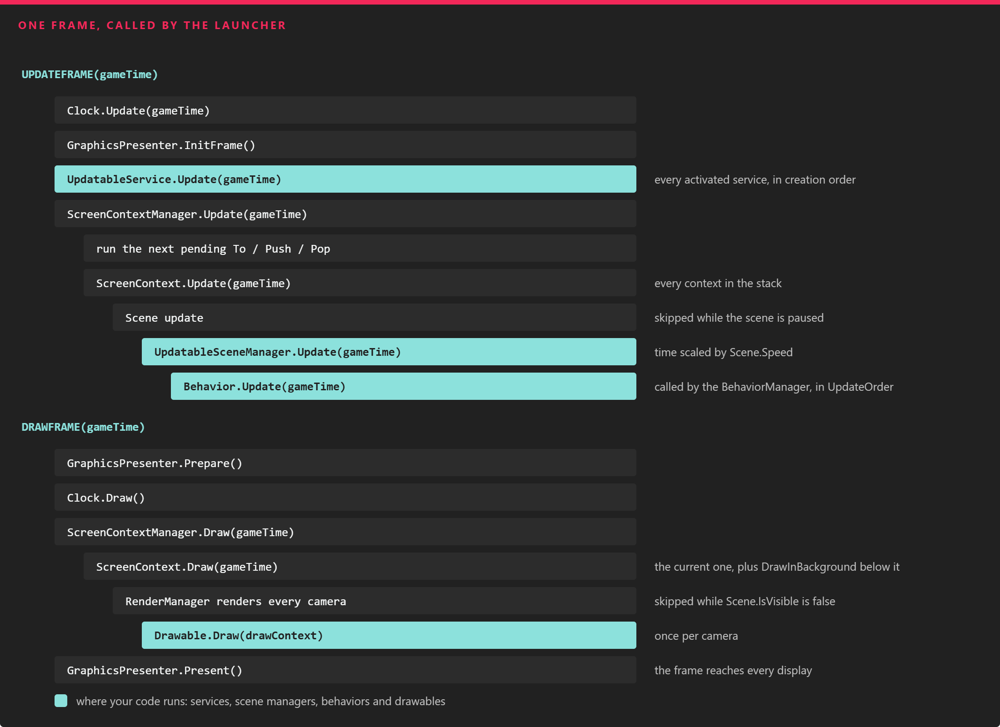

# Using Application

---

This page walks through the application class that the project template creates, the frame loop that drives it, and the few places where you are expected to add your own code.

## The Default Application

A new project (see [Project Structure](../project_structure.md)) contains a `MyApplication` class in the base project:

```csharp
using Evergine.Common.IO;
using Evergine.Framework;
using Evergine.Framework.Services;
using Evergine.Framework.Threading;

namespace MyProject
{
    public partial class MyApplication : Application
    {
        public MyApplication()
        {
            this.Container.Register<Settings>();
            this.Container.Register<Clock>();
            this.Container.Register<TimerFactory>();
            this.Container.Register<Random>();
            this.Container.Register<ErrorHandler>();
            this.Container.Register<ScreenContextManager>();
            this.Container.Register<GraphicsPresenter>();
            this.Container.Register<AssetsDirectory>();
            this.Container.Register<AssetsService>();
            this.Container.Register<ForegroundTaskSchedulerService>();
            this.Container.Register<WorkActionScheduler>();
        }

        public override void Initialize()
        {
            base.Initialize();

            // Get ScreenContextManager
            var screenContextManager = this.Container.Resolve<ScreenContextManager>();
            var assetsService = this.Container.Resolve<AssetsService>();

            // Navigate to scene
            var scene = assetsService.Load<MyScene>(EvergineContent.Scenes.MyScene_wescene);
            ScreenContext screenContext = new ScreenContext(scene);
            screenContextManager.To(screenContext);
        }
    }
}
```

* The **constructor** registers the services that every Evergine application needs. Add your own [services](../services.md) here, after the default ones.
* **Initialize()** runs once, when the launcher is ready to start the loop. `base.Initialize()` starts the services, so call it first. Then load your first [scene](../scenes/index.md) and hand it to the [ScreenContextManager](screen_context_manager.md).
* The class is `partial` on purpose. When you configure services in Evergine Studio ([Manage services](../../evergine_studio/settings/project_services.md)), a source generator adds the other half of the class, which overrides `RegisterApplicationServices()`. `base.Initialize()` calls that method, and it skips any service you already registered in the constructor, so registrations in code always win.

> [!NOTE]
> `EvergineContent` is also generated: it is a class with the ID of every asset in your project, so `EvergineContent.Scenes.MyScene_wescene` is the ID of `Content/Scenes/MyScene.wescene`.

## Services Registered by Each Profile

Services that depend on the platform are registered by the launcher project of each profile, not by the base project. The Windows launcher, for example, registers the window system, the graphics context and the audio device before calling `Initialize()`:

```csharp
MyApplication application = new MyApplication();

WindowsSystem windowsSystem = new Evergine.Forms.FormsWindowsSystem();
application.Container.RegisterInstance(windowsSystem);

GraphicsContext graphicsContext = new Evergine.DirectX12.DX12GraphicsContext();
graphicsContext.CreateDevice();
// ... create the swap chain and the display ...
application.Container.RegisterInstance(graphicsContext);

var xaudio = new Evergine.XAudio2.XAudioDevice();
application.Container.RegisterInstance(xaudio);
```

The graphics context class changes with the profile:

| Profile template | Graphics context |
| --- | --- |
| Windows (DirectX12) | `DX12GraphicsContext` |
| Windows (DirectX11), WinUI, Windows OpenXR, Avalonia | `DX11GraphicsContext` |
| Windows (Vulkan), Android, Meta Quest, Pico | `VKGraphicsContext` |
| Windows (OpenGL), Web (WebGL 2.0) | `GLGraphicsContext` |
| iOS | `MTLGraphicsContext` |
| Web (Experimental WebGPU) | `WGPUGraphicsContext` |

Because they are all registered as `GraphicsContext`, the rest of your code never needs to know which one is running. See [Platforms](../../platforms/index.md) for each profile.

## The Frame Loop

The launcher calls `UpdateFrame()` and then `DrawFrame()` once per frame, passing the time elapsed since the previous one. Everything else in the engine is reached from these two calls:



*One frame, top to bottom. Updatable services run before any scene, every scene updates its scene managers, and drawables are drawn once for each camera.*

**UpdateFrame(gameTime)**

1. The `Clock` service records the frame time, and the `GraphicsPresenter` starts a new frame.
2. Every activated `UpdatableService` runs its `Update()`.
3. The `ScreenContextManager` executes the next pending navigation (`To`, `Push` or `Pop`) and then updates every `ScreenContext` in its stack. A paused scene skips its update.
4. Each scene updates its updatable scene managers. One of them is the `BehaviorManager`, which calls `Update()` on every started [behavior](../component_arch/components/behaviours.md) in `UpdateOrder`.

**DrawFrame(gameTime)**

1. The `GraphicsPresenter` prepares the displays.
2. The `ScreenContextManager` draws the current `ScreenContext`, plus any context below it flagged with `DrawInBackground`.
3. Each visible scene asks its render manager to render. The render pipeline processes every camera, and calls `Draw()` on each activated [drawable](../component_arch/components/drawables.md) once per camera.
4. The `GraphicsPresenter` presents the result on every display: windows, XR headsets or off-screen targets.

> [!NOTE]
> `UpdateFrame()` does nothing while the application is deactivated (between `OnDeactivated()` and `OnActivated()`). The launcher of each platform calls those methods when the app goes to the background and comes back.

You can override `UpdateFrame()` and `DrawFrame()` to add work around the default loop, but always call the base implementation.

## Application Lifecycle Methods

| Method | Description |
| --- | --- |
| **Initialize()** | Registers the services configured in Evergine Studio, starts every service already created, and is the place to navigate to the first scene. |
| **UpdateFrame(TimeSpan gameTime)** | Runs the update half of the frame described above. |
| **DrawFrame(TimeSpan gameTime)** | Runs the draw half of the frame described above. |
| **OnActivated()** / **OnDeactivated()** | Resume and suspend the application when the platform moves it to the foreground or the background. |
| **Dispose()** | Destroys every service and releases the container. To release resources of your own, override the protected `Destroy()` method and call `base.Destroy()`. |

## Check Whether the Code Runs in Evergine Studio

Your components also run inside Evergine Studio, where the scene is being edited rather than played. Use `IsEditor` to skip code that only makes sense at runtime:

| Property | Description |
| --- | --- |
| **IsEditor** | `true` when the application is running inside Evergine Studio, either editing or simulating. |

```csharp
using Evergine.Framework;
using Evergine.Framework.Graphics;
using Evergine.Mathematics;

namespace MyProject
{
    public class SpawnPoint : Component
    {
        [BindComponent]
        private Transform3D transform;

        protected override void Start()
        {
            base.Start();

            // In the editor, keep the position the designer placed; at runtime, snap to the origin.
            if (!Application.Current.IsEditor)
            {
                this.transform.Position = Vector3.Zero;
            }
        }
    }
}
```
