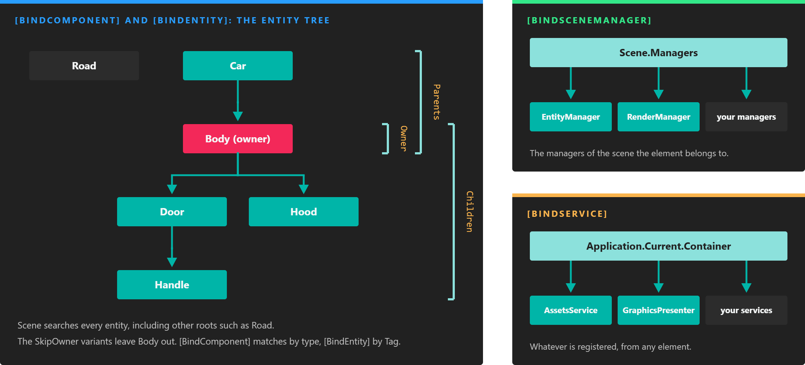

# Bindings

---



*Each attribute searches a different place. The two entity attributes walk the entity tree from the owner of the component; the other two ask the scene or the application.*

**Bindings** connect an element to the things it depends on without any lookup code. You mark a field or property with an attribute such as `[BindComponent]`, and Evergine finds the dependency and assigns it when the element is attached. A component can require the `Transform3D` of its entity, the `RenderManager` of its scene or a service of the application, and simply use it.

Bindings are resolved during the **attach** step of the [lifecycle](../lifecycle_elements.md), right before `OnAttached()` runs. If a required dependency cannot be found, the element is not attached at all, which is far easier to diagnose than a `NullReferenceException` later on.

> [!NOTE]
> Bound members are still `null` in the constructor and in `OnLoaded()`. Use them from `OnAttached()` onwards.

## The Four Binding Attributes

| Attribute | Finds | Where it searches | Usable in |
| --- | --- | --- | --- |
| [`[BindComponent]`](bind_components.md) | Components | The owner entity by default; also its children, its parents or the whole scene. | Components |
| [`[BindEntity]`](bind_entities.md) | Entities, by tag | The whole scene by default; also the owner, its children or its parents. | Components |
| [`[BindSceneManager]`](bind_scenemanagers.md) | Scene managers | The scene managers of the current scene. | Components, scene managers |
| [`[BindService]`](bind_services.md) | Services | The [Application Container](../application/container.md). | Components, scene managers, services |

Every attribute has an `isRequired` parameter, `true` by default. The pages of each attribute list the rest of their parameters.

## Example

This component binds a service, a scene manager and a component, and uses all three in `Start()`:

```csharp
using Evergine.Framework;
using Evergine.Framework.Graphics;
using Evergine.Framework.Managers;
using Evergine.Framework.Services;
using Evergine.Mathematics;

namespace MyProject
{
    public class DebugSetup : Component
    {
        [BindService]
        private AssetsService assetsService;

        [BindSceneManager]
        private RenderManager renderManager;

        [BindComponent]
        private Transform3D transform;

        private Material defaultMaterial;

        protected override void Start()
        {
            base.Start();

            // All three members were assigned before OnAttached() ran.
            this.defaultMaterial = this.assetsService.Load<Material>(DefaultResourcesIDs.DefaultMaterialID);
            this.renderManager.DebugLines = true;
            this.transform.Position = Vector3.Zero;
        }
    }
}
```

If the entity had no `Transform3D`, `DebugSetup` would not attach and `Start()` would never run.

## Binding Errors

How a failed required binding is reported depends on the `ErrorHandler` service:

| `ErrorHandler.ThrowBindingExceptions` | What happens |
| --- | --- |
| `true` (the default) | A `BindingException` is thrown that names the type and the member that could not be resolved. |
| `false` | An error with the same information is written to the trace output, and the element stays detached. |

Evergine Studio sets it to `false`, so a component with a missing dependency does not stop you from editing the scene; look for the error in the **Output** panel.

## Bind Collections

When the bound member is a `List<T>`, the binding collects every match instead of the first one:

```csharp
// The Transform3D of the owner entity.
[BindComponent]
private Transform3D transform;

// Every Camera3D in the scene.
[BindComponent(source: BindComponentSource.Scene)]
private List<Camera3D> sceneCameras;
```

A list binding is always satisfied, even when the list is empty. It is filled once, when the element is attached: elements that appear later are not added to it, while bound elements that are removed are taken out of it. For a set of entities that changes over time, use an [entity tag collection](../component_arch/entities/entity_manager.md#entity-tag-collections).

> [!NOTE]
> Only `List<T>` is recognized as a collection. Arrays and other collection types are treated as a single value.

## When a Dependency Goes Away

Bindings keep track of what they found. If a **required** dependency is detached or destroyed, for example because its component is removed, the element that depends on it is detached too, since its binding no longer holds. An optional dependency is set back to `null` instead, so check it before using it.

## In this section

* [Bind Components](bind_components.md)
* [Bind Services](bind_services.md)
* [Bind Entities](bind_entities.md)
* [Bind Scene Managers](bind_scenemanagers.md)
