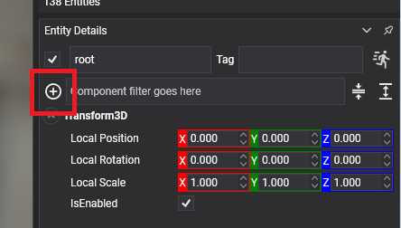
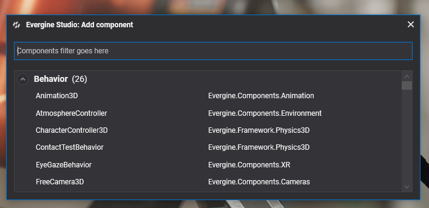
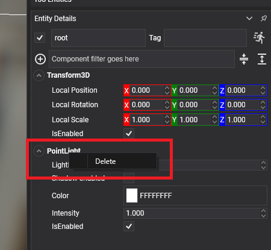

# Components

---


A **component** adds data or functionality to an [entity](../entities/index.md). `Component` is the base class of every component in Evergine, from `Transform3D` to cameras, lights and renderers, and it is also what you derive from to write your own.

There are three kinds of components:

| Base class | Description |
| --- | --- |
| `Component` | Holds data or exposes logic without any per-frame call. It can subscribe to events, react to its [lifecycle](../../lifecycle_elements.md) and offer methods to other components. |
| [`Behavior`](behaviours.md) | Adds logic that runs every frame, through its `Update()` method. |
| [`Drawable`](drawables.md) | Adds rendering work, through its `Draw()` method, which runs once for each camera that renders the scene. |

## Component Lifecycle

Components follow the lifecycle shared by every Evergine element: `OnLoaded()`, `OnAttached()`, `OnActivated()`, `Start()` and their counterparts. See [Lifecycle of Elements](../../lifecycle_elements.md) for when each one runs.

## Using Components

You can manage components both in Evergine Studio and from code.

### From Evergine Studio

#### Add a Component

Select the entity in the Scene Editor and click the  button in the **Entity Details** panel:



A dialog lists every component available in Evergine and in your project. Select the one you want to add:



#### Remove a Component

Select the entity, right-click the header of the component in the **Entity Details** panel and click **Delete**:



### From Code

#### Add Components

Call `Entity.AddComponent()`. It returns the entity, so calls can be chained:

```csharp
Entity entity = new Entity("MyAwesomeEntity")
    .AddComponent(new Transform3D())
    .AddComponent(new CubeMesh())
    .AddComponent(new MaterialComponent())
    .AddComponent(new MeshRenderer());
```

A component added to an entity that is already in a running scene is attached, activated and started straight away.

#### Remove Components

Remove a component by instance or by type. The methods that take a type have an optional `isExactType` parameter, `true` by default: when it is `false`, components of a derived type match too.

```csharp
// Remove a specific instance.
entity.RemoveComponent(component);

// Remove the component of type MeshRenderer.
entity.RemoveComponent<MeshRenderer>();

// The same, without generics.
entity.RemoveComponent(typeof(MeshRenderer));

// Remove every component that is a Drawable or derives from it.
entity.RemoveAllComponentsOfType<Drawable>(isExactType: false);
```

Removing a component destroys it. Use `DetachComponent()` instead when you want to keep the instance and add it to another entity later.

#### Find Components

| Method | Description |
| --- | --- |
| `FindComponent<T>()` | The first component of type `T` in the entity, or `null`. |
| `FindComponents<T>()` | Every component of type `T` in the entity. |
| `FindComponentInChildren<T>()` | The first component of type `T` in the entity or its descendants. |
| `FindComponentInParents<T>()` | The first component of type `T` in the entity or its ancestors. |

All of them accept `isExactType` and a `tag` to filter the entities searched. Inside a component, prefer [bindings](../../bindings/bind_components.md), which find the component once and keep the reference up to date.

## Create a Component

When the components included in Evergine are not enough, write your own. Add a class to the base project that derives from `Component`:

```csharp
using System.Diagnostics;
using Evergine.Framework;

namespace MyProject
{
    public class Greeter : Component
    {
        // Public properties are saved with the scene and shown in Evergine Studio.
        public string Greeting { get; set; } = "Hello";

        protected override void Start()
        {
            base.Start();
            Trace.TraceInformation($"{this.Greeting} from {this.Owner.Name}");
        }
    }
}
```

After you build the project, the new component appears in the component dialog of Evergine Studio.

## Allow Multiple Instances

By default, an entity can only have one component of each type; adding a second `Transform3D`, for example, throws an `InvalidOperationException`.

Some components make sense more than once on the same entity, such as several colliders or several sound emitters. Mark them with the `[AllowMultipleInstances]` attribute:

```csharp
using Evergine.Framework;

namespace MyProject
{
    [AllowMultipleInstances]
    public class Label : Component
    {
        public string Value { get; set; }
    }
}
```

```csharp
// Valid, because Label has the [AllowMultipleInstances] attribute.
Entity entity = new Entity()
    .AddComponent(new Label() { Value = "Red" })
    .AddComponent(new Label() { Value = "Heavy" })
    .AddComponent(new Label() { Value = "Collectable" });
```

## In this section

* [Behaviors](behaviours.md)
* [Drawables](drawables.md)
