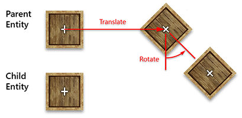
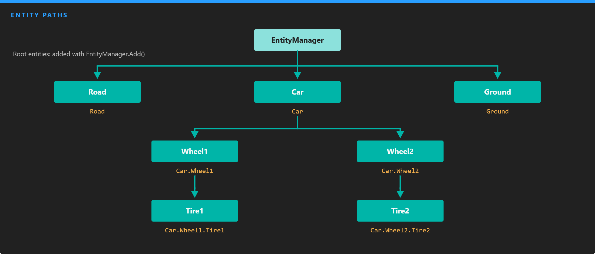

# Entity Hierarchy

---

An entity can be the child of another entity. These parent and child relationships form a tree: the entities at the top are added to the scene's [EntityManager](entity_manager.md), and each of them can have children, which can have children of their own. Hierarchies group what belongs together, such as a car and its wheels, so that it moves, is enabled and is removed as a whole.

## Hierarchy Transformations

When both entities have a `Transform3D`, the child moves, rotates and scales with its parent. Think of your arm and your body: when your body moves, your arm moves with it. Your hand is a child of your arm, and your fingers are children of your hand.



The child's `LocalPosition`, `LocalOrientation` and `LocalScale` are relative to its parent. See [Transform3D](../../transform.md#local-and-world-space) for the difference between local and world values.

Enabling and disabling work the same way: disabling an entity deactivates all its descendants too.

## Build a Hierarchy

Build the tree with `AddChild()`, then add only the root to the `EntityManager`. The children are added to the scene with it:

```csharp
var tire1 = new Entity("Tire1").AddComponent(new Transform3D());
var tire2 = new Entity("Tire2").AddComponent(new Transform3D());

var wheel1 = new Entity("Wheel1").AddComponent(new Transform3D()).AddChild(tire1);
var wheel2 = new Entity("Wheel2").AddComponent(new Transform3D()).AddChild(tire2);

var car = new Entity("Car")
    .AddComponent(new Transform3D())
    .AddChild(wheel1)
    .AddChild(wheel2);

this.Managers.EntityManager.Add(car);
```

> [!NOTE]
> An entity can only have one parent, and an entity that is already at the top of a scene cannot become a child. Detach it from the `EntityManager` first.

## Hierarchy Properties and Methods

| Property | Type | Description |
| --- | --- | --- |
| **Parent** | `Entity` | The direct parent of the entity, or `null` if it has none. |
| **ChildEntities** | `IEnumerable<Entity>` | The direct children of the entity. |
| **NumChildren** | `int` | The number of direct children. |

| Method | Description |
| --- | --- |
| `AddChild(Entity)` | Adds a child. If the parent is already in a running scene, the child is attached, activated and started at once. Returns the parent, so calls can be chained. |
| `RemoveChild(...)` | Removes a child and **destroys** it. The child can be given as the `Entity`, its `Name` or its `Id`. |
| `DetachChild(...)` | Removes a child **without** destroying it, so it can be added somewhere else. Takes the same arguments as `RemoveChild`. |
| `FindChild(string name, bool isRecursive = false)` | Returns the first child with that name, or `null`. With `isRecursive`, searches all descendants, level by level. |
| `FindChild(Guid id, bool isRecursive = false)` | The same, by `Id`. |
| `FindChildrenByTag(string tag, bool isRecursive = false, bool skipOwner = true)` | Returns the children with that tag. With `skipOwner: false`, the entity itself is included when it matches. |
| `FindParentsByTag(string tag, bool isRecursive = false, bool skipOwner = true)` | Returns the ancestors with that tag, nearest first. Without `isRecursive`, only the direct parent is checked. |

The `ChildAdded` and `ChildDetached` events notify you when the direct children of an entity change.

## Entity Paths



*The path of an entity is the chain of names from the top of the tree down to it, separated by dots.*

Every entity in a scene has a path, exposed by its `EntityPath` property. It is made of the names of the entity and all its ancestors, from the root down, separated by the `.` character. In the scene above, the path of `Tire2` is `Car.Wheel2.Tire2`, and the path of `Road` is just `Road`.

Paths are always **absolute**: they start at an entity added directly to the `EntityManager`. Because `.` is the separator, entity names cannot contain it; setting such a name throws an `InvalidOperationException`.

### Find an Entity by Path

Pass a path to `EntityManager.Find()`:

```csharp
// The Tire1 entity, wherever the code that looks for it lives.
Entity tire1 = this.Managers.EntityManager.Find("Car.Wheel1.Tire1");
```

`Entity.Find(path)` resolves a path in the same way, through the scene of the entity, so it returns `null` for an entity that is not in a scene yet. The path is **not** relative to the entity you call it on.

To search below a given entity, use `FindChild()` instead:

```csharp
// Relative to car: its direct child named Wheel1.
Entity wheel1 = car.FindChild("Wheel1");

// Relative to car: the first descendant named Tire1, at any depth.
Entity tire1 = car.FindChild("Tire1", isRecursive: true);
```

> [!TIP]
> `EntityManager.FindComponentFromEntityPath<T>(path)` combines both steps and returns a component of the entity at that path.
