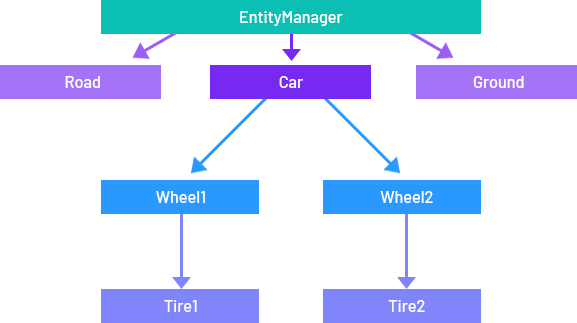

# Entity Hierarchy

You can establish an Entity as a child of another Entity. Using these relationships, it is possible to define an entity tree, where root entities have several children, and those children could have other children too.

## Hierarchy Transformations

If an Entity has a `Transform3D` component (or `Transform2D` for 2D entities), the Child Entity will move, rotate and scale in the same way as its Parent does. You can think of the parent/child hierarchy as being like the relationship between your arms and your body; whenever your body moves, your arms also move along with it. Child objects can also have children. Your hands can be considered as children of your arms, and your fingers are children of your hands.


## Hierarchy Properties and Methods

The Entity has the following properties and methods to maintain and inspect the hierarchy:

| Property | Type | Description |
| --- | --- | --- |
| **Parent** | `Entity` | Points to the immediate ascendant of this entity. If the entity has no parents, this property is `null` |
| **ChildEntities** | `IEnumerable<Entity>` | A collection of the immediate descendants.  |

To add and remove entities, an Entity instance has the following methods:

| Method | Description |
| --- | --- |
| `Entity.AddChild(Entity)` | Adds a child entity to the current entity. |
| `Entity.RemoveChild(...)` | Removes a child entity from the current entity. You can specify the entity to remove by giving the following options: <ul><li>The **Entity** instance.</li><li>The child **Name**</li><li>The child **ID**</li></ul>|

## Entity Paths



Like in a normal file system, Evergine implements a simple **Entity Path** system to allow the identification of entities in the Scene entity tree.

An Entity Path can be accessed by the `EntityPath` property and is represented by the sequence of ascendant entity names (including the current entity) separated by the `.` symbol. For example, in the hierarchy described above, the EntityPath of the `Tire2` entity is `Car.Wheel2.Tire2`.

### Path Representation

These are the path representation elements:

* Entity separator: `.`
* Current entity: `[this]`
* Parent entity: `[parent]`

#### Sample Uses

Using the example described above...

* The *relative* path from **Wheel1** to **Tire2** would be: `[parent].Wheel2.Tire2`
* The *relative* path from **Car** to **Tire1** would be: 
  * `.Wheel1.Tire1`
  * Or: `[this].Wheel1.Tire1`, Notice that `[this]` is optional.
* The *absolute* path of the **Wheel1** entity would be exactly the one we've been using until now: `Car.Wheel1`
* When you want to get an entity that doesn't belong to the source's root entity, simply specify the target's absolute path. For example, the relative path from **Tire1** to **Ground** is just `Ground`, instead of `[parent].[parent].[parent].Ground` (Incorrect path)
* To determine if a specific path is absolute or relative, we just have to check the first element. If it's one of the special elements (`.`, `[this]` or `[parent]`):

| Path | Type |
|--- | ---|
| `[parent].Wheel1` | Relative |
| `.Tire2` | Relative |
| `[this]` | Relative |
| `Car.Wheel2` | Absolute |
| `Road` | Absolute |

## Additional Methods

To make it easier to search for entities in code, we’ve added the `Find()` method in the Entity class.

```csharp
public Entity Find(string path)
```

This method finds an entity with the desired **relative** path with respect to the caller entity. If the relative path is not correct, it returns `null`.

We have also added an additional parameter in the **Find** method in the **EntityManager** class, allowing you to set the source entity and directly search there.

```csharp
public Entity Find(string path, Entity sourceEntity = null)
```

For example (following the above-mentioned hierarchy), if we want to search for the tire1 entity from the car we can call one of the following:

```csharp
Entity tire;

// We can find the entity either of these ways
tire = car.Find(".Wheel1.Tire1");
tire = entityManager.Find(".Wheel1.Tire1", car);
```