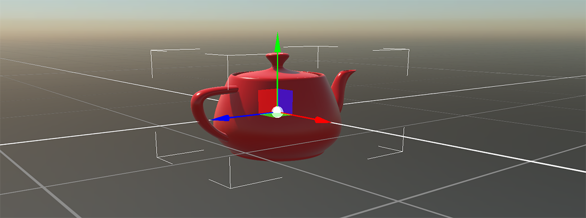

# Entities

---

An **entity** is an object in a scene: a character, a light, a model, a camera. On its own an entity does nothing and is not drawn; it is a named container for [components](../components/index.md), and the components you add decide what it is. An entity with a `Camera3D` is a camera, and an entity with a mesh, a material and a `MeshRenderer` is a visible model.

Entities can also contain other entities, forming the [entity hierarchy](entity_hierarchy.md) of the scene, and they are owned by the scene's [EntityManager](entity_manager.md).

## Basic Properties

| Property | Type | Description |
| --- | --- | --- |
| **Id** | `Guid` | The unique identifier of the entity. No two entities in a scene share it. It is generated when the entity is created, and restored when the entity is loaded from a scene asset. |
| **Name** | `string` | The name of the entity, `Entity_0`, `Entity_1` and so on if you do not give one. Names are what [entity paths](entity_hierarchy.md#entity-paths) are made of, so they cannot contain the `.` character. Siblings may share a name, but a path then finds only the first of them. |
| **Tag** | `string` | A label that groups entities with something in common, for example every `"Enemy"`. The [EntityManager](entity_manager.md#find-entities) and the [bindings](../../bindings/bind_entities.md) can find entities by tag. |
| **IsEnabled** | `bool` | `true` by default. Disabling an entity deactivates it, its components and all its descendants. |
| **IsStatic** | `bool` | `false` by default. Marks an entity that is not moved, rotated or scaled once it is initialized, so that the engine can treat it as static. |
| **Components** | `IEnumerable<Component>` | The components of the entity. |
| **Parent** | `Entity` | The parent entity, or `null` for an entity at the top of the hierarchy. |
| **ChildEntities** | `IEnumerable<Entity>` | The direct children of the entity. |
| **EntityPath** | `string` | The path of the entity in the hierarchy, such as `Car.Wheel1.Tire1`. See [Entity Paths](entity_hierarchy.md#entity-paths). |
| **Scene** | `Scene` | The scene the entity belongs to. It is `null` until the entity is added to a scene; see [Lifecycle of Elements](../../lifecycle_elements.md). |

## In this section

* [Entity Manager](entity_manager.md)
* [Entity Hierarchy](entity_hierarchy.md)
* [Using Entities](using_entities.md)
