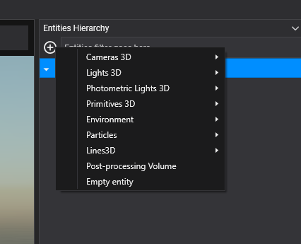
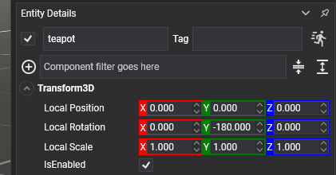

# Using Entities

Manipulating entities is quite straightforward in Evergine.

## From Evergine Studio

### Add Entity in Evergine Studio

In the **Entities Hierarchy** area in an opened SceneEditor, just click the  button. A pop-up menu will appear:



This menu gives you several options to create entities. If you just want to create an entity with only the Transform3D component, click the `Empty entity` button.

If an entity is selected, you can change its properties (Name, Tag, Enable) in the Entity Details panel:



## From Code

### Create a new Entity from Code

Creating an entity from code is not a complex task:

```csharp
Entity entity = new Entity("EntityName");

// Set the Entity Tag...
entity.Tag = "Tag";

// Add some components...
entity.AddComponent(new Transform3D())
    .AddComponent(new TeapotMesh())
    .AddComponent(new MaterialComponent())
    .AddComponent(new MeshRenderer());

// Add to the EntityManager
this.Managers.EntityManager.Add(entity);
```

### Create a Simple Hierarchy from Code

```csharp
// Create the parent entity...
Entity parentEntity = new Entity()
    .AddComponent(new Transform3D());

// Create the child entity...
Entity childEntity = new Entity()
    .AddComponent(new Transform3D());

// Add the child entity to the parent...
parentEntity.AddChild(childEntity);

// Add only the parent entity to the EntityManager
this.Managers.EntityManager.Add(parentEntity);
```

### Bind an Entity to a Component Property

Components can expose properties that reference other entities in the scene. To make an `Entity` property assignable from Evergine Studio, decorate it with the `[RenderPropertyAsEntity]` attribute:

```csharp
public class Follower : Behavior
{
    [RenderPropertyAsEntity]
    public Entity Target { get; set; }

    [BindComponent]
    private Transform3D myTransform;

    private Transform3D targetTransform;

    protected override void Start()
    {
        base.Start();

        this.targetTransform = this.Target?.FindComponent<Transform3D>();
    }
}
```

In Evergine Studio, you can assign the `Target` property by dragging an entity from the **Entities Hierarchy** and dropping it onto the corresponding property in the component panel.

The entity reference is stored as part of the component configuration. When the scene is loaded and the component dependencies are resolved, the property contains the corresponding `Entity` instance. Therefore, the referenced entity can be used directly from the component code.

In the example above, once the `Follower` component starts, `Target` already references the entity selected in Evergine Studio. The component can then retrieve its `Transform3D` component using `FindComponent<Transform3D>()`.