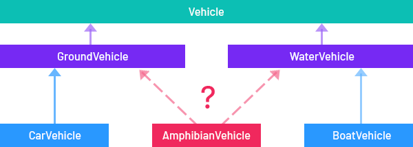
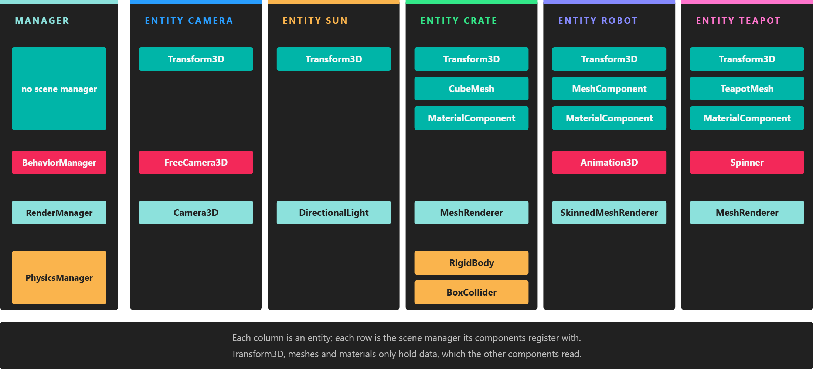

# Component-Based Architecture

---

Evergine is built on entities and components. An [**entity**](entities/index.md) is an object in a scene, and it gets all of its functionality from the [**components**](components/index.md) attached to it. Each component does one job, such as holding a position, drawing a mesh or moving a camera, and the same component can be reused on any entity that needs that job done.

## Why Components

Every object in a scene needs some kind of code: a car, a player, the sun. A natural first idea is a class hierarchy, with a base class such as `AppObject` for common code, a `Vehicle` class under it, and `Car`, `Motorbike` or `Train` under that.

This works for small projects, but it breaks down as they grow:

* Base classes accumulate code that only some subclasses need, and they become hard to split into separate systems.
* Some objects do not fit a single branch of the tree. If there are `GroundVehicle` and `WaterVehicle` classes, which one should an `AmphibianVehicle` derive from? Either choice leaves out half of what it needs.

Evergine uses **aggregation** instead. The `Entity` class has no behavior of its own, only a collection of independent components that derive from `Component`. An object gets exactly the features it needs by combining components, and a new feature is a new component rather than a change to a base class. The amphibian is an entity with a ground movement component and a water movement component.

## Entities and Components

**Entities** represent everything in a scene: characters, lights, models, cameras. An entity without components does nothing; it is not drawn and nothing interacts with it.

What an entity is depends on its components. Add a `Camera3D` and it becomes a camera; add a mesh, a material and a `MeshRenderer` and it becomes a visible model.

### Scene Managers and Components

A **scene** has a set of subsystems called [**scene managers**](../scenes/scenemanagers.md). Each one runs one aspect of the scene for all entities at once: the `RenderManager` draws the scene, the `BehaviorManager` updates every behavior, the `PhysicsManager` runs the physics simulation, and so on.

Components register themselves with the scene managers that need them when they are attached. That way, every scene manager only sees the components it cares about and can ignore the rest.

> [!NOTE]
> For instance: Every physics-related component (RigidBody, BoxCollider, etc.) is internally registered into the PhysicsManager when an Entity is spawned into the scene. This allows PhysicsManager to gather and control all the physics information in the scene.

### The Whole Picture

A **scene** contains [**entities**](entities/index.md). Each entity has a collection of components that give it its data and functionality, and each component can be registered with one or more **scene managers** of the scene:

*Read the diagram by columns to see what each entity is made of, and by rows to see which components each scene manager drives.*

## In This Section

* [Entities](entities/index.md)
* [Components](components/index.md)
* [Prefabs](prefabs/index.md)
