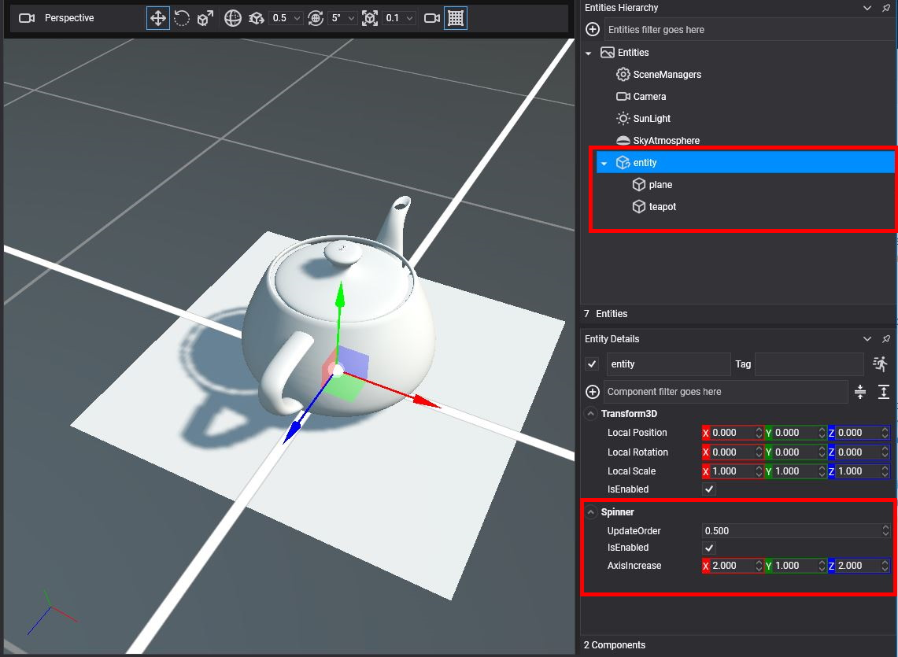
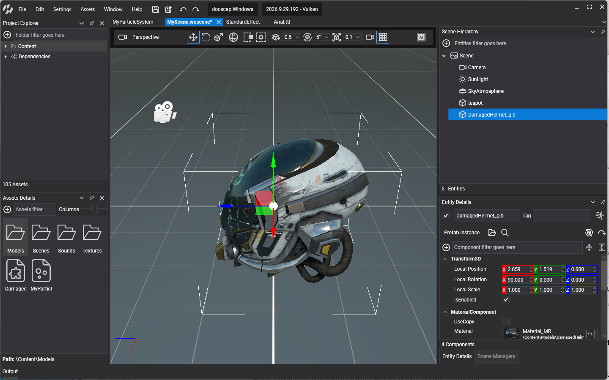
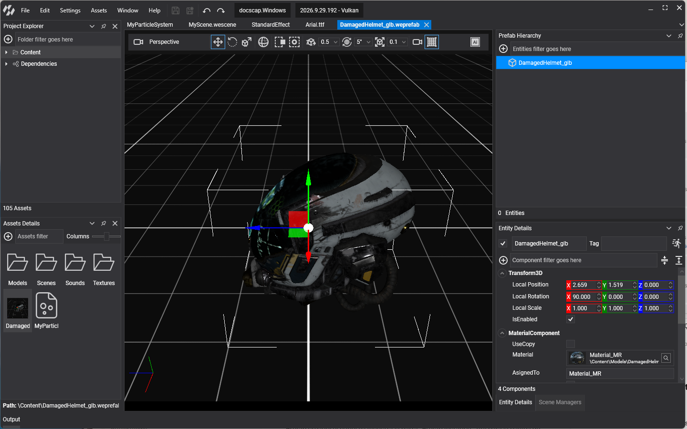
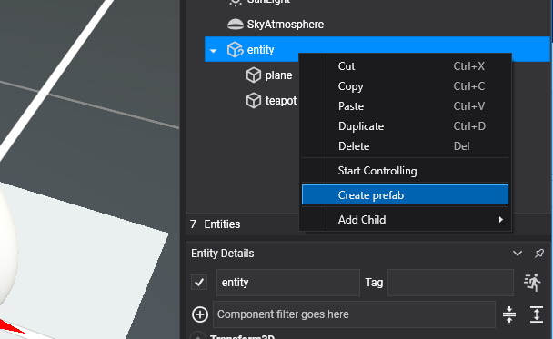
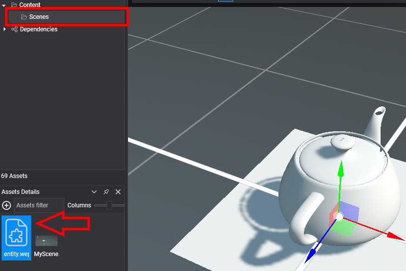
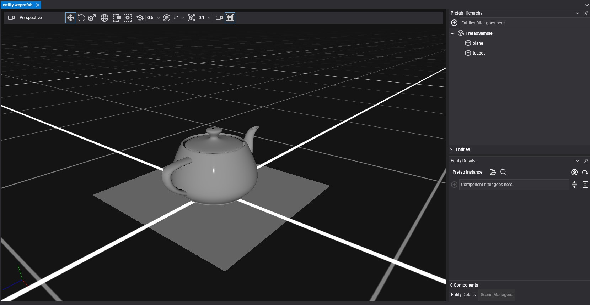

# Prefabs

---



A **prefab** is an asset that stores an entity together with its components and its descendants, so that you can place the same object many times, in one scene or in several. Every placed copy is a **prefab instance** linked to the asset: change the prefab and every instance changes with it. Use prefabs instead of copying and pasting entities, which leaves you with many independent copies to keep in sync by hand.





## Create a Prefab

First build the entity hierarchy and give it its components. For example, an entity with a teapot and a plane as children, and a `Spinner` component on the top entity so that the whole group rotates.

To turn it into a prefab, right-click the top entity of the hierarchy and select **Create prefab**.



Evergine Studio creates an asset with the `.weprefab` extension in the folder selected in the **Project Explorer** panel. Like any other asset, you can move it to another folder afterwards.



The entities you selected become the first instance of the new prefab, and they are marked with a `(Prefab)` suffix once you save and reload the scene. To place more instances, drag the prefab asset from the **Assets Details** panel into the scene.

> [!IMPORTANT]
> Creating a prefab cannot be undone once you save the scene.

## Edit a Prefab

Changing the entities of an instance in the scene does not change the prefab or its other instances. To add, remove or modify the entities and components of the prefab itself, open it in the prefab editor by double-clicking the asset:



Prefabs can be nested: a prefab can contain instances of other prefabs. Cycles are not allowed; if a change would make a prefab contain itself, directly or through other prefabs, Evergine Studio rejects it and shows a warning in the **Output** panel.

## Instantiate a Prefab from Code

Load the prefab with the `AssetsService`, create an instance, and add it to the scene like any other entity:

```csharp
using Evergine.Framework;
using Evergine.Framework.Graphics;
using Evergine.Framework.Prefabs;
using Evergine.Framework.Services;
using Evergine.Mathematics;

namespace MyProject
{
    public class TeapotSpawner : Component
    {
        [BindService]
        private AssetsService assetsService;

        public void Spawn(Vector3 position)
        {
            var prefab = this.assetsService.Load<Prefab>(EvergineContent.Prefabs.SpinningTeapot_weprefab);

            // Every call creates a new, independent entity hierarchy.
            Entity instance = prefab.Instantiate();
            instance.FindComponent<Transform3D>().Position = position;

            this.Managers.EntityManager.Add(instance);
        }
    }
}
```

`EvergineContent.Prefabs.SpinningTeapot_weprefab` is the ID that the generated `EvergineContent` class gives to a prefab named `SpinningTeapot.weprefab` in a `Content/Prefabs` folder.
