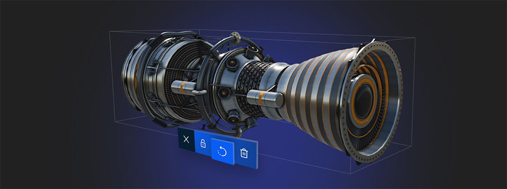

# Basics

---

This section explains the concepts that every Evergine application is built on: how a project is organized, how entities and components make up a scene, how elements are created and destroyed, and how the application, its services and its scenes fit together. Read it before you start writing code of your own.

## Evergine and .NET

Evergine is a component-based engine built on .NET and designed to run on many platforms from one code base.

All the code of an Evergine application is written in **C#**. You can edit it in [Visual Studio](https://visualstudio.microsoft.com/) or in any IDE that supports .NET.

An Evergine application is a .NET application, so you can use any library or service of the .NET ecosystem in it.

### NuGet Packages

Evergine is distributed as [NuGet packages](https://www.nuget.org/). Your projects reference them like any other .NET library, which also makes it easy to combine Evergine with the rest of the .NET ecosystem. [Project Structure](project_structure.md#projects-and-packages) shows which packages each project of your solution uses.

> [!IMPORTANT]
> To update the Evergine version of your application, use the [Evergine Launcher](../evergine_launcher/manage_versions.md) instead of the NuGet Package Manager of Visual Studio.

## In this section

* [Project Structure](project_structure.md)
* [Component Based Architecture](component_arch/index.md)
* [Transform](transform.md)
* [Bindings](bindings/index.md)
* [Lifecycle of Elements](lifecycle_elements.md)
* [Scenes](scenes/index.md)
* [Services](services.md)
* [Application](application/index.md)
* [Testing](testing.md)
