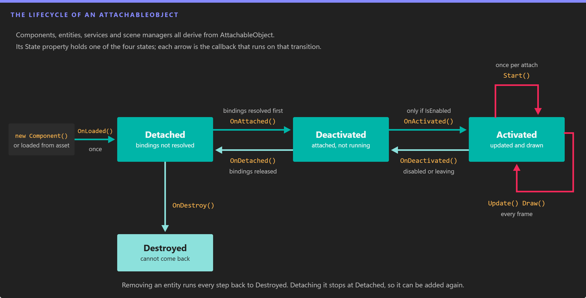

# Lifecycle of Elements

---



*Every component, entity, service and scene manager moves through the same four states. The callback on each arrow runs as the object changes state, so each one is the right place for a specific kind of work.*

Components, entities, [services](services.md) and [scene managers](scenes/scenemanagers.md) share one lifecycle. Evergine loads them, resolves their [bindings](bindings/index.md), attaches them, activates them and starts them, and runs the same steps backwards when they go away. Knowing which callback runs when tells you where to put initialization, event subscriptions and cleanup so that enabling, disabling and removing an element never leaves anything behind.

All of these classes derive from `AttachableObject`:

* [Components](component_arch/components/index.md), including [Behaviors](component_arch/components/behaviours.md) and [Drawables](component_arch/components/drawables.md)
* [Entities](component_arch/entities/index.md)
* [Services](services.md)
* [Scene managers](scenes/scenemanagers.md)

## States

The current state is exposed by the `State` property, of type `AttachableObjectState`:

| State | Meaning |
| --- | --- |
| `Detached` | The initial state. The object is not connected to a scene or to the application, and its bindings are not resolved. |
| `Deactivated` | The object is attached: its bindings are resolved and `OnAttached()` succeeded, but it is not running. A disabled component stays here. |
| `Activated` | The object is running. Behaviors are updated and drawables are drawn only in this state. |
| `Destroyed` | The object has been released. Nothing brings it back. |

The `AttachableStateChanged` event is raised every time the state changes.

## Lifecycle Properties

| Property | Default | Description |
| --- | --- | --- |
| **IsEnabled** | `true` | Enables or disables the element. Setting it to `false` on an activated element deactivates it, and setting it back to `true` activates it again. A component is only activated when both the component and its entity are enabled. |
| **State** | `Detached` | The current `AttachableObjectState`. Read only. |
| **IsLoaded** | `false` | `true` once `OnLoaded()` has run. It never goes back to `false`. |
| **IsAttached** | `false` | `true` while the state is `Deactivated` or `Activated`. |
| **IsActivated** | `false` | `true` while the state is `Activated`. |
| **IsStarted** | `false` | `true` once `Start()` has run and while the element is activated. It is reset when the element is detached. |
| **IsDestroyed** | `false` | `true` once the element has been destroyed. |

## Initialization

These callbacks run when an element enters a scene or the application. Override the ones you need and call the base implementation.

### OnLoaded()

Runs **once** in the lifetime of the object, when it is created from code and added (for a component, when it is passed to `AddComponent()`) or when it is deserialized from a scene asset.

* Initialize here everything that does **not** depend on other elements: collections, default values, cached calculations.
* Bindings are not resolved yet, and a component has no `Owner` yet.

### OnAttached()

Runs when the element is attached, for example when its entity is added to the `EntityManager`.

* **All bindings are resolved** before this method runs. If a required binding cannot be resolved, `OnAttached()` is not called and the element stays `Detached` (see [Binding Errors](bindings/index.md#binding-errors)).
* Use it to establish relationships with other elements, such as registering the component with a scene manager.
* It returns a `bool`. Return `true` if attaching succeeded. Returning `false` leaves the element `Detached`.

> [!NOTE]
> The elements you are bound to have been found, but they may not be attached yet. Do not call into them here.

### OnActivated()

Runs when the element is activated, right after it is attached or when `IsEnabled` changes to `true`.

* It only runs when the element **and** its owner are enabled. If a component or its entity is disabled, the component stays `Deactivated`.
* Put here the setup that you undo in `OnDeactivated()`, such as event subscriptions. It can run many times in the lifetime of the object.

> [!NOTE]
> Your dependencies are attached at this point, but some of them may not be activated yet.

### Start()

Runs **once per attachment**, before the first update, and only if the element is activated.

* Disabling and enabling an element does not call `Start()` again. Detaching it and attaching it again does, after `OnAttached()` and `OnActivated()`.
* Use it for initialization that depends on other elements and must happen only once, such as reading the initial state of a bound component.

> [!NOTE]
> Your dependencies are activated at this point, but some of them may not be started yet.

## Per Frame Loop

Once started, some elements receive a call every frame. The [Application](application/using_application.md#the-frame-loop) page shows where these calls come from.

### Update(TimeSpan gameTime)

Available on [Behaviors](component_arch/components/behaviours.md), `UpdatableService` ([services](services.md)) and `UpdatableSceneManager` ([scene managers](scenes/scenemanagers.md)).

* It runs once per frame, and only while the element is activated. A behavior is also skipped until it has started.
* `gameTime` is the time elapsed since the previous frame, scaled by the scene `Speed` for behaviors and scene managers.
* Put here the logic that changes the state of the application: movement, input handling, game rules.

### Draw(DrawContext drawContext)

Available on [Drawables](component_arch/components/drawables.md).

* It runs while the drawable is activated, **once for each camera** that renders the scene.
* Put here the code that updates or submits render objects for that camera.

## Deinitialization

These callbacks undo the initialization, in reverse order.

### OnDeactivated()

Runs when an activated element is disabled or is about to be detached.

* Undo here everything you did in `OnActivated()`, for example unsubscribe from events.

### OnDetached()

Runs when an element is detached, for example when its entity is removed from the scene or the component is removed from its entity.

* Undo here everything you did in `OnAttached()`. Bindings are released right after this method returns.

> [!IMPORTANT]
> Override `OnDetached()`. The older `OnDetach()` callback is obsolete; it is still invoked just before `OnDetached()` for compatibility, but new code must not use it.

### OnDestroy()

Runs when a detached element is destroyed, and only if it was loaded.

* A destroyed element cannot be attached again.
* Release here everything created in `OnLoaded()`: collections, native resources, anything that must not outlive the object.

> [!NOTE]
> If a **required** dependency is detached or destroyed, Evergine detaches the elements that depend on it as well, because their bindings can no longer be satisfied. An optional dependency (`isRequired: false`) is set back to `null` instead.

## Example: Log Every Callback

Adding this behavior to an entity is the quickest way to see the lifecycle in action. It writes one line per callback to the debug output.

```csharp
using System;
using System.Diagnostics;
using Evergine.Framework;

namespace MyProject
{
    public class LifecycleLogger : Behavior
    {
        private bool isFirstUpdate = true;

        protected override void OnLoaded()
        {
            base.OnLoaded();

            // The component has no owner yet: it has only been added to an entity.
            this.Log(nameof(this.OnLoaded));
        }

        protected override bool OnAttached()
        {
            this.Log(nameof(this.OnAttached));
            return base.OnAttached();
        }

        protected override void OnActivated()
        {
            base.OnActivated();
            this.Log(nameof(this.OnActivated));
        }

        protected override void Start()
        {
            base.Start();
            this.Log(nameof(this.Start));
        }

        protected override void Update(TimeSpan gameTime)
        {
            // Update runs every frame, so only the first call is logged.
            if (this.isFirstUpdate)
            {
                this.isFirstUpdate = false;
                this.Log(nameof(this.Update));
            }
        }

        protected override void OnDeactivated()
        {
            base.OnDeactivated();
            this.Log(nameof(this.OnDeactivated));
        }

        protected override void OnDetached()
        {
            this.Log(nameof(this.OnDetached));
            base.OnDetached();
        }

        protected override void OnDestroy()
        {
            this.Log(nameof(this.OnDestroy));
            base.OnDestroy();
        }

        private void Log(string callback)
        {
            Trace.WriteLine($"[{this.Owner?.Name ?? "no owner"}] {callback}");
        }
    }
}
```

Then exercise it from a scene or another component:

```csharp
var entity = new Entity("Logged")
    .AddComponent(new Transform3D())
    .AddComponent(new LifecycleLogger());   // OnLoaded

this.Managers.EntityManager.Add(entity);    // OnAttached, OnActivated and Start, because the scene is running

entity.IsEnabled = false;                   // OnDeactivated
entity.IsEnabled = true;                    // OnActivated (Start does not run again)

this.Managers.EntityManager.Remove(entity); // OnDeactivated, OnDetached, OnDestroy
```

> [!TIP]
> `EntityManager.Remove()` destroys the entity and its components. Use `EntityManager.Detach()` instead when you want to take an entity out of the scene and add it again later: it stops at `OnDetached()`, and adding the entity back runs `OnAttached()`, `OnActivated()` and `Start()` again.

## Scenes

A [Scene](scenes/index.md) is not an `AttachableObject` and has its own, simpler sequence: `RegisterManagers()`, `CreateScene()`, `Start()`, then `Pause()`, `Resume()` and `End()`. The [Create Scenes](scenes/create_scenes.md) page describes each of them.
