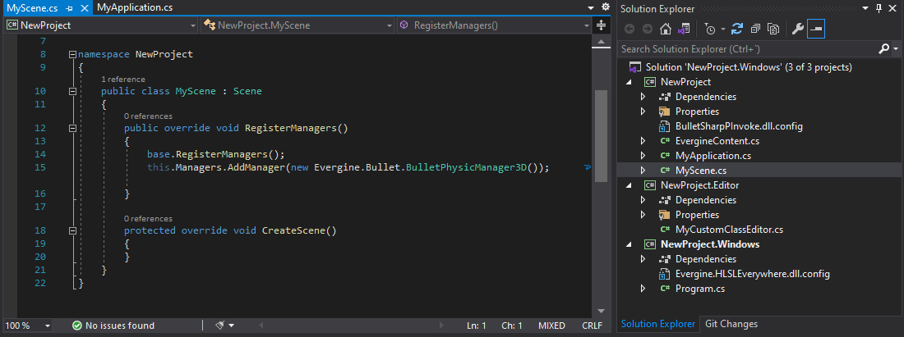
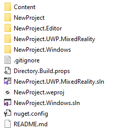
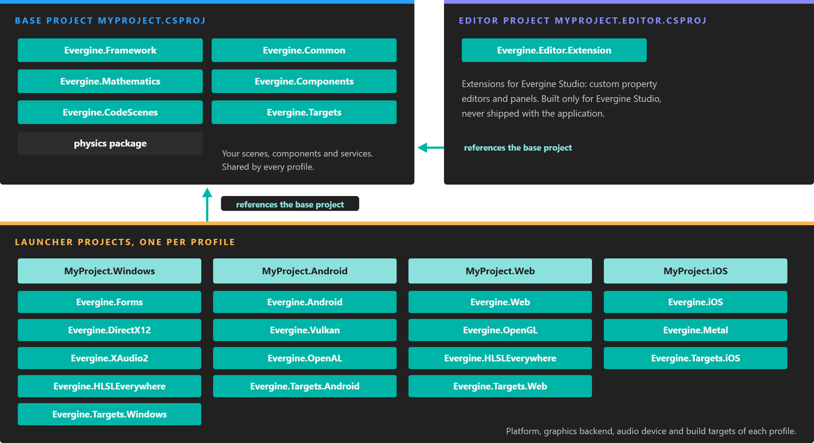

# Project Structure

---

An Evergine project is a set of .NET projects that share one code base and one set of assets. The code that makes up your application lives in a single base project; each platform you target gets a small launcher project that starts it; and Evergine Studio adds an editor project for its own extensions. This page describes what each folder and file is for, so that you know where new code belongs.

## Folders and Files

A new project created from the [Evergine Launcher](../evergine_launcher/create_project.md) contains the following:

| Folder or file | Example | Description |
| ------ | ------- | -------------------- |
| **[ProjectName].weproj** | `MyProject.weproj` | The **Evergine project** file. It stores the Evergine packages of the project, its [profiles](../evergine_studio/settings/project_profiles.md) and the path of the `Content` folder. Double-click it to open the project in **Evergine Studio**. |
| **[ProjectName].weservices** | `MyProject.weservices` | The services configured in Evergine Studio and their settings (see [Manage services](../evergine_studio/settings/project_services.md)). It is created the first time you configure one, and a source generator turns it into registration code when the project builds. |
| **Content/** | `Content/` | Every **asset** of the project: scenes, prefabs, models, textures, materials, sounds. |
| **[ProjectName]/** | `MyProject/MyProject.csproj` | The **base** project. Your scenes, components, behaviors, services and scene managers go here, and it is shared by every profile. It also contains the generated `EvergineContent` class with the IDs of every asset. |
| **[ProjectName].Editor/** | `MyProject.Editor/MyProject.Editor.csproj` | The **editor** project, for Evergine Studio extensions such as custom property editors for your components. It is only built for Evergine Studio and never ships with your application. |
| **[ProjectName].[Profile]/** | `MyProject.Windows/MyProject.Windows.csproj` | One **launcher** project per profile. It creates the window or view of that platform, the graphics context and the audio device, registers them in the application container, and runs the frame loop. Keep code that only makes sense on one platform here. |
| **[ProjectName].[Profile].sln** | `MyProject.Windows.sln` | One **Visual Studio solution** per profile, with the base project and the launcher of that profile. The Windows solution also contains the editor project. |
| **Directory.Build.props** | | MSBuild settings shared by every project. Evergine Studio uses it to add the `EVERGINE_EDITOR` build constant when it builds the project. |
| **README.md**, **.gitignore** | | A readme to fill in, and Git ignore rules suited to Evergine projects. |

## Profiles

A **profile** is a target platform with its launcher project, its graphics backend and its asset settings. The Windows (DirectX12) profile is always present, because Evergine Studio runs your project through it. Add others from the Evergine Launcher when you create the project, or later from [Project Settings](../evergine_studio/settings/project_profiles.md).

| Profile template | Platform | Graphics backend |
| --- | --- | --- |
| Windows (DirectX12) | Windows, Windows Forms | DirectX 12 |
| Windows (DirectX11), Windows (Vulkan), Windows (OpenGL) | Windows, Windows Forms | DirectX 11, Vulkan, OpenGL |
| Windows OpenXR (DirectX11) | Windows, OpenXR headsets | DirectX 11 |
| WinUI (DirectX11), Avalonia | Windows, WinUI 3 or Avalonia | DirectX 11 |
| Android | Android | Vulkan |
| Android Meta Quest (OpenXR), Android Pico (OpenXR) | Android XR headsets | Vulkan |
| iOS | iOS | Metal |
| MAUI | Windows, Android and iOS from one .NET MAUI project | DirectX 11, Vulkan, Metal |
| Web (WebGL2.0), React SPA (WebGL2.0) | Browser, Blazor WebAssembly | WebGL 2.0 |
| WebXR (Experimental AR) | Browser, WebXR | WebGL 2.0 |
| Web (Experimental WebGPU) | Browser, Blazor WebAssembly | WebGPU |

Each profile solution may need extra Visual Studio workloads, such as **.NET Multi-platform App UI development** for Android, iOS and MAUI, or **ASP.NET and web development** for the web profiles. Visual Studio offers to install whatever is missing when you open the solution. See [Platforms](../platforms/index.md) for the details of each one.

## Projects and Packages

Evergine is distributed as [NuGet packages](https://www.nuget.org/), and every project of your solution references the ones it needs:

*The base project carries the engine and is referenced by every launcher; each launcher adds only the packages of its platform, graphics backend and audio device.*

* The **base** project references the engine: `Evergine.Framework`, `Evergine.Common`, `Evergine.Mathematics`, `Evergine.Components`, the physics package and `Evergine.CodeScenes`, which generates code from your scenes.
* The **editor** project adds `Evergine.Editor.Extension`, the API for extending Evergine Studio.
* Each **launcher** adds the platform (`Evergine.Forms`, `Evergine.Android`, `Evergine.iOS`, `Evergine.Web`...), the graphics backend (`Evergine.DirectX12`, `Evergine.Vulkan`, `Evergine.Metal`, `Evergine.OpenGL`...) and the audio backend (`Evergine.XAudio2` or `Evergine.OpenAL`).
* `Evergine.Targets` and its platform variants (`Evergine.Targets.Windows`, `Evergine.Targets.Android`...) contain the build steps that process your assets and generate the `EvergineContent` class.

> [!IMPORTANT]
> All Evergine packages of a project must have the same version. Update them with the [Evergine Launcher](../evergine_launcher/manage_versions.md), not with the NuGet Package Manager of Visual Studio, so that the `.weproj` file and every project change together.

## Custom Structure

You can reorganize the folders of your project. Evergine Studio can still open it as long as:

- The **[ProjectName].weproj** file and the **[ProjectName].Windows.sln** solution are in the same folder. Other solution files can be moved or renamed, but only the ones that stay next to the Windows solution with their original names appear in the **File > Open C# editor** and **File > Build & Run** menus.
- **[ProjectName].Windows.sln** references both the base project (**[ProjectName].csproj**) and the editor project (**[ProjectName].Editor.csproj**), and the solution builds in Visual Studio.
- If you move the **Content** folder, you update the `ResourcesPath` value in **[ProjectName].weproj** with its new relative path.
