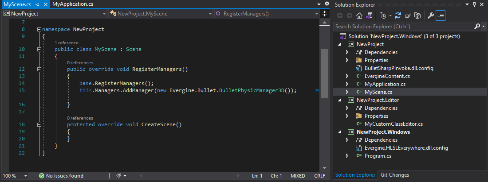
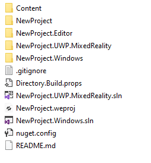

# Project Structure

**Evergine** projects need to be interconnected to manage different platforms or rendering systems, for example. This means that by default, an **Evergine** project has a specific structure.

## Folders / Projects

When we create our **Evergine** application, it defines by default one **Visual Studio Solution** for every **Project profile** we create. It will also define the following folders:

Here is a description of this project structure:

| Folder | Example | Element Description |
| ------ | ------- | -------------------- |
| **[ProjectName].weproj** | NewProject.weproj | This is the **Evergine Project** file. This file contains metadata information about the project profiles, packages, among other things.  *If you double-click this file, the project will open in **Evergine Studio*** |
| **Content/** | Content/ | Contains all the **Evergine assets** of the project. Every texture, model, and scene of the project is saved in this folder. |
| **[ProjectName]/**| NewProject/**NewProject.csproj** | Contains _[ProjectName].csproj_, the **base** project where the main **Evergine** code is usually defined (_scenes, components, services, etc._).  *All code written in this project will be shared among all profile projects.* |
| **[ProjectName].[Profile]/** | NewProject.Windows/**NewProject.Windows.csproj** **NewProject.Windows.sln** | There will be a folder for each application profile. It contains _[ProjectName].[Profile].csproj_, the **Launcher** application for that specific profile, carrying all its specific classes and logic. For example, the project for **UWP.MixedReality** will be a UWP Mixed Reality application. Additionally, a Visual Studio Solution is created for each profile.  *In these projects, we recommend placing all specific code for that profile.*|
| **[ProjectName].Editor/**| NewProject.Editor/**NewProject.Editor.csproj** | Contains _[ProjectName].Editor.csproj_, the project that contains the **Evergine Editor** customizations. For example, showing a custom panel for a specific component is created here. 

## Visual Studio Solutions
As mentioned before, for each different [Profile](../evergine_studio/project_profiles.md) (Windows, UWP, Android, etc...) **Evergine** will create a Visual Studio solution.

This solution will launch the Evergine application in the specified target. For example, a Windows profile will produce a .NET desktop application, while an Android profile solution will create a Xamarin.Android project for deployment on devices.

> [!NOTE]
> Every profile solution may require different Visual Studio features ("Mobile development with .Net" for mobile devices, or "UWP development" for UWP profiles...). 
> Follow Visual Studio's indications to install the missing features.

## Custom Structure
**Evergine** supports custom folder structure in your application.  To open the project using **Evergine Studio**, ensure the following requirements are met:
- The **[ProjectName].weproj** file and the main **[ProjectName].Windows.sln** file must be in the same folder. You can move or edit other solution files, but if they remain in the same location as the Windows solution file and keep their original name, they will appear in the `File -> Open C# editor` and `File -> Build & Run` menus.
- The **[ProjectName].Windows.sln** must reference both the base project (**[ProjectName].csproj**) and the editor project (**[ProjectName].Editor.csproj**). Additionally, the solution must build successfully in Visual Studio.
- If you have moved the **Content** folder, the `ResourcesPath` value in **[ProjectName].weproj** must be updated to set the correct relative path to it.