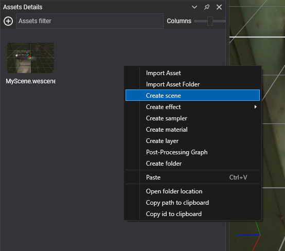
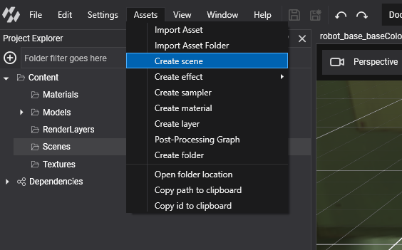

# Create Scenes

---

Every new project contains a scene, `Content/Scenes/MyScene.wescene`, and a matching `MyScene` class in the base project. You add more scenes in the same two ways: as an asset that you edit in Evergine Studio, and optionally as a class that adds code to it.

## Create a Scene in Evergine Studio

Scenes are assets, and they are created like any other asset:

- In the **Assets Details** panel, right-click and select **Create scene**.



- Or, in the main menu, select **Assets > Create scene**.



> [!NOTE]
> The new scene is created in the asset folder selected in the **Project Explorer** panel, which is also the folder shown in the **Assets Details** panel.

Double-click the new asset to open it in the [Scene Editor](scene_editor.md).

## Create a Scene Class

A scene asset only contains data: entities, components and scene manager settings. To run code of your own when the scene is built, create a class that derives from `Scene` and load the asset as that class:

1. Add a class to the base project of your solution, for example `LevelScene.cs`.
2. Make it derive from `Scene`.
3. Override the methods you need.
4. Load the asset with `assetsService.Load<LevelScene>(...)` (see [ScreenContext Manager](../application/screen_context_manager.md#load-a-scene-and-play-it)).

| Method | Description |
| --- | --- |
| **RegisterManagers()** | Registers the [scene managers](scenemanagers.md). The base implementation adds `EntityManager`, `AssetSceneManager`, `BehaviorManager`, `RenderManager` and `EnvironmentManager` if they are not present. Call it, then add your own managers. |
| **CreateScene()** | Called once, while the scene is initialized, after its managers are attached. Create and add entities from code here. |
| **Start()** | Called when the scene starts playing, after its managers have started. |
| **End()** | Called when the scene stops playing because its screen context left the stack. |
| **Pause()** | Called when the scene is paused, for example when another screen context is pushed on top of it. A paused scene is not updated. Call the base implementation. |
| **Resume()** | Called when a paused scene plays again. Call the base implementation. |

> [!NOTE]
> Loading a scene asset creates your class with its parameterless constructor, adds the scene managers and entities saved in the asset, and only then calls `RegisterManagers()` and `CreateScene()` when the scene is initialized. Keep a public parameterless constructor, and let the base `RegisterManagers()` skip the managers the asset already added.

The `Started`, `Paused`, `Resumed` and `Closed` events let other objects react to the same moments without deriving from `Scene`.

This is the pattern of the template scene, extended to create a camera from code:

```csharp
using Evergine.Components.Cameras;
using Evergine.Framework;
using Evergine.Framework.Graphics;

namespace MyProject
{
    public class MyScene : Scene
    {
        public override void RegisterManagers()
        {
            base.RegisterManagers();
            this.Managers.AddManager(new Evergine.Framework.Physics.PhysicsManager());
        }

        protected override void CreateScene()
        {
            // Entities saved in the scene asset are already here.
            // Anything added now exists only at runtime and is not shown in Evergine Studio.
            var cameraEntity = new Entity("camera")
                .AddComponent(new Transform3D())
                .AddComponent(new Camera3D())
                .AddComponent(new FreeCamera3D());

            this.Managers.EntityManager.Add(cameraEntity);
        }
    }
}
```

## Scene Properties

| Property | Default | Description |
| --- | --- | --- |
| **Managers** | The default scene managers | The [scene managers](scenemanagers.md) of the scene. `Managers.EntityManager` is how you add and find entities. |
| **Name** | `null` | A name for the scene, useful for logs and debugging. |
| **Speed** | `1` | Scales the time the scene passes to its managers and behaviors. `0.5` runs the scene at half speed. It must be greater than `0`. |
| **IsVisible** | `true` | When `false`, the scene is still updated but not drawn. |
| **IsPaused** | `false` | `true` while the scene is paused. Read only. |
