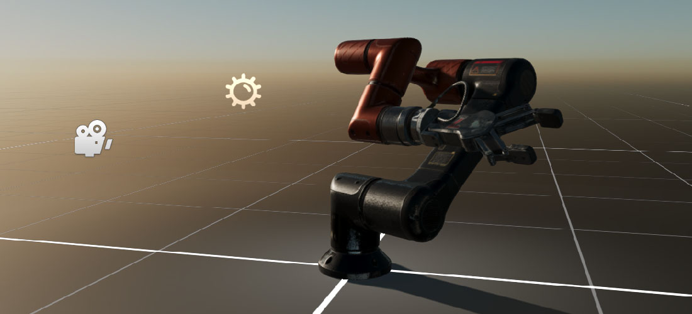

# Scenes

---

A **Scene** is a world made of [entities](../component_arch/entities/index.md), plus the [scene managers](scenemanagers.md) that run it: the `EntityManager` that owns the entities, the `BehaviorManager` that updates behaviors, the `RenderManager` that draws them, and so on. A scene usually represents one screen of your application, such as a level or a menu, although several scenes can play at the same time.

The scene in the image above contains a robot, a light, a camera and an environment. You build scenes visually in the [Scene Editor](scene_editor.md) of Evergine Studio, where they are saved as `.wescene` [assets](../../evergine_studio/assets/index.md), and you can also create or extend them from code.

A scene does not play by itself. The [ScreenContextManager](../application/screen_context_manager.md) service loads it into a screen context and decides when it plays, pauses and ends.

## In this section

* [Create Scenes](create_scenes.md)
* [Scene Managers](scenemanagers.md)
* [Scene Editor](scene_editor.md)
