# Scene Editor

---

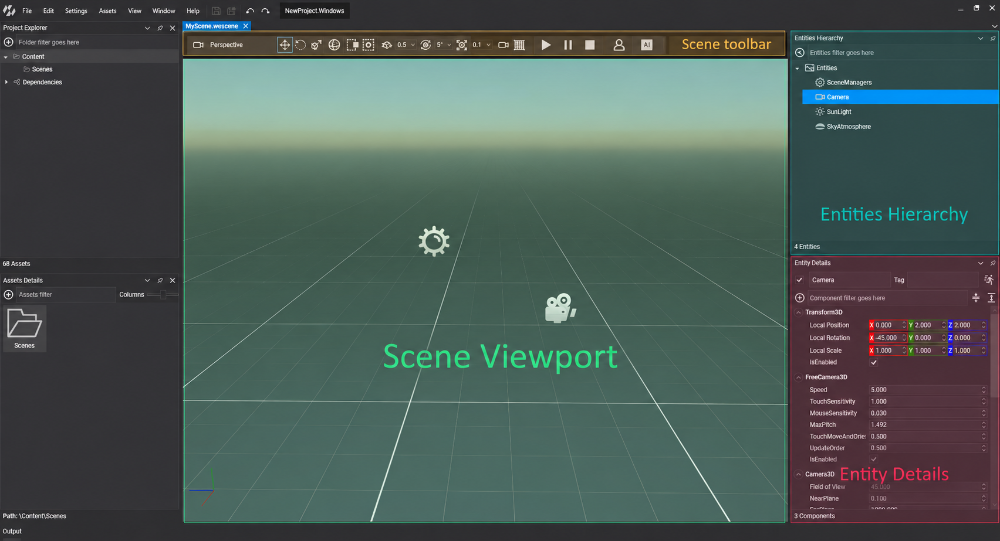

<!-- CAPTURE: scene_editor_annotated.png; the Scene Editor of Evergine Studio with the template scene open, annotated with numbered callouts on the Scene Toolbar, the Scene Viewport, the Entities Hierarchy and the Entity Details panels -->

The **Scene Editor** is where you build a scene in Evergine Studio. It opens when you double-click a scene asset, and it lets you create entities, arrange them in the scene, and add, remove and edit their components while the scene renders exactly as it will at runtime. It has four areas:

- **Scene Toolbar**: transform modes, snapping and viewport options.
- **Scene Viewport**: the rendered scene, where you navigate and manipulate entities.
- **Entities Hierarchy**: the entity tree of the scene.
- **Entity Details**: the properties and components of the selected entity.

## Scene Toolbar

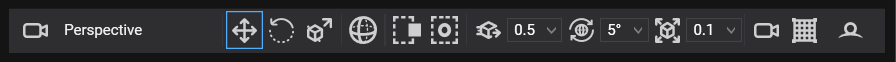

The scene toolbar contains useful controls for adjusting the scene during editing.

| Control | Description |
| ------- | ----------- |
| 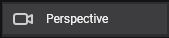 | Camera selection. Allows the **Scene Viewport** to visualize one of the scene cameras. **Perspective** is the default value, representing the **Evergine Studio** camera. |
| 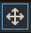 | Sets the transform manipulation in **Translation Mode**.|
|  | Sets the transform manipulation in **Rotation Mode**. |
| 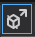 | Sets the transform manipulation in **Scale Mode**. |
|  /  | Toggles the transform manipulation from local axis to global axis. |
| 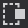 /   | Toggles the selection mode between **Crossing Mode** (Selects any entity that touches the rectangle selection) and **Window Mode** (Selects only the entities wholly inside the selection rectangle.). |
|  / |  Switch the pivot location between **the last entity selected** and **the center of all the selected entities**.  |
| 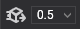 | When enabled, translation manipulation is done by steps of a custom value (0.5, 1, 5, 10, 50, 100). |
|  | When enabled, rotation manipulation is done by steps of a custom value (5, 10, 15, 30, 45, 60, and 90 degrees). |
| 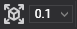 | When enabled, scale manipulation is done by steps of a custom value (0.001, 0.01, 0.1, 0.5, 1, 5, and 10). |
|  | Opens a dialog with the properties of the editor scene camera (more details below). |
|  | Toggles the visibility of the grid in the viewport. |

### Editor Camera Properties

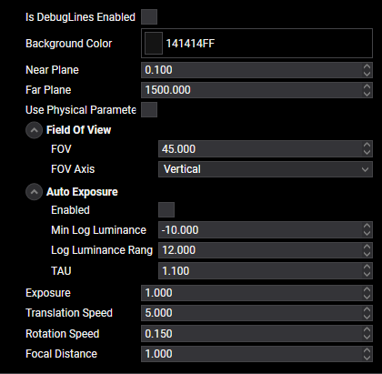

This dialog sets the properties of the **Editor Camera**. This camera is the default camera when editing your scene. The properties shown in this panel are the same as those that appear when editing a **Camera3D** component. More information is in [this article](../../graphics/cameras.md).

## Scene Viewport
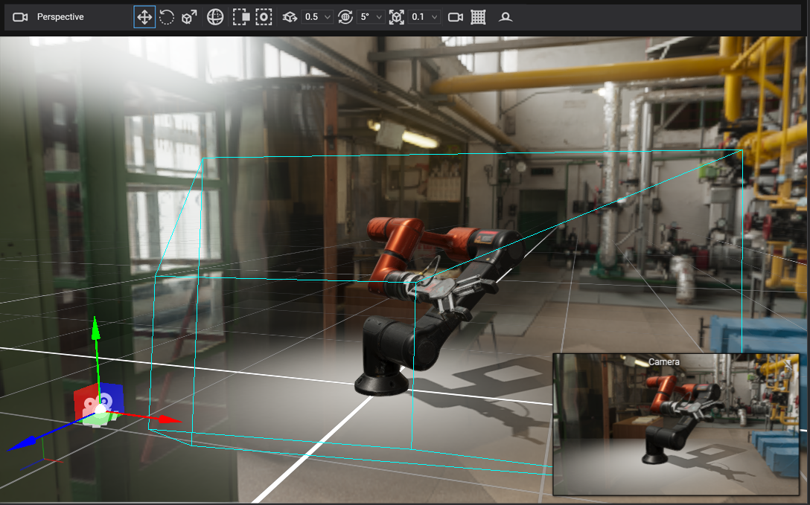

This area allows navigating the camera through the scene, as well as selecting, transforming, and manipulating all the entities of the scene (Cameras, Lights, and other types).

At the top of the viewport is the **Scene Toolbar**, where the user can adjust how the viewport behaves.

### Controls

<!-- CAPTURE: scene_editor_navigation.mp4; 15 s video in the Scene Viewport: right-drag to look around while moving with W A S D, middle-drag to pan, Shift + middle-drag to orbit, mouse wheel to dolly, then select an entity and use the translation, rotation and scale gizmos with move snap enabled -->

| Action | Description |
| ------ | ----------- |
| **Left Mouse** | Selects an entity. |
| **Drag Left Mouse** | Rectangle selection. |
| **Ctrl + Left Mouse** | Adds an entity to the selection. |
| **Alt + Left Mouse** | Removes an entity from the selection. |
| **Drag Right Mouse** | Rotates the camera to look around. |
| **Right Mouse + W / A / S / D** | Moves the camera forward, left, backward and right. |
| **Right Mouse + Q / E** | Moves the camera up and down. |
| **Right Mouse + Mouse Wheel** | Increases or decreases the camera speed. |
| **Right Mouse + Shift / Ctrl** | Moves the camera twice as fast, or half as fast. |
| **Drag Middle Mouse** | Pans the camera. |
| **Shift + Drag Middle Mouse** | Orbits the camera around the point under the cursor. |
| **Mouse Wheel** | Dollies the camera toward or away from the point under the cursor. |
| **Ctrl + Mouse Wheel** | Zooms the camera in or out. |
| **P** | Toggles between perspective and orthographic projection. |
| **Ctrl + D** | Duplicates the selected entity. |
| **G** | Toggles grid visibility. |
| **W** | Sets the translation manipulation mode. |
| **E** | Sets the rotation manipulation mode. |
| **R** | Sets the scale manipulation mode. |

### Basic Manipulation

When selecting an entity, a **Bounding Selection Box** will appear, along with a **manipulator** for adjusting the entity's **Transform3D**.

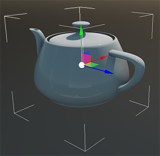

There are 3 different transform manipulations, selected by the above keys (W, E, and R), or through the **Toolbar**:

#### Translation

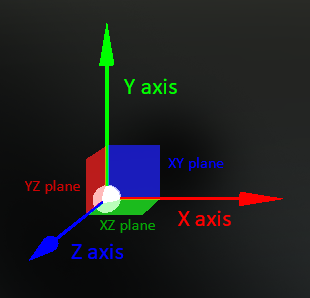 

Moves the entity through the scene. It allows for translating the entity:

- **3 main axes** (X, Y, and Z) as a one-dimensional translation.
- **3 main surfaces** (XY, XZ, and YZ) as two-dimensional translations.

#### Rotation

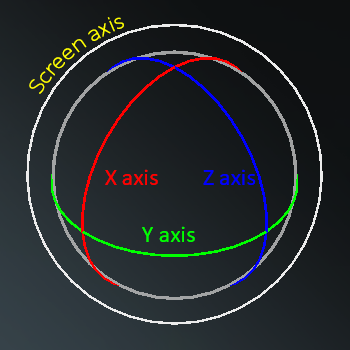 

Rotates the entity around one rotation axis. These axes are:

- **X axis**
- **Y axis**
- **Z axis**
- **Screen Axis**, rotating the entity around the camera (using the camera forward as the axis).

#### Scale

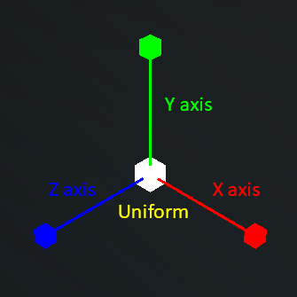 

Scales the entity along one or more axes:

- **X axis**
- **Y axis**
- **Z axis**
- **Uniform**, scaling proportionally so the entity's proportions remain the same.

>[!NOTE]
> Scaling manipulations always use the local axis.

## Entities Hierarchy

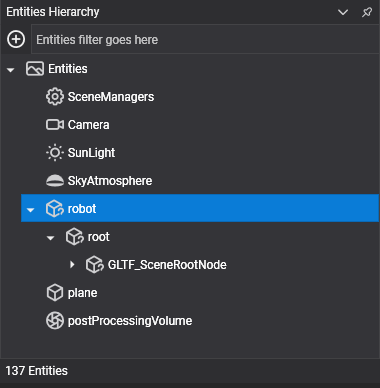

This panel shows the entity tree of the scene. Every node represents an **entity**, so it reflects the entity hierarchy. When a node has children, it means that entity has some child entities.

#### Operations

- **Entities can be rearranged**. This will cause the entities to be relocated under another parent. When this operation is made, the overall world transform (scale, rotation, and translation) tries to remain constant during the process.
- **Entities can be removed**. Pressing the **Delete** button will delete the selected entity and all its children.
- **Double-clicking an entity** will focus on it in the **Scene Viewport**.
- **Clicking the**  **button** will show the **Add Entity dialog**. More details are in the [Using Entities](../component_arch/entities/using_entities.md) article.
- The bottom bar shows the **total number of entities** in the scene (_137 in the above image_).

## Entity Details

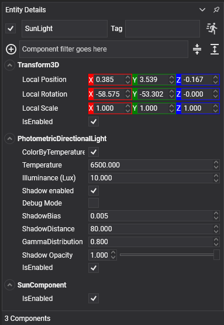

This panel shows all the properties of a selected entity. It displays all the entity parameters like **name**, **tag**, and enable status, and also shows an accordion panel of their components. Here are some specific controls:

#### Controls

| Control | Description |
| ------- | ----------- |
| 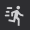 | Toggles the entity as a static entity. |
| 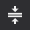 | Collapses the visibility of all the components. |
|  | Expands the visibility of all the components. |

More details are in the [Using Entities](../component_arch/entities/using_entities.md) article.